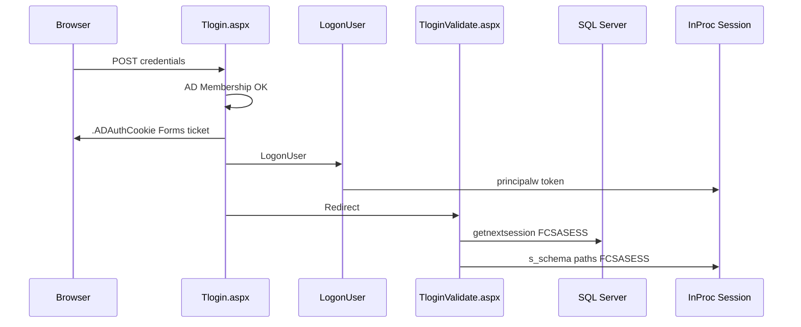
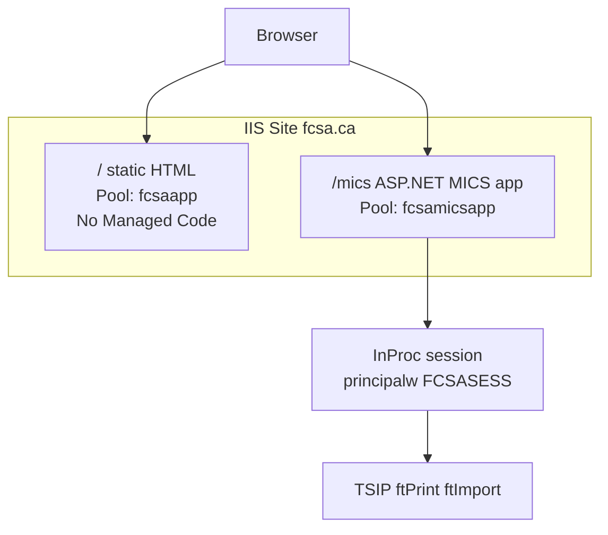

# FCSA.ca — MICS auth integration (Phase 5)

**Status:** Planned — not implemented  
**Prerequisite:** [fcsa-migration-plan.md](fcsa-migration-plan.md) Phases 1–4 complete  
**Related:** [login-flow.md](../remicsdev/login-flow.md)

How to connect the static `fcsa.ca` marketing site with the existing MICS authentication system so members log in once and can use TSIP, imports, and other batch features.

---

## Problem

After Phases 1–4, `fcsa.ca` is **static HTML** with all content public. Phase 5 re-introduces member-only access using the **existing MICS login code** (not WordPress), without requiring a second login when moving between marketing pages and MICS tools.

---

## How MICS authentication works today

MICS login is **three steps**, not one cookie:



| Mechanism | Storage | Purpose | Cross-app? |
|-----------|---------|---------|------------|
| `.ADAuthCookie` | Browser cookie | Forms Authentication identity | Can share across ASP.NET apps on same domain with matching `machineKey` |
| `ASP.NET_SessionId` | Browser cookie + InProc | Binds to server session | **Per IIS application only** |
| `Session["principalw"]` | InProc session | Windows token for `CreateProcessAsUser` | **No** |
| `Session["FCSASESS"]` | InProc session | MICS business session id | **No** |
| `Session["s_schema"]`, `user_dir`, etc. | InProc session | SQL schema, paths, batch args | **No** |

**Verified** in MICS `web.config`:

```xml
<sessionState mode="InProc" cookieless="false" />
<authentication mode="Forms">
  <forms loginUrl="Tlogin.aspx" name=".ADAuthCookie" slidingExpiration="true" timeout="10" />
</authentication>
```

TSIP, ftPrint, ftImport, and other batch jobs require `Session["principalw"]` and related keys — **not** the Forms cookie alone.

---

## What does NOT provide single login

| Approach | Why it fails |
|----------|--------------|
| Shared app pool between static + MICS | Session is per IIS **application**, not per pool |
| Sharing `.ADAuthCookie` across separate hostnames | `fcsa.ca` vs `remicsdev.cloudmicsdev.ca` — cookies don't cross |
| Static HTML checking Forms cookie | Identity only; no `principalw`, no TSIP |
| WordPress member cookies | Discarded — MICS replaces WordPress auth entirely |

---

## Recommended architecture: `fcsa.ca/mics`



| Component | Setting |
|-----------|---------|
| Site root `/` | Static marketing files; `fcsaapp`; no auth |
| Child app `/mics` | Existing MICS web application; dedicated ASP.NET pool (`fcsamicsapp` or equivalent) |
| Login URL | `https://fcsa.ca/mics/Tlogin.aspx` |
| Member / batch features | Stay inside `/mics` — static pages link in |

**Why this works:** One hostname. User logs in once at `/mics/Tlogin.aspx`. Session lives in the `/mics` application. Static pages at `/` need no session; links to TSIP, imports, etc. go to `/mics/...` where the session already exists.

---

## IIS configuration checklist (Phase 5)

### 1. IIS site structure

- [ ] Create or extend IIS site `fcsa.ca` with physical path `D:\inetpub\fcsa\` (static root).
- [ ] Add IIS **application** `/mics` → `D:\inetpub\fcsa\mics\` (or symlink/copy of MICS tree).
- [ ] App pool `fcsaapp` — No Managed Code — for site root only.
- [ ] App pool `fcsamicsapp` — .NET version matching MICS — for `/mics` only.
- [ ] Do **not** share `remicsdevapp` with marketing static files.

### 2. Forms authentication

- [ ] Set `<forms path="/" ...>` in `/mics/web.config` so the cookie is visible across the site hostname.
- [ ] Add explicit **matching `machineKey`** to `/mics/web.config` (and parent site `web.config` if a root ASP.NET app is added later). Today no `machineKey` is in the repo — server may auto-generate per app, which breaks cross-app ticket validation.

### 3. MICS `web.config` updates

- [ ] Update `SiteName`, URLs, and path-related appSettings for `fcsa.ca` hostname.
- [ ] Confirm `ProgDir`, SQL instance, and `SiteType` for target environment (dev vs prod).
- [ ] Retain GPO requirements: `IISReMicsSer` privileges for batch spawn (see [session-2026-06-29-login-import-fixes.md](../remicsdev/session-2026-06-29-login-import-fixes.md)).

### 4. Static site navigation

- [ ] Replace open-access member links with `/mics/...` entry points where batch/session is required.
- [ ] Keep public marketing copy on static `/` pages.
- [ ] Remove any placeholder login forms from static HTML — login only via `/mics/Tlogin.aspx`.

### 5. Re-gating member content

- [ ] Identify pages that should require login (e.g. `members-list`, former dashboard content).
- [ ] Implement as MICS `.aspx` pages or protect via `Global.asax` authorization inside `/mics` — **not** on static HTML.
- [ ] Static site may show a "Members — log in" link to `/mics/Tlogin.aspx`.

### 6. Verification

- [ ] Login at `fcsa.ca/mics/Tlogin.aspx` → `shownetsession` shows `FCSASESS`, `principalw`, `prog_dir`.
- [ ] Run one TSIP job via web — `web.dblogger` exit 0, no 1314.
- [ ] Navigate from static `/about/` to `/mics/...` without second login prompt.
- [ ] Logout via `logoff.aspx` clears session; static pages remain accessible.

---

## Alternative: separate hostname (not recommended)

Keeping MICS at `remicsdev.cloudmicsdev.ca/mics` while marketing is at `fcsa.ca` forces **two logins** unless you add central SSO (ADFS / Entra ID). Only consider this if `fcsa.ca/mics` is impossible for operational reasons.

---

## Open questions (resolve before Phase 5)

1. Which SQL environment does production `fcsa.ca/mics` point to?
2. Copy MICS tree to `D:\inetpub\fcsa\mics\` vs deploy from existing `D:\inetpub\remicsdev\mics\` build pipeline?
3. Explicit `machineKey` generation and secure storage (not in git).
4. TLS certificate covering `fcsa.ca` and path `/mics`.
5. Whether `remicsdev` hostname remains for dev while prod uses `fcsa.ca/mics`.

---

## Related

- [fcsa-migration-plan.md](fcsa-migration-plan.md) — Phases 1–4 static migration
- [login-flow.md](../remicsdev/login-flow.md) — session keys and cookies
- [web-app-structure.md](../remicsdev/web-app-structure.md) — batch invocation via session
