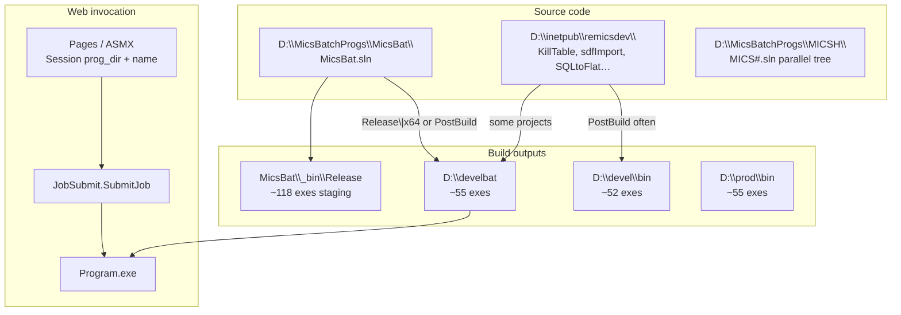

# ReMICS Dev — batch programs

**Codebase:** remicsdev  
**Status:** In progress (first analysis pass, 2026-06-17)  
**Prerequisite:** [Web application structure](web-app-structure.md), [Login flow](login-flow.md)  
**Context file:** [`context/codebases/remicsdev.yaml`](../../context/codebases/remicsdev.yaml)

This document maps **C# batch/console programs**: where source lives, how builds land on disk, how the web app invokes them, and known gaps.

---

## Executive summary

Batch work is **not** a single pipeline. It is a layered system with duplicate source trees and **three runtime directories** tied to **environment** via `ProgDir` in each site's `web.config`:

| Runtime directory | Typical site | `ProgDir` value |
|-------------------|--------------|-----------------|
| **`D:\develbat\`** | **remicsdev** | `\develbat\` |
| **`D:\devel\bin\`** | **remicstest** | `\devel\bin\` |
| **`D:\prod\bin\`** | Production (inferred) | *(not found on this server's inetpub copy)* |

**Primary source of truth for new batch work:** `D:\MicsBatchProgs\MicsBat\` (`MicsBat.sln`, ~63 projects).

**Verified:** remicsdev web app resolves `Session["prog_dir"]` → **`D:\develbat\`** and launches exes via `JobSubmit.SubmitJob` + `CreateProcessAsUser`.

---

## Big picture



---

## Source trees

### 1. `D:\MicsBatchProgs\MicsBat\` — primary (use this)

| Item | Detail |
|------|--------|
| Solution | `D:\MicsBatchProgs\MicsBat\MicsBat.sln` |
| Projects | ~63 in solution |
| Shared libs | `_Auxlib`, `_Configuration`, `_DataStructures`, `_NewLib`, `_OHloss`, `_Utillib`, `DBAccess`, `utilities` |
| Staging folder | `MicsBat\_bin\Release\` — **~118** `.exe` files (includes `.vshost` and tools not deployed) |
| Framework | .NET 4.8, many exes **x64** |

Representative projects (not exhaustive):

| Category | Examples |
|----------|----------|
| Table / data | `CopyTable`, `KillTable`, `SQLtoFlat`, `NewTable` |
| Import / print / validate | `sdfImport`, `sdfPrint`, `sdfValidate`, `FeImport`, `FtImport`, `FePrint`, `FtPrint`, `FeValidate`, `FtValidate` |
| SDF updates | `SdUpdateOper`, `SdUpdateAnte`, `SdUpdateBand`, … (many `SdUpdate*` ) |
| Engineering / coords | `GetCoords`, `GetOHLrep`, `GetProfRep`, `GenCtx`, `Interpol`, `HiLoCheck`, `PFDcont` |
| TSIP | `TsipInitiator`, `TsipQdelete`, `TpRunTsip` |
| Orbit / terrain (Windows helpers) | `Worbit`, `Wpassive`, `WsatAze` |
| Admin / utility | `CheckMicsConfig`, `CompareReports`, `PCNscan`, `ComsearchToTAFL`, `IsedTaflToTable` |

### 2. `D:\inetpub\remicsdev\` — legacy duplicates (site root)

Some batch projects still live under the **IIS site root** (sibling to `mics\`), referenced from **`mics.sln`** via `..\`:

| Project path | Notes |
|--------------|-------|
| `CopyAnyTable`, `KillTable`, `sdfImport`, `sdfValidate`, `SQLtoFlat` | **Verified** on disk |
| `CopyTable`, `sdfPrint`, `BatchProgs`, `RunJob`, … | Referenced in `mics.sln` but **missing** — stale entries |

These often use **Debug PostBuild** copying to `D:\devel\bin\` rather than Release → `D:\develbat\`.

**Inferred:** Prefer building from `MicsBatchProgs\MicsBat`; inetpub copies are legacy and may drift.

### 3. `D:\MicsBatchProgs\MICSH\`

Parallel tree with its own **`MICS#.sln`** and many of the same folder names as `MicsBat` (FeImport, Worbit, `_Utillib`, etc.).

**Open:** Relationship to `MicsBat` — fork, older mainline, or experimental. Treat as **separate** until diffed; do not assume identical to `MicsBat`.

### 4. `MICSTSIP` — does not exist

**Documented (2026-06-17):** There is **no maintained MICSTSIP C# source tree** — not in CentralProject and not available as a separate buildable codebase on the server. Older notes that referenced `D:\MicsBatchProgs\MICSTSIP\` are superseded.

**TSIP source of truth:** `MicsBat\TpRunTsip`, `MicsBat\TsipInitiator`, and shared `MicsBat\_Utillib`. Build Release\|x64 → PostBuild copies `TpRunTsip.exe` to `D:\develbat\`. See [TSIP implementation plan](tsip-implementation-plan.md).

**Bill report-table SQL:** Disabled — `TsipReportHelper.cs` `mOutputToReportsTable = false` plus guards on final MD5/ERR paths. `-t` CLI still enables if needed.

**TSIP batch UI:** Success submission no longer shows two JavaScript `alert()` popups (`tsipBatch.aspx` `batchDone` on `OK:0`); uses `window.status` instead. Error/cancel alerts unchanged.

---

## Production vs dev — where is the `.cs`?

**Verified:** `D:\prod\` contains only **`bin\`** (~55 `.exe`) and **`files\`** — **no C# source**. Production and remicsdev share **`D:\MicsBatchProgs\`** as the only batch source tree on this server.

| Environment | IIS `ProgDir` (typical) | Runtime directory | Source |
|-------------|-------------------------|-------------------|--------|
| remicsdev | `\develbat\` | `D:\develbat\` | `D:\MicsBatchProgs\` |
| remicstest | `\devel\bin\` | `D:\devel\bin\` | Same source |
| Production | *(site-specific)* | `D:\prod\bin\` | Same source; promotion **manual / undocumented** |

CentralProject / GitHub track docs and selected IIS symlinks — **not** `MicsBatchProgs` (not in repo yet).

---

### Pattern A — Release → `D:\develbat\` (dominant in MicsBat)

Many `MicsBat` projects set **Release** output directly to develbat:

```xml
<!-- Example: CopyTable.csproj Release|AnyCPU -->
<OutputPath>..\..\..\develbat\</OutputPath>
```

Path resolves: `MicsBat\<Project>\` → up 3 levels → `D:\` → `develbat\`.

**Platform matters:** Several projects use **Release|x64** → `develbat`, while **Debug|AnyCPU** → `..\bin\Release\` or `_bin\Release` only.

Example `CheckMicsConfig.csproj`:

| Configuration | OutputPath |
|---------------|------------|
| Debug\|AnyCPU | `..\bin\Release\` |
| Release\|x64 | `..\..\..\develbat\` |

### Pattern B — PostBuild COPY to `D:\develbat\`

Some projects build to `_bin\Release` then copy:

```text
COPY D:\MicsBatchProgs\MicsBat\_bin\Release\KillTable.exe D:\develbat\KillTable.exe
```

**Verified** in `KillTable.csproj`, `TsipInitiator.csproj`, `MtUpdate.csproj`, etc.

### Pattern C — Legacy inetpub PostBuild → `D:\devel\bin\`

**Verified** in `D:\inetpub\remicsdev\KillTable\KillTable.csproj`, `sdfValidate.csproj`:

```text
copy D:\inetpub\remicsdev\killtable\bin\Debug\KillTable.exe D:\devel\bin
```

Also copies `utilities.dll`, `DBAccess.dll` alongside exes.

### Pattern D — Shared DLLs to develbat

Web and batch share **`DBAccess.dll`** and **`utilities.dll`** in `D:\develbat\`:

**Verified** PostBuild from `mics\DBAccess` and `mics\utilities`:

```text
Copy D:\inetpub\remicsdev\mics\bin\DBAccess.dll D:\develbat\DBAccess.dll
```

Batch exes depend on these at runtime.

### `D:\prod\bin\`

**Verified:** ~55 exes, similar set to `D:\develbat\`.  
**Not verified:** No `prod\bin` references in `.csproj` PostBuild events searched on this server.

**Inferred:** Production binaries are **promoted manually** or by an undocumented script from `develbat` / `devel\bin`. No automated `prod\bin` deploy found in project files.

### SQLtoFlat — deploy gap example

| Location | Release output |
|----------|----------------|
| `MicsBatchProgs\MicsBat\SQLtoFlat\` | `..\..\..\develbat\` |
| `inetpub\remicsdev\SQLtoFlat\` | `bin\Release\` only (no develbat) |

**Verified:** `SQLtoFlat.exe` **not present** in `D:\develbat`, `_bin\Release`, or `SQLtoFlat\bin\Release` on disk — source exists but **not built/deployed** here. Web code references `SQLtoFlat.exe` in `TwsTabUtil.asmx.cs`.

---

## Runtime directory comparison

**Verified** exe counts (2026-06-17):

| Directory | .exe count | Role |
|-----------|------------|------|
| `MicsBat\_bin\Release` | ~118 | Build staging (includes vshost, unused tools) |
| `D:\develbat` | ~55 | **remicsdev** runtime |
| `D:\devel\bin` | ~52 | **remicstest** runtime |
| `D:\prod\bin` | ~55 | Production runtime (inferred) |

Run comparison anytime:

```powershell
.\scripts\compare-batch-bins.ps1
```

Most deployed programs appear in **develbat**, **devel\bin**, and **_bin\Release**. Many _bin-only exes are **not** deployed to either runtime dir (e.g. `CompareResults`, `ImportAnte`, `.vshost` variants).

---

## Environment → runtime mapping

**Verified** from `web.config`:

| Site | `ProgDir` | Resolved path |
|------|-----------|---------------|
| **remicsdev** | `\develbat\` | `D:\develbat\` |
| **remicstest** | `\devel\bin\` | `D:\devel\bin\` |

Build targeting **develbat** aligns with **remicsdev**. Builds that only PostBuild to **devel\bin** align with **remicstest** unless manually copied.

---

## How the web app invokes batch programs

See [web-app-structure.md](web-app-structure.md) for full detail. Short form:

1. Page/ASMX sets `dblogger.logprogram = Session["prog_dir"] + "<Name>"`
2. `JobSubmit.SubmitJob` builds env vars (`SqlInstance`, `MicsUser`, `Password`, `work_dir`, …)
3. `CreateProcessAsUser` with **`Session["principalw"]`** (logged-in user's Windows token)
4. Logs to **`web.dblogger_view`** via `dblogger.Start()` / `Finish()`

Primary web entry points: **`Tfileactions\TwsTabUtil.asmx.cs`**, **`auxengmenu\AUX*.aspx.cs`**, **`Ttsipmenu\TwsTsip.asmx.cs`**.

---

## Web code ↔ disk verification

Script: **`scripts/verify-batch-mapping.ps1`**

Scans live `.cs` for `Session["prog_dir"] + "..."` and checks `D:\develbat`.

**Verified run (2026-06-17):** 27 found, 9 missing (36 unique references).

### Missing / problematic references

| Code name | On disk? | Analysis |
|-----------|----------|----------|
| `Dummy` | No | **Inferred** placeholder — `logprogram` overwritten before `SubmitJob` |
| `esImport`, `esPrint` | No | **Inferred** dead — commented branches in `TwsTabUtil.asmx.cs` |
| `updatedb` | No | **Inferred** dead — `userUpdate` builds `logprogram` but **returns `"OK"` without `SubmitJob`** |
| `SQLtoFlat.exe` | No | **Verified** not built to develbat; source in MicsBat |
| `pl5Import` | No | **Open** — live import path? |
| `wTerrex` | No (`Worbit.exe` exists) | **Verified bug** — `AUXTerrex3.aspx.cs` calls `wTerrex`; deployed exe is **`Worbit.exe`** (different name) |
| `BatchApp` | No | **Open** |
| `testdefaultschema` | No | **Open** — maintenance/test |

**Note:** Windows file matching is case-insensitive (`fePrint` → `FePrint.exe` works). **Base name must match** (`wTerrex` ≠ `Worbit`).

---

## Building batch programs (developer workflow)

### Recommended

1. Open **`D:\MicsBatchProgs\MicsBat\MicsBat.sln`** in Visual Studio 2022
2. Build **Release** (often **x64** per project — check Configuration Manager)
3. Confirm output in **`D:\develbat\`** (or run PostBuild-dependent projects)
4. Ensure **`DBAccess.dll`** and **`utilities.dll`** in `D:\develbat` match web app if those changed
5. Re-run `.\scripts\verify-batch-mapping.ps1` if web code references new program names

### Caveats

- **Debug vs Release** — Debug may only write to `_bin\Release`, not develbat
- **Platform x64 vs AnyCPU** — wrong platform → exe not copied to develbat
- **Stale inetpub projects** — building `D:\inetpub\remicsdev\KillTable` may deploy to **devel\bin** instead of develbat
- **`mics.sln`** may fail to load missing `..\BatchProgs` projects — use **MicsBat.sln** for batch work

---

## Tier 4 automation candidate (not selected yet)

Requirements for first **batch smoke test** (see [automated-testing.md](automated-testing.md)):

- Dev-safe (read-only or minimal side effects)
- Exe present in `D:\develbat`
- Callable from web after login
- Deterministic success/failure

**Candidates to evaluate next:**

| Program | Pros | Cons |
|---------|------|------|
| `CheckMicsConfig.exe` | Config validation, likely read-only | Need to confirm args and side effects |
| `CompareReports.exe` | Name suggests comparison | May need input files |
| `GetCoords.exe` | Used from auxengmenu | May need DB/coord inputs |

**Not candidates:** `KillTable`, `CopyTable`, imports, updates — destructive or data-changing.

---

## Open questions

1. How is **`D:\prod\bin`** populated? Manual copy, release script, or GPO job?
2. **`MICSH` vs `MicsBat`** — which is authoritative today?
3. Is **`wTerrex`** a rename oversight for **`Worbit`**?
4. Should **`SQLtoFlat`** be built Release\|x64 and deployed to develbat?
5. Can legacy **`D:\inetpub\remicsdev\*`** batch folders be retired in favor of MicsBatchProgs only?
6. Full inventory of **`MicsBat.sln` project → develbat deploy path** (automate from csproj scan)

---

## Verification scripts

| Script | Purpose |
|--------|---------|
| [verify-batch-mapping.ps1](../../scripts/verify-batch-mapping.ps1) | Web code program names vs `D:\develbat` |
| [compare-batch-bins.ps1](../../scripts/compare-batch-bins.ps1) | Exe presence across develbat / devel\bin / prod/bin / _bin |
| [extract-session-keys.ps1](../../scripts/extract-session-keys.ps1) | Session keys used by web (incl. `prog_dir`) |

---

## Related docs

- [Web app structure](web-app-structure.md) — JobSubmit flow
- [Login flow](login-flow.md) — `prog_dir`, `principalw`, `s_password`
- [Infrastructure mapping](infrastructure-mapping.md) — drives and IIS
- [TODO](../TODO.md) — batch doc + tier 4 automation
