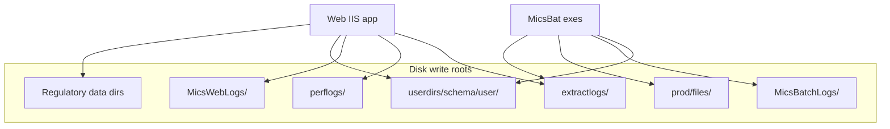

# Disk Write Reduction — Staged Plan

**Codebase:** remicsdev  
**Status:** Active — inventory complete; Stage 1 not started  
**Created:** 2026-06-17  
**Related:** [disk-writes-inventory.md](disk-writes-inventory.md), [tsip-implementation-plan.md](tsip-implementation-plan.md), [automated-testing.md](automated-testing.md)

---

## Goals

1. **Classify** all disk writes by purpose and external dependency.
2. **Reduce writes in stages** — start with debug/extractlogs (comment out or gate off).
3. **Preserve business-critical paths** until DB/archive replacements exist (notably TSIP Phase 4).
4. **Do not break external apps** that read physical files (COMS, ISED, FCC batch drivers).

---

## Architecture overview

Full write inventory: **[disk-writes-inventory.md](disk-writes-inventory.md)**

---

## Staged elimination

| Stage | Target | Action | Risk | Prerequisite |
|-------|--------|--------|------|--------------|
| **1** | Category A — Debug/diagnostic | Comment out or gate `StreamWriter` / `AppendAllText`; set `Log2.Set(WriteMode.DISABLED)`; no-op `WriteToTsipLog` body | Low | Smoke login + one TSIP run after changes |
| **2** | Category B — Ops/audit (subset) | Disable session/menu/perflogs; **keep** bad-login + `ErrorLog.txt` | Low–medium | Confirm ops does not rely on `perflogs` |
| **3** | Category C — TSIP deliverables | After TSIP Phase 4: web reads `web.tsip_run_report_line`; stop `CopyToTxt`; optional stop report file writes once email uses DB | Medium | Phase 4 UI + email path |
| **4** | Category C — Other deliverables | KML, PCN, JobSubmit stdout — per-feature DB/streaming design | Medium–high | Per-feature design |
| **5** | Category D — Regulatory | Do **not** comment out without external batch app inventory | High | COMS, ISED, FCC dependency map |

---

## Stage 1 — Disable debug/extractlogs bulk writes

**Next action.** Comment out or gate off the highest-volume debug writes.

### Priority files

| # | File | Writes |
|---|------|--------|
| 1 | `FCCInfo\BuildSiteTables.aspx.cs` | `extractlogs\{user}fccButton*.txt` |
| 2 | `utilities\JobSubmit.cs` | `extractlogs\{site}_{user}submit5.txt` |
| 3 | `Ttsipmenu\TwsTsip.asmx.cs` | `{user}tsip.txt`, `tsipDelete.txt` |
| 4 | `utilities\KmlUtils.cs`, `FCCMAPkml.aspx.cs` | KML/PDF debug side files |
| 5 | `utilities\SesUtils.cs` | Email debug files (not SMTP send) |
| 6 | `TpRunTsip.cs`, `TsipInitiator.cs`, `TsipEmail.cs` | `MicsBatchLogs\*.log` via Log2 |
| 7 | `_Utillib\TsipQ.cs` | `{GetMicsRoot}files\tsiplog.log` via `WriteToTsipLog` |

### Implementation pattern

- Comment out write blocks with marker: `// DISK-WRITE-REDUCTION stage1 — debug only`
- For shared helpers (`Log2`, `WriteToTsipLog`), prefer early return on config flag or env var over many inline comment-outs
- Rebuild and deploy affected DLLs/exes to remicsdev after batch changes
- Update [disk-writes-inventory.md](disk-writes-inventory.md) stage column as items are disabled

### Verification

1. Login + `shownetsession` assertions ([automated-testing.md](automated-testing.md) tiers 1–2)
2. One known-good TSIP run (`ecomm2602` / `TS1`) + `web.tsip_run` archive assert (tier 4)
3. Spot-check: Retrieve TSIP Batch Reports still works (unchanged until Stage 3)
4. Optional: compare `D:\extractlogs` file count before/after on a test day

---

## Stage 2 — Ops audit review

Review Category B writes with ops team:

- **Keep for now:** bad-login files (B3), `ErrorLog.txt` (B6)
- **Candidate to disable:** session lifecycle (B1), email metadata log (B4), release audit logs (B5) if not used for incident response
- **Smoke test impact:** tier 3 uses `MicsWebLogs\logins\{user}_conn.txt` — update test or keep B2 until tests move to SQL

---

## Stage 3 — TSIP deliverables (blocked on Phase 4)

Disk reduction for TSIP reports requires [tsip-implementation-plan.md](tsip-implementation-plan.md) **Phase 4**:

| Today | After Phase 4 |
|-------|---------------|
| Web UI scans `user_dir` (`TwsTsipTree.asmx.cs`) | List/search from `web.tsip_run` |
| `CopyToTxt` writes display copy | Reassemble from `web.tsip_run_report_line` |
| Email attaches physical files (`TsipEmail.cs`) | Attachments from DB cache |
| `TpRunTsip` writes report files to disk | Optional: stop disk writes once all consumers use DB |

Archive Phases 2–3 already capture data in DB (`TsipRunArchive.cs`). Stage 1 can proceed **in parallel** with Phase 4.

---

## Stage 4 — Other user deliverables

Per-feature evaluation:

- KML output (`KmlUtils.cs`)
- PCN lookup text (`PcnLookup.aspx.cs`)
- Generic JobSubmit stdout files
- Radio catalog / ImpExp export reports

---

## Stage 5 — Regulatory / import-export

Requires external dependency inventory before any changes:

- COMS batch driver reads from `coms_data_dir`
- ISED-TS/ES import pipelines
- FCC import/export file formats
- User file upload (`SaveAs`)

**Do not comment out** Category D writes until each external consumer is confirmed replaced or retired.

---

## Relationship to TSIP archive

| Component | Disk today | DB archive | Stage to retire disk |
|-----------|------------|------------|----------------------|
| Report line content | `user_dir\{prefix}_{run}.*` | `web.tsip_run_report_line` | 3 (after Phase 4 UI) |
| Run registry | Queue + file scan | `web.tsip_run` | 3 |
| Debug traces | `extractlogs`, `MicsBatchLogs` | None needed | 1 |
| Email attachments | UNC paths to `user_dir` | Not yet | 3 |

---

## Tracking

Progress tracked in [TODO.md](../TODO.md) under **Disk write reduction (staged)**.
