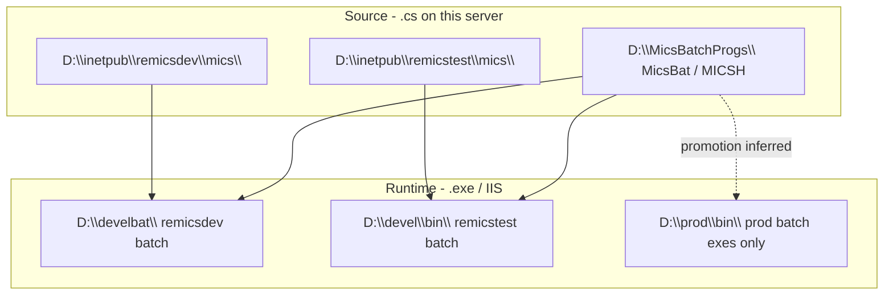

# ReMICS — environments, URLs, and code locations

**Codebase:** remicsdev server (`EC2AMAZ-9DKDM82`)  
**Status:** Verified 2026-06-23 (IIS `appcmd`, DNS, filesystem)  
**Related:** [Infrastructure mapping](infrastructure-mapping.md), [Source layout](source-layout.md), [Batch programs](batch-programs.md)

This document records what we verified about **which URLs work on this server**, how they map to **IIS and disk**, and where **source code vs compiled binaries** live. Production URLs in `web.config` are **cross-environment links**, not sites hosted on this box.

---

## Executive summary

| Question | Answer on this server |
|----------|----------------------|
| Dev login URL | **Works** — `http://remicsdev.cloudmicsdev.ca/mics/Tlogin.aspx` |
| Test login URL | **Configured** — `http://remicstest.cloudmicsdev.ca/mics/Tlogin.aspx` (IIS site exists; app pool was **Stopped** on 2026-06-23) |
| Prod URLs (`remicsproddev`, `micsprod`) | **Do not resolve** — no DNS, no IIS site, no `D:\inetpub\` folder |
| Import URL (`micsimport`) | **Do not resolve** — same |
| Production C# source | **Not on this server** — shared batch source is `D:\MicsBatchProgs\`; prod only has `D:\prod\bin\*.exe` |
| Local IIS prod site | **None** — only `remicsdev` and `remicstest` are MICS web copies under `D:\inetpub\` |

---

## Login URLs

MICS always runs under the **`/mics` IIS application**. Login page name is **`Tlogin.aspx`** on all environments that use this pattern.

| Environment | Login URL | Works on this server? |
|-------------|-----------|------------------------|
| **Development** | `http://remicsdev.cloudmicsdev.ca/mics/Tlogin.aspx` | **Yes** — primary working entry point |
| **Test** | `http://remicstest.cloudmicsdev.ca/mics/Tlogin.aspx` | **Site exists** — verify app pool is started before use |
| **Prod (local name in config)** | `http://remicsproddev.cloudmicsdev.ca/mics/Tlogin.aspx` | **No** — DNS and IIS absent on this host |
| **Prod (remote name in config)** | `https://micsprod.cloudmicsdev.ca/mics/Tlogin.aspx` | **No** — DNS absent on this host; intended for **`WIN-V9206VTNL3J`** per `Remote_server` in dev `web.config` |
| **Import** | `http://micsimport.cloudmicsdev.ca/mics/Tlogin.aspx` | **No** — DNS and IIS absent on this host |

---

## IIS sites verified on this server (2026-06-23)

```powershell
& "$env:windir\system32\inetsrv\appcmd.exe" list site
& "$env:windir\system32\inetsrv\appcmd.exe" list app
```

### Sites

| Site | Binding | State | MICS? |
|------|---------|-------|-------|
| `remicsdev` | `http/*:80:remicsdev.cloudmicsdev.ca` | Started | **Yes** — `/mics` app |
| `remicstest` | `http/*:80:remicstest.cloudmicsdev.ca` | Started | **Yes** — `/mics` app |
| `REMICS` | `http/*:8080` | Started | No MICS app listed |
| `Default Web Site` | `http/*:80` (default) | Started | No |

**Not present:** `remicsproddev`, `micsimport`, or any site bound to `micsprod.cloudmicsdev.ca`.

### Applications and app pools

| IIS application | Physical path | App pool | Pool state (2026-06-23) |
|-----------------|---------------|----------|-------------------------|
| `remicsdev/mics` | `D:\inetpub\remicsdev\mics` | `remicsdevapp` | Started |
| `remicsdev/` (site root) | `D:\inetpub\remicsdev` | `remicsdevapp` | Started |
| `remicstest/mics` | `D:\inetpub\remicstest\mics` | `remicstestapp` | **Stopped** |
| `remicstest/` | `D:\inetpub\remicstest` | `remicstestapp` | **Stopped** |

`remicsdevapp`: .NET 4.0, **Classic** pipeline, identity `cloudmicsdev\IISReMicsSer`.

### `D:\inetpub\` folders (MICS-related)

| Folder | `Tlogin.aspx` | IIS site |
|--------|---------------|----------|
| `D:\inetpub\remicsdev\mics\` | Yes | `remicsdev` |
| `D:\inetpub\remicstest\mics\` | Yes | `remicstest` |
| `D:\inetpub\remicsproddev\` | **Does not exist** | — |
| `D:\inetpub\micsimport\` | **Does not exist** | — |

Other inetpub folders on this server (`archdevcs`, `rearchtest`, `rerearchtest`) are unrelated to MICS.

---

## DNS on this server (2026-06-23)

| Hostname | Result |
|----------|--------|
| `remicsdev.cloudmicsdev.ca` | Resolves → **127.0.0.1** (local) |
| `remicstest.cloudmicsdev.ca` | Resolves → **127.0.0.1** (local) |
| `remicsproddev.cloudmicsdev.ca` | **DNS name does not exist** |
| `micsprod.cloudmicsdev.ca` | **DNS name does not exist** |
| `micsimport.cloudmicsdev.ca` | **DNS name does not exist** |

Prod and import hostnames appear in **`web.config` as link targets** (`ProdUrl`, `ProdUrl2`, `ImportUrl`) but are **not registered for this machine**. Browsing those URLs from this server fails before IIS is involved.

---

## `web.config` URL keys vs reality

Values differ slightly between dev and test copies.

### remicsdev (`D:\inetpub\remicsdev\mics\web.config`)

| Key | Value | Role |
|-----|-------|------|
| `SiteType` | `remicsdev` | This site's environment id |
| `SiteName` | `http://remicsdev.cloudmicsdev.ca/mics/` | Canonical URL for **this** app |
| `DevUrl` | `http://remicsdev.cloudmicsdev.ca/` | Cross-link |
| `TestUrl` | `http://remicstest.cloudmicsdev.ca/` | Cross-link |
| `ProdUrl` | `http://remicsproddev.cloudmicsdev.ca/` | Cross-link — **not hosted here** |
| `ProdUrl2` | `https://micsprod.cloudmicsdev.ca/` | Remote prod — **`Remote_server` = WIN-V9206VTNL3J** |
| `ImportUrl` | `http://micsimport.cloudmicsdev.ca/` | Cross-link — **not hosted here** |
| `ProgDir` | `\develbat\` | Batch runtime → **`D:\develbat\`** |
| `DBName` | `remicsdev` | SQL database for this site |

### remicstest (`D:\inetpub\remicstest\mics\web.config`)

| Key | Value | Notes |
|-----|-------|-------|
| `SiteType` | `remicstest` | |
| `ProgDir` | `\devel\bin\` | Batch runtime → **`D:\devel\bin\`** (not develbat) |
| `DBName` | `remicstest` | Separate test database |
| `ProdUrl2` | *(empty)* | Remote prod URL not set on test copy |
| `SiteNameRemote` | `http://micsproddev.cloudmicsdev.ca/mics/` | Different remote naming than dev's `SiteNameRemote` |

**Lesson:** `ProdUrl` / `ProdUrl2` in dev `web.config` are **navigation/metadata keys**, not proof that prod runs locally. Do not assume hitting `remicsproddev` on this box will work.

---

## Where code lives (source vs runtime)

There is **one batch source tree** and **separate web copies per IIS site**. Production has **binaries only** on this server.



| Layer | Development | Test | Production (this server) |
|-------|-------------|------|--------------------------|
| **Web app source + IIS** | `D:\inetpub\remicsdev\mics\` | `D:\inetpub\remicstest\mics\` | **No inetpub copy** |
| **Batch source (.cs)** | `D:\MicsBatchProgs\` (shared) | Same | Same — **no prod-only source** |
| **Batch runtime (.exe)** | `D:\develbat\` | `D:\devel\bin\` | `D:\prod\bin\` (~55 exes) |
| **SQL database** | `remicsdev` | `remicstest` | Not on this instance for prod |

**CentralProject / GitHub** tracks docs and selected remicsdev config symlinks — not `MicsBatchProgs` or full inetpub trees.

### TSIP code trees (batch)

| Tree | Notes |
|------|-------|
| **`MicsBat\`** | **Authoritative TSIP source** — `TpRunTsip`, `TsipInitiator`; builds to `D:\develbat\` |
| **`MICSTSIP\`** | **Does not exist** — no maintained C# source anywhere |
| **`MICSH\`** | Parallel fork — treat as separate; do not deploy to develbat |

See [TSIP implementation plan](tsip-implementation-plan.md).

---

## Special login → database routing (not IIS)

`TloginValidate.aspx.cs` can route certain usernames to **other databases** (e.g. `import*` → `remicsimport`, `hulme2` → `remicsproddev`). That is **SQL/database naming**, not proof those hostnames are IIS sites on this machine.

---

## How to re-verify

```powershell
# IIS
& "$env:windir\system32\inetsrv\appcmd.exe" list site
& "$env:windir\system32\inetsrv\appcmd.exe" list apppool

# Disk
Test-Path D:\inetpub\remicsdev\mics\Tlogin.aspx
Test-Path D:\inetpub\remicsproddev\mics\Tlogin.aspx
Get-ChildItem D:\inetpub -Directory | Select-Object Name

# DNS
Resolve-DnsName remicsproddev.cloudmicsdev.ca
Resolve-DnsName micsprod.cloudmicsdev.ca
```

---

## Open questions

1. Where is **`remicsproddev`** / **`micsprod`** actually hosted? (`WIN-V9206VTNL3J` or elsewhere?)
2. Should **`remicsproddev`** DNS be added to this server's hosts file for local testing, or is prod intentionally remote-only?
3. How are **`D:\inetpub\remicstest`** and **`D:\inetpub\remicsdev`** kept in sync?
4. Process to promote **`D:\develbat\`** / **`D:\prod\bin\`** builds to real production web servers (if different from this box)
