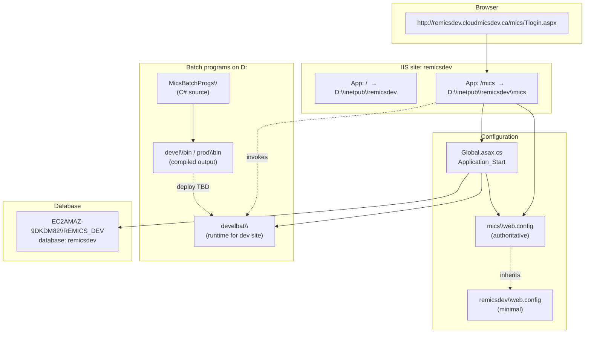
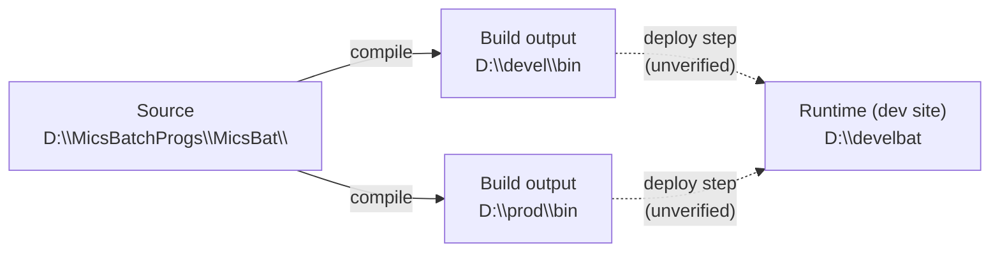

# ReMICS Dev — infrastructure mapping

**Codebase:** remicsdev  
**Verified:** 2026-06-17 (IIS `appcmd`, filesystem, `web.config`, `Global.asax.cs`)  
**Context file:** [`context/codebases/remicsdev.yaml`](../../context/codebases/remicsdev.yaml)

This document maps how a browser request reaches disk, configuration, batch programs, and SQL Server for the **remicsdev** environment. It is the foundation for deeper docs on login flow, individual pages, and batch tools.

---

## Big picture

MICS is not a single folder on disk. It spans:

1. An **IIS site** with two applications (root + `/mics`)
2. A **web application** under `mics\` with its own `web.config`
3. **C# batch executables** on `D:\` (source, build output, and runtime copy)
4. **SQL Server** on a separate machine



---

## URL → IIS → disk

### Primary entry point

| URL path | IIS site | IIS application | Physical path |
|----------|----------|-----------------|---------------|
| `http://remicsdev.cloudmicsdev.ca/mics/Tlogin.aspx` | `remicsdev` | `/mics` | `D:\inetpub\remicsdev\mics\Tlogin.aspx` |

The **`/mics`** segment matters. It is not just a subfolder of the site root — it is registered as a **separate IIS application** with its own application root and `web.config`.

### IIS site: `remicsdev` (verified)

| Property | Value |
|----------|-------|
| Site ID | 2 |
| State | Started |
| Host binding | `http/*:80:remicsdev.CLOUDMICSDEV.ca` |
| App pool (both apps) | `remicsdevapp` |

### Applications under `remicsdev`

| IIS path | Physical path | Role |
|----------|---------------|------|
| `/` | `D:\inetpub\remicsdev` | Site root — sibling tools and folders (COMS, FCC, sdfImport, etc.) |
| `/mics` | `D:\inetpub\remicsdev\mics` | **Main MICS web application** — login, menus, data search, reports |

Both applications use the same app pool **`remicsdevapp`**:

| Property | Value |
|----------|-------|
| .NET runtime | v4.0 |
| Pipeline mode | **Classic** |
| Identity | `cloudmicsdev\IISReMicsSer` |
| State | Started |

### Other IIS sites on this server (related environments)

| Site | Binding | MICS app | Notes |
|------|---------|----------|-------|
| `remicstest` | `remicstest.cloudmicsdev.ca` | `remicstest/mics` | Test environment; same `/mics` pattern |
| `REMICS` | `http/*:8080` | — | Separate site on port 8080 |
| `Default Web Site` | `http/*:80` (default) | — | Not remicsdev |

---

## Filesystem layout

### Site root: `D:\inetpub\remicsdev`

Contains the IIS site root application plus standalone sibling folders. These are **not** all part of `mics.sln`, but they share the same IIS site hostname.

| Folder | Typical role |
|--------|----------------|
| `mics\` | Main ASP.NET web app (**primary focus**) |
| `COMS\` | Related component |
| `FCC\`, `ISED\` | Domain-specific modules |
| `CopyAnyTable\`, `KillTable\`, `SQLtoFlat\` | Utility / admin tools |
| `micsBatch\` | Batch-related web or tooling |
| `sdfImport\`, `sdfValidate\` | SDF import/validation |
| `Tbulkprint\` | Bulk print |
| `bin\` | Site-root bin (separate from `mics\bin`) |
| `web.config` | Minimal parent config (see below) |

### Web application root: `D:\inetpub\remicsdev\mics`

This is the working directory for MICS web development.

**Important:** This folder is **both** the IIS runtime root and the Visual Studio source tree (`mics.sln`, `mics.csproj`). There is no separate web source copy on this server — see [Source layout](source-layout.md).

| Item | Path | Notes |
|------|------|-------|
| Solution | `mics.sln` | Visual Studio 2022; large multi-project solution |
| Main project | `mics.csproj` | Web Forms, namespace `mics` |
| Login page | `Tlogin.aspx` + `Tlogin.aspx.cs` | Forms auth entry |
| Application bootstrap | `Global.asax` / `Global.asax.cs` | Loads all `web.config` settings into `Application[]` |
| Compiled web DLL | `bin\mics.dll` | ASP.NET output |
| Authoritative config | `web.config` | All app settings, auth, compilation |
| Sub-apps / areas | `FCCInfo\`, `lookuptsip\`, `reports\`, `LAML\`, … | Nested folders; some have own `.sln` or `web.config` |

---

## Configuration: two `web.config` files

ASP.NET merges configuration from parent to child. For requests under `/mics/`, the **application root** is `mics\`, so that folder's `web.config` is authoritative for app settings.

### Parent (site root) — minimal

**Path:** `D:\inetpub\remicsdev\web.config`

- Directory browsing enabled
- Forms authentication mode declared
- **No** `appSettings`, **no** connection strings, **no** SQL or batch paths

### Application (MICS) — authoritative

**Path:** `D:\inetpub\remicsdev\mics\web.config`

Contains everything the running app needs:

| Section | Purpose |
|---------|---------|
| `<appSettings>` | Site URLs, DB name, ODBC DSN, SQL instance, batch directory (`ProgDir`), AD settings, feature flags |
| `<connectionStrings>` | Active Directory LDAP connection |
| `<system.web>` | Forms auth (`loginUrl="Tlogin.aspx"`), membership provider, compilation (.NET 4.8), session state, Telerik handlers |
| `<system.webServer>` | Request size limits, Telerik modules |

Key values for **remicsdev** (from `appSettings`):

| Key | Value | Meaning |
|-----|-------|---------|
| `SiteType` | `remicsdev` | Environment identifier |
| `SiteName` | `http://remicsdev.cloudmicsdev.ca/mics/` | Canonical app URL |
| `Web_drive` | `D:` | Drive letter prepended to paths |
| `ProgDir` | `\develbat\` | Batch program folder (relative to drive) |
| `DBName` | `remicsdev` | SQL database name |
| `SQL_INSTANCE` | `EC2AMAZ-9DKDM82\REMICS_DEV` | SQL Server instance |
| `ODBC_DSN` | `remicsdev` | ODBC data source name |

**Evidence this is the correct config:** `Global.asax.cs` reads these keys at startup; they exist only in `mics\web.config`. `SiteName` explicitly includes `/mics/`.

---

## Startup wiring: `Global.asax.cs`

On application start, MICS copies `web.config` values into **`Application[]`** state (available to all pages for the life of the app pool).

Important derived values:

```117:122:D:\inetpub\remicsdev\mics\Global.asax.cs
            // set full path to batch programs directory
            Application["prog_dir"] = Application["web_drive"].ToString() + Application["ProgDir"].ToString();
            // set up connection string for use as sqlclient
            Application["sqlclient_cnString"] = "Server=" + Application["Sql_Instance"].ToString() +
                                    ";Database=" + Application["db_name"].ToString() +
                                    ";Trusted_Connection=true;";
```

| `Application` key | Source | Resolved value (remicsdev) |
|-------------------|--------|----------------------------|
| `web_drive` | `Web_drive` | `D:` |
| `ProgDir` | `ProgDir` | `\develbat\` |
| **`prog_dir`** | computed | **`D:\develbat\`** |
| `Sql_Instance` | `SQL_INSTANCE` | `EC2AMAZ-9DKDM82\REMICS_DEV` |
| `db_name` | `DBName` | `remicsdev` |
| **`sqlclient_cnString`** | computed | `Server=EC2AMAZ-9DKDM82\REMICS_DEV;Database=remicsdev;Trusted_Connection=true;` |
| `site_name` | `SiteName` | `http://remicsdev.cloudmicsdev.ca/mics/` |

Pages and code throughout MICS typically use `Application["prog_dir"]` when launching batch executables and `Application["sqlclient_cnString"]` (or ODBC via `ODBC_DSN`) for database access.

---

## Batch programs

Batch logic is split across **three disk locations** on `D:`:



| Location | Path | Role |
|----------|------|------|
| **Source** | `D:\MicsBatchProgs\MicsBat\` | C# source; `MicsBat.sln` and per-tool solutions (e.g. `CopyTable.sln`, `FeImport.sln`) |
| **Sibling source trees** | `D:\MicsBatchProgs\MICSH\`, `MICSTSIP\` | Additional batch code (scope TBD) |
| **Build output (devel)** | `D:\devel\bin\` | ~182 compiled `.exe` / support files |
| **Build output (prod)** | `D:\prod\bin\` | ~191 compiled `.exe` / support files |
| **Runtime (remicsdev)** | `D:\develbat\` | Executables the **dev web site** invokes via `Application["prog_dir"]` |

The web app does **not** point at `MicsBatchProgs` or `devel\bin` directly. For remicsdev, `web.config` sets `ProgDir` to `\develbat\`, which resolves to **`D:\develbat\`**.

Example executables present in `D:\develbat\`: `CheckMicsConfig.exe`, `CompareReports.exe`, `ComsearchToTAFL.exe`, …

### Open: build vs deploy

**Not yet verified:** how `.exe` files move from `D:\devel\bin` or `D:\prod\bin` into `D:\develbat`. Document when traced.

---

## Database

| Property | Value |
|----------|-------|
| Engine | Microsoft SQL Server |
| Instance | `EC2AMAZ-9DKDM82\REMICS_DEV` |
| Database | `remicsdev` |
| Server location | Separate machine (not this IIS box) |
| ODBC DSN | `remicsdev` |
| Web connection pattern | Windows integrated auth via `Trusted_Connection=true` in `sqlclient_cnString` |

The app pool identity (`cloudmicsdev\IISReMicsSer`) must have SQL access for integrated auth to work.

**Ad-hoc access from CentralProject:** [Database access](database-access.md) — `scripts/Invoke-RemicsDevSql.ps1`, schema overview, read/write conventions.

---

## Related site URLs (from web.config)

Configured in `mics\web.config` for cross-environment links and routing:

| Environment | URL |
|-------------|-----|
| Dev (this) | http://remicsdev.cloudmicsdev.ca/ |
| Test | http://remicstest.cloudmicsdev.ca/ |
| Prod (local) | http://remicsproddev.cloudmicsdev.ca/ |
| Prod (remote) | https://micsprod.cloudmicsdev.ca/ |
| Import | http://micsimport.cloudmicsdev.ca/ |

---

## Request walkthrough: login page

Tracing one request clarifies the mapping:

1. Browser requests `http://remicsdev.cloudmicsdev.ca/mics/Tlogin.aspx`
2. IIS site **`remicsdev`** receives it (host header match)
3. IIS routes to application **`/mics`** → physical `D:\inetpub\remicsdev\mics\`
4. ASP.NET loads **`mics\web.config`** (merged with parent)
5. If app pool just started, **`Global.asax.cs` `Application_Start`** runs once — populates `Application["prog_dir"]`, SQL connection info, site URLs, etc.
6. **`Tlogin.aspx`** / **`Tlogin.aspx.cs`** handle the login UI and AD membership validation
7. On success, forms auth cookie set; subsequent requests use same `/mics` application and `Application[]` state

---

## How to verify this mapping

Run in PowerShell (IIS config read access required):

```powershell
# Sites
& "$env:windir\system32\inetsrv\appcmd.exe" list site

# Applications (look for remicsdev/mics)
& "$env:windir\system32\inetsrv\appcmd.exe" list app

# Full detail for remicsdev site (includes physical paths)
& "$env:windir\system32\inetsrv\appcmd.exe" list site "remicsdev" /text:*

# MICS application only
& "$env:windir\system32\inetsrv\appcmd.exe" list app "remicsdev/mics" /text:*
```

Filesystem checks:

```powershell
Test-Path D:\inetpub\remicsdev\mics\Tlogin.aspx
Test-Path D:\inetpub\remicsdev\mics\bin\mics.dll
Test-Path D:\develbat\CheckMicsConfig.exe
```

---

## Open questions

Track here until resolved in future docs:

1. **Batch deploy pipeline** — copy script, manual step, or build post-event from `devel\bin` → `develbat`?
2. **`prod\bin` vs `devel\bin`** — which environment uses which?
3. **`MICSH` and `MICSTSIP`** — part of MICS batch workflow or separate?
4. **Sibling folders** at `D:\inetpub\remicsdev\` (COMS, FCC, etc.) — separate IIS apps or static folders under site root only?

---

## Next documentation topics

Suggested order for understanding the codebase:

1. **Startup & configuration** — full `Application[]` key reference, auth/membership, session lifecycle
2. **Login flow** — `Tlogin.aspx` → AD → session setup → redirect
3. **Web app structure** — major folders under `mics\`, shared libraries, how pages call batch programs
4. **Batch programs** — `MicsBat.sln` project catalog, typical invoke pattern from web code
5. **Database** — schemas, ODBC usage vs SqlClient, stored procedures
