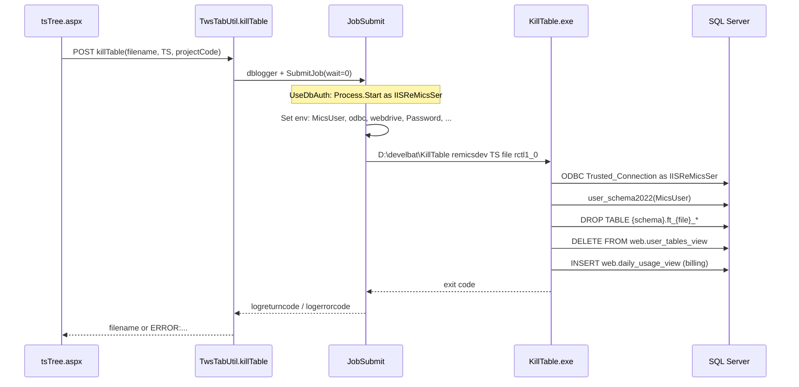

# KillTable TS delete failure (UseDbAuth / remicsdev)

**Status:** Fixed on remicsdev (2026-07-28)

**Symptom:** Logging in as `rctl1`, opening TS files in WebMICS, and choosing **Delete** showed a system error popup mentioning KillTable. The popup text could not be copied; it affected TS (and other) file types using the same path.

**Environment:** `remicsdev`, `UseDbAuth=true`, app pool `remicsdevapp` / `CLOUDMICSDEV\IISReMicsSer`.

---

## How the bug was found

### 1. Trace the web call chain

Delete from the TS tree (`Ttsmenu/tsTree.aspx`) posts to:

```
Tfileactions/TwsTabUtil.asmx/killTable
```

with JSON `filename`, `filetype` (`TS`), and `projectCode`.

The ASMX method `killTable` in `TwsTabUtil.asmx.cs`:

1. Checks session via `getconnstring()`
2. Wraps work in `MicsDbAuth.ImpersonateForJob(Session["principalw"])` (no-op under UseDbAuth)
3. Creates a `dblogger` for `Session["prog_dir"] + "KillTable"` → `D:\develbat\KillTable`
4. Sets `logargs` to `{db_name} TS {filename} {projectCode}`
5. Calls `JobSubmit.SubmitJob(oLog, " ", 0)` and `oLog.Finish()`
6. Maps return codes to user-facing `ERROR:` strings

### 2. Reproduce without the browser popup

Because the UI alert blocks copying the message, the failure was reproduced with an authenticated HTTP POST (Forms login as `rctl1`, then POST to the ASMX). That returned:

```json
{"d":"ERROR: Unspecified error running KillTable - See dblogger"}
```

That string means `logerrorcode` was not `0`, `-98`, or `-99` — the batch ran but exited with an error (typically `logreturncode` from `KillTable.exe`).

### 3. Read the submit log (most useful artifact)

`JobSubmit` writes per-user diagnostics to:

```
D:\extractlogs\remicsdev_{user}submit5.txt
```

For a failed delete, the log showed:

```
UseDbAuth: spawn as app pool via Process.Start
Progargs: D:\develbat\KillTable remicsdev TS {filename} rctl1_0
Exit code: 2
logreturncode: 2
logerrorcode: -1
logerrordesc: Error 2 from D:\develbat\KillTable
```

`KillTable` return code **2** = failure opening the DB connection or resolving the user schema (see batch source comments).

### 4. Compare with a working batch job

`exportTable` → `ftPrint` succeeded under the same UseDbAuth / `Process.Start` path. That showed job spawning and ODBC were generally fine; the problem was specific to how `KillTable` resolves schema.

### 5. Isolate the schema lookup

`KillTable.exe` connects with **Windows integrated auth** (`Trusted_Connection=True`) as whoever spawned the process — under UseDbAuth that is **`IISReMicsSer`**, not `rctl1`.

It then runs:

```sql
SELECT RTrim(dbo.user_schema2022('{MicsUser}'))
```

Testing as `IISReMicsSer` (`EXECUTE AS LOGIN`):

| Query | Result |
|-------|--------|
| `sys.database_principals` where `name = 'rctl1'` | **0 rows** (app pool cannot see that principal) |
| `dbo.user_schema2022('rctl1')` (before fix) | **NULL** |
| `SELECT PrimarySchema FROM dbo.t_UserDetails WHERE micsId = 'rctl1'` | **`rctl`** |

The old `user_schema2022` only consulted `sys.database_principals`. Under the app pool identity that returned NULL; casting the scalar to `(string)` in `KillTable` threw, which surfaced as exit code **2**.

---

## How the code works (end-to-end)



### Web layer

| Piece | Role |
|-------|------|
| `tsTree.aspx` | User confirms delete; `callajaxchrome` POSTs to `killTable` |
| `TwsTabUtil.asmx.cs` | Builds `dblogger`, submits job, maps exit codes |
| `JobSubmit.cs` | UseDbAuth → `SubmitJobViaProcessStart` (no `CreateProcessAsUser`) |
| `MicsDbAuth.cs` | `ImpersonateForJob` is a no-op when `UseDbAuth=true` |

### Batch program (`KillTable.exe`)

Source: `D:\inetpub\remicsdev\KillTable\Program.cs` (also under `MicsBatchProgs`); runtime: `D:\develbat\KillTable.exe`.

| Step | Behavior |
|------|----------|
| Args | `[0]` database, `[1]` file type, `[2]` filename, `[3]` project code |
| Env | `MicsUser`, `odbc`, `webdrive` from parent process |
| Connect | `DSN={odbc};DATABASE={dbase};Trusted_Connection=True;MARS_Connection=yes` |
| Schema | `dbo.user_schema2022(MicsUser)` |
| TS delete | Drop `rctl.ft_{name}_{ante,chan,chng,shrl,site,titl}`; delete `web.user_tables_view` row (`tabletype=0`) |
| Billing | Insert into `web.daily_usage_view` |
| Return codes | `0` success; `2` connection/schema; `7` drop failed; etc. |

### Why AD login worked but UseDbAuth did not

| Auth mode | Who runs `KillTable` | Schema lookup |
|-----------|----------------------|---------------|
| AD (`UseDbAuth=false`) | `CreateProcessAsUser` as `CLOUDMICSDEV\rctl1` | `user_schema2022` saw `rctl1` in `sys.database_principals` (member of `ROLwebusers`) |
| DB (`UseDbAuth=true`) | `Process.Start` as `IISReMicsSer` | Old function returned NULL; cast failed → exit **2** |

Programs like **`ftPrint`** still worked because they use **`Ssutil` / SQLConnect with `MicsUser` + `Password`** from environment variables, not `user_schema2022` over a pure Trusted_Connection path at startup.

### What the user sees in the browser

If the ASMX returns a string starting with `ERROR` (and not `ERRORS`), `Tutils.js` `callajax` shows:

1. `from Tutils:` + the server message  
2. `A SYSTEM ERROR HAS OCCURRED: Details have been forwarded to FCSA for analysis.`  
3. Redirect to `relogin.aspx`

`tsTree.aspx` uses `callajaxchrome`, which does not check the response body on success; other menus / flows using `callajax` with a callback will show the popup above.

---

## Fix applied (remicsdev)

### Primary fix: `dbo.user_schema2022`

Altered the function to resolve schema from **`dbo.t_UserDetails.PrimarySchema`** first (readable by `IISReMicsSer`), then fall back to the original `sys.database_principals` lookup for AD-era users:

```sql
ALTER FUNCTION [dbo].[user_schema2022] (@instring VARCHAR(20))
RETURNS CHAR(8)
AS
BEGIN
    DECLARE @uschema CHAR(8);
    SELECT @uschema = RTRIM(PrimarySchema)
    FROM dbo.t_UserDetails
    WHERE RTRIM(micsId) = RTRIM(@instring);
    IF @uschema IS NULL OR @uschema = ''
        SELECT @uschema = default_schema_name
        FROM sys.database_principals
        WHERE type = 'U' AND name = @instring;
    RETURN (@uschema);
END
```

This fixes **KillTable** and any other batch program that calls `user_schema2022` under the app pool (e.g. `CopyTable`, `sdfImport`, `sdfValidate`).

### Secondary change (harmless; not sufficient alone)

```sql
GRANT EXECUTE ON dbo.user_schema2022 TO [CLOUDMICSDEV\IISReMicsSer];
```

Execute permission alone did not fix the bug; the function still returned NULL until it read `t_UserDetails`.

### Verification

```sql
EXECUTE AS LOGIN = 'CLOUDMICSDEV\IISReMicsSer';
SELECT RTRIM(dbo.user_schema2022('rctl1'));  -- expect: rctl
REVERT;
```

Web `killTable` POST after fix returned `{"d":"dog"}` (success). Submit log showed `Exit code: 0`.

---

## Diagnostics cheat sheet

| What to check | Where |
|---------------|--------|
| Batch exit code | `D:\extractlogs\remicsdev_{user}submit5.txt` |
| Job row (may lag `Finish`) | `web.dblogger` — columns `logprogram`, `logargs`, `logreturncode`, `logerrorcode`, `logerrordesc` |
| Optional KillTable trace | `web.debuglogs` (`debugmodule='KillTable'`) → `D:\MicsWebLogs\auxeng\{db}_{user}KillTable.txt` |
| Reproduce without UI | Forms login + POST `Tfileactions/TwsTabUtil.asmx/killTable` |
| App pool identity | `appcmd list apppool remicsdevapp /text:processModel.userName` |

### `killTable` return mapping (web)

| Server string | Meaning |
|---------------|---------|
| `{filename}` | Success |
| `ERROR: Unspecified error running KillTable - See dblogger` | Batch ran; non-zero exit (see submit log) |
| `ERROR: Unable to start KillTable program` | `logerrorcode -98` (spawn failed) |
| `ERROR:Could not determine default schema` | KillTable exit `2` (mapped in switch) |
| `ERROR:Dropping tables failed` | KillTable exit `7` |
| `ERROR:System problem running batch job killTable` | Unhandled exception in ASMX |

---

## Rollout notes

- Apply the **`user_schema2022`** change on any environment using **UseDbAuth** where batch jobs run as the app pool and call this function.
- Apply **`fix-user_tables_view.sql`** on UseDbAuth dev/test sites (see [killtable-hardening-fix.md](killtable-hardening-fix.md)).
- Deploy hardened **`KillTable.exe`** and **`utilities.dll`** (`ApplyBatchEnvironment`) together; recycle the app pool.
- Related AD-free context: [AD-free auth Phase 2 cut](ad-free-auth-phase2-cut.md), [login flow](login-flow.md).

## See also

- [KillTable hardening (idempotent drop + env)](killtable-hardening-fix.md)

- [Web application structure — KillTable invoke path](web-app-structure.md)
- [Batch programs](batch-programs.md)
- [Test account setup](test-account-setup.md) — mentions `KillTable` on import overwrite
