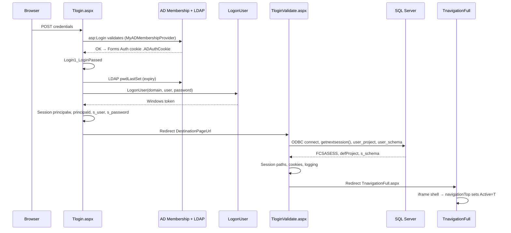

# ReMICS Dev — login flow & session model

**Codebase:** remicsdev  
**Status:** **Complete** (source + browser validated 2026-06-17)  
**Audience:** Auth migration planning — **read session sections carefully**  
**Prerequisite:** [Infrastructure mapping](infrastructure-mapping.md)

---

## Why this doc exists

Authentication is split across **Forms Auth**, **AD Membership**, **Win32 `LogonUser`**, and **SQL session ids**. Session state carries credentials, impersonation handles, DB routing, and file paths used by the entire app including batch jobs.

Any auth redesign must account for what is stored in **`Session[]`**, **`Application[]`**, and cookies today.

---

## Login flow (verified from source)



### Step-by-step

| Step | Page / component | What happens |
|------|------------------|--------------|
| 1 | `Tlogin.aspx` | User submits MICS ID + password via `<asp:Login>` |
| 2 | `web.config` | Forms auth (`loginUrl="Tlogin.aspx"`, cookie `.ADAuthCookie`, timeout **10 min**) + `ActiveDirectoryMembershipProvider` |
| 3 | `Tlogin.aspx.cs` `Login1_LoginPassed` | LDAP password expiry → `Session["DaystoPwdExpiry"]`; **`Session["s_user"]`, `Session["s_password"]`**; **`LogonUser`** → **`Session["principalw"]`** (Windows), **`Session["principald"]`** (Forms/generic) |
| 4 | `Tlogin.aspx` markup | **`DestinationPageUrl="TloginValidate.aspx"`** — auto-redirect after success |
| 5 | `TloginValidate.aspx.cs` | ODBC to SQL; allocate **`FCSASESS`**; load schema/project; set paths; cookies; redirect |
| 6 | `TnavigationFull.aspx` | Frame layout; left menu loads `TnavigationLeft.aspx` |
| 7 | `TnavigationLeft.aspx` (JS) | Sets parent iframe to **`navigationTop.aspx`** |
| 8 | `navigationTop.aspx.cs` | Loads project list; **`Session["Active"] = "T"`** — session considered fully live |

**Verified:** redirect chain `Tlogin` → `TloginValidate` → `TnavigationFull` from `DestinationPageUrl` and `Response.Redirect` in source.

**Verified (browser, 2026-06-17):** Manual login on remicsdev succeeded; `Maintenance/shownetsession.aspx` displayed expected session fields after navigation loaded. Confirms SQL steps (`getnextsession`, schema/project lookup) and session key population at runtime — not just from static analysis.

### Alternate / recovery pages

| Page | Role |
|------|------|
| `relogin.aspx` | Session expired / auth failure; abandons session, `FormsAuthentication.SignOut` |
| `logoff.aspx` | User logout; logs session end, `Session.Abandon`, redirect `relogin.aspx?reason=1` |
| `login2.aspx` | Site inactive (`Site_active=0`) reroute |
| `Maintenance/pwdrecov.aspx` | Password recovery (uses `JobSubmit.SubmitJobPwd`) |
| `Maintenance/shownetsession.aspx` | **Diagnostic** — dumps session keys (use to validate live session) |

---

## Browser validation (passed 2026-06-17)

Manual test on **remicsdev** confirmed the documented flow end-to-end.

### Procedure

1. Incognito browser → `http://remicsdev.cloudmicsdev.ca/mics/Tlogin.aspx`
2. Log in with valid MICS credentials
3. Confirm main navigation frame shell loads
4. Same session → `http://remicsdev.cloudmicsdev.ca/mics/Maintenance/shownetsession.aspx`
5. Compare output to session key tables in this doc

### Result

| Check | Outcome |
|-------|---------|
| Login + redirect to navigation | **Pass** |
| `shownetsession.aspx` accessible with session | **Pass** |
| Session fields populated (`FCSASESS`, `s_user`, `db_name`, `prog_dir`, `user_dir`, etc.) | **Pass** |
| `Active` = `T` (after navigation loaded) | **Pass** (when tested after full UI load) |

### Optional corroboration (recommended for automation tier 3)

| Check | Path |
|-------|------|
| Login trace log | `D:\MicsWebLogs\logins\<user>_conn.txt` |
| User workspace | `D:\inetpub\remicsdev\mics\userdirs\<schema>\<user>\` |
| Forms / session cookies | Browser dev tools → `.ADAuthCookie`, `ASP.NET_SessionId` |

This manual test is the **template for automated tiers 1–2**. See [automated-testing.md](automated-testing.md).

---

### Three layers

| Layer | Mechanism | Lifetime | Auth migration impact |
|-------|-----------|----------|------------------------|
| **ASP.NET Session** | `Session["key"]`, **InProc** | Until timeout/abandon | **Primary** — most state lives here |
| **Application** | `Application["key"]` from `Global.asax` | App pool lifetime | Site config mirror; not per-user |
| **Cookies** | Forms auth + preferences | Browser | `.ADAuthCookie`, `PrefUID`, `PrefTime`, `PrefHelp` |

**Verified** `web.config`:

```xml
<sessionState mode="InProc" cookieless="false" />
<authentication mode="Forms">
  <forms loginUrl="Tlogin.aspx" name=".ADAuthCookie" slidingExpiration="true" timeout="10" />
</authentication>
```

**Note:** Forms timeout (10 min) and IIS session timeout may diverge — code comments reference a gap where forms expires before session cleanup.

### Dual session identifiers

| ID | Source | Purpose |
|----|--------|---------|
| `Session.SessionID` | ASP.NET | IIS session cookie `ASP.NET_SessionId` |
| **`Session["FCSASESS"]`** | SQL `dbo.getnextsession()` | **MICS business session id** — used in logging, `dblogger`, menu tracking |

**Verified** allocation in `TloginValidate.aspx.cs`:

```csharp
OdbcCommand getsesid = new OdbcCommand("{ ? = CALL dbo.getnextsession() }", cn1);
Session["FCSASESS"] = getsesid.Parameters["RETURN_VALUE"].Value.ToString();
```

### Windows impersonation in session

**Verified** — batch jobs depend on this:

| Key | Set in | Used for |
|-----|--------|----------|
| **`Session["principalw"]`** | `Tlogin.aspx.cs` after `LogonUser` | `JobSubmit.CreateProcessAsUser` — runs batch as **logged-in Windows user** |
| **`Session["principald"]`** | `Tlogin.aspx.cs` | Swapped in `Global.asax` `PreRequestHandlerExecute` / `PostRequestHandlerExecute` |
| **`Session["s_password"]`** | `Tlogin.aspx.cs` | Passed to batch via env var `Password` in `JobSubmit` |

**Auth migration flag:** Removing password from session or changing to token-based auth **breaks batch launch** unless `JobSubmit` is updated.

---

## Session keys — login pipeline (set during auth)

Keys set in **`Tlogin.aspx.cs`** (`Login1_LoginPassed`):

| Key | Content | Sensitivity |
|-----|---------|-------------|
| `s_user` | MICS username | Identity |
| **`s_password`** | **Plaintext password** | **Critical** |
| `DaystoPwdExpiry` | Days until AD password expires | Low |
| `principald` | GenericPrincipal (Forms) | Auth |
| `principalw` | WindowsPrincipal (from LogonUser token) | Auth / impersonation |
| `loginType` | `"2"` (set on Page_Load) | Config |

Keys set in **`TloginValidate.aspx.cs`**:

| Key | Source / meaning |
|-----|------------------|
| `db_name` | `web.config` or override by username prefix (`import*`, `venn2`, `hulme2`) |
| `site_type` | `SiteType` appSetting (`remicsdev`) |
| `sqlclient_cnString` | Built from `Sql_Instance` + `db_name` |
| `prog_dir` | `D:\develbat\` |
| `s_cnString` | ODBC `DSN=...;DATABASE=...;Trusted_Connection=yes` |
| **`FCSASESS`** | SQL `getnextsession()` |
| `defProject` | SQL `dbo.user_project2022(username)` |
| **`s_schema`** | SQL `dbo.user_schema()` |
| `SiteName`, `Domain`, `Path`, `Ports` | From `web.config` |
| `home_path` | `D:\Users\<user>\` |
| **`user_dir`** | `D:\Inetpub\<site_type>\mics\userdirs\<schema>\<user>\` |
| `nSessionCounter` | `0` |
| `SESSLEN` | `Session.Timeout` |
| `projStart` / `ProjStart` | Timestamp `yyyyMMddHHmmss` (inconsistent casing in source; session keys are case-insensitive at runtime) |
| `CloseReason` | `"T"` (timeout default; `"L"` logout, `"R"` restart) |
| `logError` | `0` |
| `Active` | Not set here — set `"T"` in `navigationTop.aspx.cs` |

---

## Session keys — used after login (high-traffic)

**Verified** via `scripts/extract-session-keys.ps1` (2026-06-17): **42 unique keys**, excluding `*_Backup_*` folders.

| Key | References | Role |
|-----|------------|------|
| `s_cnString` | 726 | ODBC connection string |
| `s_schema` | 713 | SQL schema / ultrix id |
| `SiteName` | 302 | Base URL for links |
| `principalw` | 290 | Windows impersonation |
| `s_user` | 272 | MICS user id |
| `user_dir` | 218 | Per-user file workspace |
| `FCSASESS` | 156 | MICS session id |
| `db_name` | 180 | Database name |
| `prog_dir` | 85 | Batch program directory |
| `defProject` | 34 | Current project code |
| `CloseReason` | 26 | Session end reason |
| `Active` | 13 | `"T"` = logged in and navigation ready |

Full key list: run `.\scripts\extract-session-keys.ps1`.

---

## Cookies

| Cookie | Set when | Purpose |
|--------|----------|---------|
| `.ADAuthCookie` | Forms auth success | ASP.NET authentication ticket |
| `ASP.NET_SessionId` | First session access | InProc session binding |
| `PrefUID` | First login if missing | Remember username |
| `PrefTime` | First login | Session timeout preference (minutes) |
| `PrefHelp` | First login | Help file access flag (`validaccess`) |

**Verified** defaults in `TloginValidate.aspx.cs`: `PrefTime=20`, domain from `SiteDomain`.

---

## Request-guard model (post-login)

**Verified** `Global.asax.cs`:

- **`Session_Start`:** `Session["Active"] = "F"`
- **`PreRequestHandlerExecute`:** For authenticated requests (except login pages), re-applies **`Session["principalw"]`** impersonation; on failure redirects to **`relogin.aspx`**
- **`Session_End` / `logoff`:** If `Active == "T"`, logs session end via `SesUtils.LogSessionEnd`

Session is not fully "active" until **`navigationTop`** sets `Active = "T"`.

---

## Database touchpoints during login

| Call | Purpose |
|------|---------|
| `dbo.getnextsession()` | Allocate `FCSASESS` |
| `dbo.user_project2022(username)` | Default project |
| `dbo.user_schema()` | Schema / ultrix id |
| `adm.account_details_ip` | IP tracking; email on new IP |
| `adm.account_details` | Email for login notification |
| `adm.project_ids_view` | Project dropdown (navigationTop) |

**Open:** Stored procedures not inspected on SQL Server — existence assumed from code.

---

## Filesystem side effects

**Verified** paths from `TloginValidate.aspx.cs`:

| Path | Purpose |
|------|---------|
| `D:\MicsWebLogs\logins\<user>_conn.txt` | Login debug log |
| `D:\Inetpub\<site_type>\mics\userdirs\<schema>\` | User dir root (created if missing) |
| `D:\Inetpub\<site_type>\mics\userdirs\<schema>\<user>\` | **`Session["user_dir"]`** |
| `D:\Users\<user>\` | **`Session["home_path"]`** |
| `D:\perflogs\goodwinlogin.txt` | Win32 login trace |
| `D:\extractlogs\` | Job submit debug |

**Verified:** `D:\inetpub\remicsdev\mics\userdirs` exists on server.

---

## How to validate live

See **Browser validation** above (passed 2026-06-17). To re-run:

1. Log in at `http://remicsdev.cloudmicsdev.ca/mics/Tlogin.aspx`
2. After main navigation loads, open **`/mics/Maintenance/shownetsession.aspx`**
3. Compare output to keys in this doc
4. Optional: check `D:\MicsWebLogs\logins\<user>_conn.txt` and `userdirs\` on server

For developers: run `.\scripts\extract-session-keys.ps1` after code changes to detect new session dependencies.

Future: automate via [automated-testing.md](automated-testing.md) tiers 1–3.

---

## Auth migration — critical dependencies

| Today | Consumers | Risk if removed |
|-------|-----------|-----------------|
| `Session["s_password"]` | `JobSubmit` env `Password` | Batch jobs fail |
| `Session["principalw"]` | `JobSubmit`, `Global.asax` | Batch + page impersonation fail |
| Forms + AD Membership | `Tlogin.aspx` Login control | Login UI breaks |
| `LogonUser` | Windows token for batch | Batch identity wrong |
| `FCSASESS` | Logging, `dblogger`, menus | Audit trail breaks |
| InProc session | Everything | Must replatform state if scaling out |

---

## Open questions

1. Is `dbo.user_schema()` still correct vs commented `user_schema2022(username)`?
2. `projStart` vs `ProjStart` — confirm case-insensitivity in target .NET version
3. When exactly is Forms cookie renewed vs session timeout?
4. Full inventory of pages that read `Session["s_password"]` beyond `JobSubmit`
5. ~~Runtime test of `getnextsession()` on REMICS_DEV SQL instance~~ — **Resolved:** browser login + `FCSASESS` on `shownetsession` (2026-06-17)

---

## LogonUser and IIS (2026-06-29)

Web login calls `LogonUser` in `Tlogin.aspx.cs` **after** AD Membership succeeds. Token type affects SQL and batch.

| Logon type | Use from IIS | SQL `Trusted_Connection` | Notes |
|------------|--------------|--------------------------|-------|
| **INTERACTIVE (2)** | Primary | Works | Requires **Allow log on locally** for domain users on the IIS server |
| **BATCH (4)** | Fallback | Works | Requires **Log on as a batch job** |
| **NETWORK (3)** | **Do not use** | **Fails** (`NT AUTHORITY\ANONYMOUS LOGON`) | Was briefly tried for error 1385 — breaks `TloginValidate` |

**Error 1385** (`ERROR_LOGON_TYPE_NOT_GRANTED`): the IIS server has not granted domain users **INTERACTIVE** or **BATCH** logon. Fix on each IIS server — **not** SQL Server:

| User Rights Assignment | Add |
|------------------------|-----|
| Allow log on locally | `CLOUDMICSDEV\Domain Users` |
| Log on as a batch job | `CLOUDMICSDEV\Domain Users` |

**Permanent fix:** add both rights to **MICS IIS Server Rights** (or a new GPO linked/filtered to IIS servers only). **Do not rely on local `secedit` alone** — domain `gpupdate /force` reapplies the GPO and removes manual local additions (confirmed 2026-06-29 ~16:10 on IIS-ReMics-Prod).

**Temporary workaround:** append Domain Users SID to `SeInteractiveLogonRight` and `SeBatchLogonRight` via `secedit /configure` on the IIS box until the GPO is updated.

**Do not use NETWORK (3) logon** to work around 1385 — it obtains a token but ODBC `Trusted_Connection=yes` fails at `TloginValidate` with `NT AUTHORITY\ANONYMOUS LOGON`.

**Login page message:** `Tlogin.aspx?winlogon=1385` shows the Win32 code and remediation (updated 2026-06-29).

**Misleading “session timed out”:** `relogin.aspx` when `Session["principalw"]` is missing after Forms auth succeeded. Check `D:\perflogs\goodwinlogin.txt` for Win32 code.

Full session write-up: [session-2026-06-29-login-import-fixes.md](session-2026-06-29-login-import-fixes.md).

---

## Related

- [TODO](../TODO.md) — batch analysis next; automated test tiers 1–4 queued
- [Automated testing strategy](automated-testing.md) — how to automate this validation
- [Web app structure](web-app-structure.md) — batch invocation via session
- [extract-session-keys.ps1](../../scripts/extract-session-keys.ps1)
