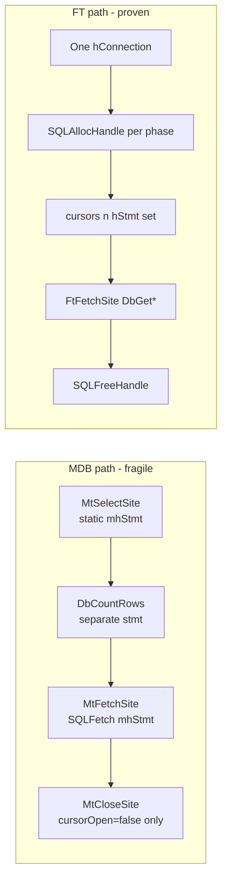

# MDB site fetch bug analysis (Si Ke findings)

**Status:** Analysis complete (2026-07-24)  
**Related:** [TSIP deep dive](tsip.md) · [application learnings](application-learnings.md)  
**Fix plan:** [mdb-site-fetch-fix-plan-option-a.md](mdb-site-fetch-fix-plan-option-a.md)

---

## Summary

Si Ke proposed replacing `MtUtils.MtGetSiteWN` with a new `MtGetSiteWN2` (and companion `*2` fetch helpers in `DynMdbSite`, `DynMdbAntenna`, `DynMdbChannel`) after working on the TSIP MDB path. Static code review shows **the underlying concern is legitimate**: the MDB site/antenna/channel fetch layer uses a fragile ODBC pattern that differs from the proven non-MDB path (`FtGetSiteWN`). Si's full replacement patch should **not** be merged as-is (contiguity/magicNumber bugs, nonexistent `NewConn(true)` API, heavy duplication).

**Recommended fix:** Option A — minimal cursor/connection cleanup in existing `DynMdb*` classes (see fix plan doc). No code changes applied yet.

---

## Where the code lives

### Call chain when `isMDB=true`

TSIP victim/remote site resolution calls `TtFullSiteGet`, which branches on `isMDB`:

| Step | File | Function |
|------|------|----------|
| 1 | `D:\MicsBatchProgs\MicsBat\TpRunTsip\TpMdbPdfGet.cs` | `TtFullSiteGet` (line ~849) |
| 2 | `D:\inetpub\remicsdev\mics\_Utillib\MtUtils.cs` | `MtGetSiteWN` (line ~105) |
| 3 | `D:\inetpub\remicsdev\mics\_Utillib\DynMdbSite.cs` | `MtSelectSite` / `MtFetchSite` / `MtCloseSite` |
| 4 | Same pattern | `DynMdbAntenna`, `DynMdbChannel` |

**TSIP callers (MDB mode):**

- `TtBuildSH.Vic2DimTable` — enumerates victim sites, calls `TtFullSiteGet(..., isMDB, ...)` per victim
- `TtBuildSH.SetRemData` — remote site lookup via `TtFullSiteGet`

When `envtype = MDB_TS` (all recent archived runs on remicsdev use this), `isMDB=true` and the MDB path is exercised on every victim/remote site fetch.

### Parallel working path (`isMDB=false`)

| File | Function |
|------|----------|
| `D:\inetpub\remicsdev\mics\_Utillib\FtUtils.cs` | `FtGetSiteWN` (line ~837) |
| `D:\inetpub\remicsdev\mics\_Utillib\DynSite.cs` | `FtSelectSite` / `FtFetchSite` |

`FtGetSiteWN` opens one ODBC connection, allocates a **per-phase** statement handle, stores it in `cursors[n].hStmt`, fetches columns with manual `Ssutil.DbGet*`, and explicitly frees handles. This is the pattern Si copied for his `MtGetSiteWN2` proposal.

---

## Architectural mismatch (root cause)



| Aspect | MDB (`MtGetSiteWN`) | Non-MDB (`FtGetSiteWN`) |
|--------|---------------------|-------------------------|
| Statement handle | Static `mhStmt` per `DynMdb*` class | Per-call handle in `cursors[n].hStmt` |
| Cursor struct | `cursors[n].hStmt = Zero`; fetch ignores it | Real `hStmt` stored in cursor |
| Column read | Pre-bound `BindPtrsToCols` + `ReadColBindings` | Manual `Ssutil.DbGet*` after `SQLFetch` |
| Close | `MtCloseSite` flips `cursorOpen`; does not close `mhStmt` cursor | Explicit `SQLFreeHandle` each phase |
| Connection | `MtSelectSite` calls `NewConn()` but stores `hConn = Zero` | One connection for site + ante + chan |

---

## Specific defects in current MDB code

### 1. `MtCloseSite` does not close the ODBC cursor

```368:387:D:\inetpub\remicsdev\mics\_Utillib\DynMdbSite.cs
public static int MtCloseSite(int curHandle)
{
    ...
    Ssutil.DisConn(cursors[curHandle].hConn);  // hConn is always Zero
    cursors[curHandle].hConn = IntPtr.Zero;
    cursors[curHandle].cursorOpen = false;
    return 0;
}
```

Comment claims it closes `hStmt` and `hConn`. In practice only `cursorOpen` is cleared. The active result set on static `mhStmt` remains open until the **next** `MtSelectSite` call runs `SQLFreeStmt(SQL_CLOSE)`. Interleaved ODBC work on the shared connection between select and the next select can produce intermittent `Invalid cursor state` or fetch failures (`Marker G-2`).

### 2. `MtSelectSite` discards the connection handle

```190:261:D:\inetpub\remicsdev\mics\_Utillib\DynMdbSite.cs
SQLHDBC hConn = Ssutil.NewConn();
...
cursors[curHandle].hStmt = SQLHANDLE.Zero;
cursors[curHandle].hConn = SQLHANDLE.Zero;
```

`MtFetchSite` uses static `mhStmt`, not the cursor's `hStmt`. The cursor index is a contiguity token (`magicNumber`), not a real statement reference — unlike `DynSite.FtFetchSite`.

### 3. `MtGetSiteWN` interleaves operations on one connection

Within a single site fetch:

1. `MtSelectSite()` — opens result set on `DynMdbSite.mhStmt`
2. `DynMdbSite.DbCountRows()` — allocates another statement on the same shared connection
3. `MtFetchSite()` — reads from `mhStmt`
4. `MtCloseSite()` — does not close `mhStmt`

MARS on the connection usually allows this, but it is fragile under nested or concurrent ODBC use (typical in long TSIP runs).

### 4. Minor code smell (not the main failure mode)

```177:177:D:\inetpub\remicsdev\mics\_Utillib\MtUtils.cs
SQLLEN[] nullInd = NullHelper.CreateArrayOfNullInd(MtAnte.NUM_COLUMNS, ...);
```

Uses `MtAnte.NUM_COLUMNS` (36) instead of `MtSite.NUM_COLUMNS` (33). Harmless here because `nullInd` is an `out` parameter overwritten by `MtFetchSite`.

---

## Problems with Si's proposed `MtGetSiteWN2` (do not merge as-is)

1. **Contiguity check:** `MtFetchSite2` requires `cursors[n].magicNumber == mMagicNumber`, but `MtGetSiteWN2` bypasses `MtSelectSite` and never increments/assigns `mMagicNumber`. Fails unpredictably after any prior `MtSelectSite` in the process.
2. **API mismatch:** Uses `Ssutil.NewConn(true)` — only `NewConn()` exists today.
3. **Duplication:** Parallel `GetSelectString`, `DbCountRows2`, `MtFetchSite2` / `MtFetchAntenna2` / `MtFetchChannel2` across three Dyn classes instead of fixing the existing path.
4. **Copied typos:** Channel error path still references `nNumAnts` instead of `nNumChan` (same as original).

Si's **direction** (align MDB with `FtGetSiteWN`) is sound; the implementation needs rework.

---

## Log markers to watch when reproducing

| Marker | Meaning |
|--------|---------|
| `MtUtils.MtGetSiteWN(): ERROR: Marker G-2` | Count said 1 site exists but `MtFetchSite` failed |
| `DynMdbSite.MtFetchSite(): failed contiguity test` | `magicNumber` mismatch (-666) |
| `Invalid cursor state` / ODBC `24000` | Statement handle reused while cursor still open |
| `TtBuildSH.SetRemData(): ERROR: call to TtFullSiteGet() failed` | TSIP remote site lookup failed |

Batch logs: `D:\MicsBatchLogs\TpRunTsip.log` (Log2 output is sparse; many errors surface in per-run `.ERR` files under the user's work directory).

---

## Reproduction status on remicsdev

### Reproduction attempt (2026-07-24)

Three MDB_TS TSIP reruns were executed via `Invoke-LastTsipCompare.ps1` (no code changes):

| Baseline | New run | Parm file | `envtype` | Cases | Site fetch errors | Archive site rows |
|----------|---------|-----------|-----------|-------|-------------------|-------------------|
| 40 | 41 | ecomm2602 | MDB_TS | 7 → 7 | None | 1112 → 1112 |
| 39 | 42 | ecomm2601 | MDB_TS | 7 → 7 | None | 1112 → 1112 |
| 38 | 43 | ecomm2601b | MDB_TS | 7 → 7 | None | 3460 → 2404 |

**Searched for bug markers** in:

- `D:\MicsBatchLogs\TpRunTsip.log` — no `MtGetSiteWN`, `Marker G-2`, or contiguity messages
- New report folders under `D:\inetpub\fcsa\admin\tsip-runs\cli072410*` — ERR files show `Environment type: MDB_TS` and `Working . . .` only (no fetch failures)
- All `tsip-runs` trees — no `TtFullSiteGet` / `SetRemData` / `Vic2DimTable` error text

**Conclusion:** The **intermittent ODBC cursor bug was not reproduced** on remicsdev today. All three runs completed with 7 interference cases, `calc_mismatches = 0`, and successful MDB site/antenna/channel archive population for ecomm2602 and ecomm2601.

Run 43 (ecomm2601b) showed fewer archived `site` rows (3460 → 2404) and STATSUM text diffs, but **calc fingerprints matched** and case count was unchanged — this looks like an archive/report-line normalization issue, not `MtGetSiteWN` fetch failure.

**Interpretation:** Static analysis supports Si's concern (fragile cursor lifecycle), but the defect appears **latent or environment-specific** rather than consistently failing on current remicsdev data. Option A remains a prudent hardening step before adopting Si's larger rewrite.
