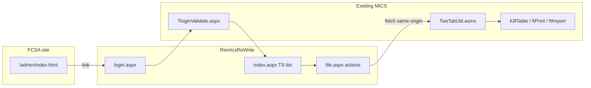

# RemIcsReWrite diagnostic harness — implementation plan

**Status:** Implemented (2026-07-29) — historical; live program = [stabilization plan](remicsrewrite-stabilization-plan.md)  
**Created:** 2026-07-28  
**Context:** KillTable delete fails in legacy UI with instant HTTP 401; browser has no `.ADAuthCookie`. Server-side tests pass. This harness isolates frames/legacy AJAX vs auth/batch.

**Cursor plan file:** `.cursor/plans/remicsrewrite_harness_c6eac697.plan.md`

> **Multi-company:** Login smoke should rotate roster users (`bchy1`, `rctl1`, `xci1`, …), not only `rctl1`.

---

## Goal

Build a standalone, frame-free MICS test harness under `/mics/RemIcsReWrite/` with its own login, TS file browser, and delete/print/import actions using same-origin `fetch` calls to existing batch web services—linked from the FCSA Testing admin page.

## Why this helps

| Outcome | Meaning |
|---------|---------|
| Rewrite works, legacy fails | Problem is frames/legacy JS/cookie path—not KillTable |
| Rewrite also 401, no cookie | Problem is browser/login/forms-auth—not the tree |
| Rewrite login sets cookie, AJAX still 401 | Cookie scope/SameSite/iframe issue narrowed further |



## Entry point

Add a new panel on the FCSA Testing page:

- Source: `sites/fcsa/src/admin/index.html` (and rebuild `dist/`)
- Link target: `/mics/RemIcsReWrite/login.aspx`
- Description: frame-free MICS TS harness for auth/AJAX debugging

## New pages (under remicsdev)

Create folder: `D:\inetpub\remicsdev\mics\RemIcsReWrite\`

### 1. `login.aspx` — fresh login (no `asp:Login` control)

- Simple HTML form: Mics ID, password, Log In
- Code-behind POST handler:
  - `MicsDbAuth.VerifyPassword()`
  - Set `Session["s_user"]`, `Session["s_password"]`, `loginType`, `EnsureProcessPrincipalInSession`
  - `FormsAuthentication.SetAuthCookie(username, false)` once
  - Redirect to `TloginValidate.aspx` for session setup (`s_cnString`, `prog_dir`, `defProject`, `s_schema`, etc.)
- Server-rendered diagnostics: cookie received on POST, `User.Identity.IsAuthenticated`

`web.config` addition in `config/remicsdev/mics/web.config`:

```xml
<location path="RemIcsReWrite/login.aspx">
  <system.web>
    <authorization><allow users="*" /></authorization>
  </system.web>
</location>
```

### 2. `index.aspx` — TS file menu

- Requires forms auth
- Query TS files: `INFORMATION_SCHEMA.TABLES` where `table_name LIKE 'ft_%_titl'` (same as `TwsTStree.TSpopulateTree`)
- Plain HTML list; links to `file.aspx?name={filename}`
- Header: user, schema, `defProject`, server-side `.ADAuthCookie` present yes/no
- Logout → `../relogin.aspx`

### 3. `file.aspx` — selected TS file actions

- Query param `name` (alphanumeric + underscore, max 16 chars)
- Actions via `remics-api.js` + `fetch` with `credentials: 'include'`:

| Action | Endpoint | Notes |
|--------|----------|-------|
| Delete | `../Tfileactions/TwsTabUtil.asmx/killTable` | `filetype: TS` |
| Print | `../Tfileactions/TwsTabUtil.asmx/exportTable` | TS → `ftPrint` |
| Validate | `../Tfileactions/TwsTabUtil.asmx/valFile` | TS → `ftValidate`; report in `userdirs/{schema}/{user}/{name}.txt` |
| Import | `upload.ashx` then `importTable` | browser `.txt` upload |

- Diagnostics panel: last fetch status, response body, hostname

### 4. `upload.ashx` — import file staging

- POST multipart `.txt` → `Session["user_dir"] + {targetName}.tmp`
- Return JSON `{ ok, path, bytes }`
- Then call `importTable` ASMX

### 5. `remics-api.js`

- Same-origin URL helper (like `micsWsUrl()`)
- Parse ASMX `{"d":"..."}` wrapper
- Clear 401 messaging

No jQuery, Telerik, or frames.

## Build and deploy

1. Add files to `mics.csproj`; build `mics.dll` (Release)
2. Recycle `remicsdevapp`
3. Rebuild FCSA site so `/admin/` gets the link

## Safety

- Call existing ASMX only; no KillTable/JobSubmit changes in this pass
- Dev-only link on FCSA Testing admin page
- Import: `.txt` only; respect `maxRequestLength`

## Out of scope (phase 1)

- ES / SDF file types
- Replacing legacy navigation
- New batch executables or SQL
- Fixing root cookie bug (harness informs that separately)

## Test plan (after implementation)

1. Open `http://remicsdev.cloudmicsdev.ca/admin/` → RemIcsReWrite
2. Login as a roster user (e.g. `bchy1` or `rctl1`) → TS list; check `.ADAuthCookie` in Application tab
3. Delete a disposable TS file → expect 200 / filename in response
4. Upload + import + print on throwaway name
5. Same browser: legacy tsTree delete → compare 401 vs success

## Implementation checklist

- [ ] `web.config` anonymous access for `RemIcsReWrite/login.aspx` only
- [ ] `RemIcsReWrite/login.aspx` + code-behind
- [ ] `RemIcsReWrite/index.aspx` + code-behind
- [ ] `RemIcsReWrite/file.aspx` + `remics-api.js`
- [ ] `RemIcsReWrite/upload.ashx`
- [ ] `mics.csproj` entries + build + app pool recycle
- [ ] FCSA `admin/index.html` link + dist rebuild

## Diagnosis (2026-07-29)

Harness delete/print/import **worked on multiple accounts**. Legacy tsTree delete failed with instant HTTP 401 and no `.ADAuthCookie` in DevTools.

| Layer | Legacy tsTree | RemIcsReWrite harness |
|-------|---------------|----------------------|
| KillTable / SQL / batch | Same backend | Same backend |
| ASMX `killTable` | Same endpoint | Same endpoint |
| Login | `asp:Login` + DB verify | Manual verify + **explicit `SetAuthCookie`** |
| AJAX | jQuery `callajaxchrome` (iframes) | `fetch` + `credentials: 'include'` |
| URL | `micsWsUrl()` (fixed) | Same-origin from `window.location` |

**Conclusion:** The bug is **forms-auth cookie not retained on legacy login** (`UseDbAuth`), not KillTable or ASMX logic. Session (`ASP.NET_SessionId`) can exist without `.ADAuthCookie`, so pages load but ASMX returns 401.

**Fix applied:** `Tlogin.aspx.cs` now calls `FormsAuthentication.SetAuthCookie` on the UseDbAuth path (same as harness). `callajaxasync` in `Tutils.js` now sends `withCredentials` for older callers (e.g. `copy.aspx`).

**Follow-up (2026-07-29):** Legacy **export**, **validate**, **import**, and **copy** pages in `Tfileactions/` still built ASMX URLs from `sesSiteName` (web.config hostname) instead of the browser host — same class of bug as delete before `micsWsUrl()`. All `TwsTabUtil.asmx` calls in that folder now use `micsWsUrl()`. `callajax` and `callajaxnocallback` in `Tutils.js` also send `withCredentials`.

**Follow-up (2026-07-29, validate):** `fileToValidate()` must pass `valType` from `parent.txtsType`; `JobSubmit.SubmitJobViaProcessStart` must normalize `ftValidate`/`feValidate` exit codes under UseDbAuth. See [validate-useDbAuth-fix.md](validate-useDbAuth-fix.md).


- Legacy delete: instant 401 on `killTable` ASMX; no `.ADAuthCookie` in browser
- Server sends cookie on login (verified via PowerShell); browser does not retain it
- `micsWsUrl()` fix deployed to `Tutils.js` / `tsTree.aspx` (hostname mismatch) — does not fix missing cookie
- See also: `killtable-delete-bug.md`, `killtable-hardening-fix.md`
