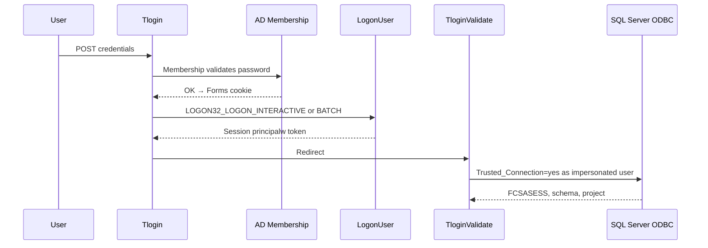

# Session notes — login, batch spawn, and TS import/export (2026-06-29)

**Environment:** remicsdev on **IIS-ReMics-Prod** (`remicsdev.cloudmicsdev.ca`)  
**Server:** `D:\inetpub\remicsdev\mics`, batch `D:\develbat\`  
**Audience:** Future debugging, auth migration, Bill / ops handoff  

---

## Executive summary

This session moved remicsdev from **broken login + batch spawn (1314)** to **working login, export, and import**. Root causes were layered:

| Layer | Symptom | Cause | Fix |
|-------|---------|-------|-----|
| IIS app pool | `CreateProcessAsUser: 1314` | Missing privileges on `IISReMicsSer` | Domain GPO **MICS IIS Server Rights** |
| Windows logon | Error **1385** / “session timed out” | `LOGON32_LOGON_INTERACTIVE` denied for domain users | Local policy: **Domain Users → Allow log on locally** (+ batch) on IIS server |
| SQL after logon | Blank page / `ANONYMOUS LOGON` | Brief use of **NETWORK** logon type | Reverted to **INTERACTIVE → BATCH** only; never NETWORK for web login |
| TS import “Errors found” | Parse errors line 22/67 | **Truncated export file** (~1024 bytes) | **FtPrint** `mTW.Close()` was commented out |
| Misleading UI | “Session timed out” on fresh login | Forms auth OK but `LogonUser` failed → no `principalw` | `Tlogin.aspx.cs` logging + redirect with Win32 code |

**Verified end state (rctl1):** login → navigation, `ftPrint` export of `cat`, `ftImport` as `ctt2` — all succeeded.

---

## What we learned about the application

### 1. Authentication is three steps, not one

MICS login is **not** “AD password → done.”

| Step | Mechanism | Failure mode |
|------|-----------|--------------|
| 1 | AD Membership (`Login1`) | Wrong password — normal login error |
| 2 | Win32 `LogonUser` → `Session["principalw"]` | **1385** logon type not granted; UI showed “session timed out” |
| 3 | ODBC `Trusted_Connection=yes` in `TloginValidate` | SQL login failure; was hidden (blank page) until error labels re-enabled |

**Critical:** AD Membership can succeed while `LogonUser` fails. Without `principalw`, `Global.asax` redirects to `relogin.aspx` (“session timed out”) even on first login.

### 2. Logon type matters for SQL and batch

| Logon type | Value | From IIS for domain users | SQL Trusted Connection | Batch `CreateProcessAsUser` |
|------------|-------|---------------------------|------------------------|----------------------------|
| INTERACTIVE | 2 | Needs **Allow log on locally** on server | Works | Works (when token valid) |
| BATCH | 4 | Needs **Log on as a batch job** | Works | Works |
| NETWORK | 3 | Often succeeds from `LogonUser` | **Fails** — SQL sees `NT AUTHORITY\ANONYMOUS LOGON` | Unusable for this app path |

Do **not** use NETWORK logon for web login on remicsdev.

### 3. Batch jobs depend on session token quality

`JobSubmit.SubmitJob` impersonates `Session["principalw"]` and calls `CreateProcessAsUser`. Requires:

- IIS app pool identity (`cloudmicsdev\IISReMicsSer`) holds **SeAssignPrimaryTokenPrivilege**, **SeImpersonatePrivilege**, **SeIncreaseQuotaPrivilege** (domain GPO).
- User session has a valid Windows token from `LogonUser` (INTERACTIVE or BATCH).

**1314** = `ERROR_PRIVILEGE_NOT_HELD` — process never starts; `web.dblogger.logerrorcode = -98`.

When spawn works: `logerrorcode = 0`; program exit `-1` with `Errors found` means **the exe ran** but rejected input (parse/validation).

### 4. TS import/export round-trip

| Step | Component | Output |
|------|-----------|--------|
| Export | `ftPrint.exe -o{path} L {name}` | TS PDF text file |
| Upload | `import.aspx` → `{user_dir}{name}.txt` → strip blanks → `.tmp` | |
| Import | `ftImport.exe {db} {project} {name} {path}.tmp` | Creates `ft_{name}_*` tables |

**Export-then-import is a valid test** but only if `ftPrint` writes the **full** file.

### 5. FtPrint 1024-byte truncation bug

- `File.CreateText()` uses a **1024-byte StreamWriter buffer**.
- `mTW.Close()` before exit was **commented out** in `FtPrint.cs`.
- Process exited via `Environment.Exit` without flush → file capped at **~1024 bytes**, often mid-record (line 22 for `cat`).
- `ftPrint` returned **exit 0**; `dblogger` showed success — silent data loss.
- `ftImport` then failed with “end of data found” on the truncated line — **not** invalid DB data.

**Symptom:** export file size exactly **1024** (or ~1026 with CRLF). Full `cat` export after fix ≈ **1307 bytes**.

### 6. Diagnostic files (use these first next time)

| Issue | File |
|-------|------|
| LogonUser result | `D:\perflogs\goodwinlogin.txt` |
| Login validate / SQL | `D:\MicsWebLogs\logins\{user}_conn.txt` |
| Batch spawn | `D:\extractlogs\remicsdev_{user}submit5.txt` |
| Batch jobs | `web.dblogger` (`scripts/Invoke-RemicsDevSql.ps1`) |
| Import parse errors | `{user_dir}{name}.txt` (stdout capture) |
| Export/import batch log | `D:\MicsBatchLogs\FtPrint.log`, `FtImport.log` |

### 7. GPO vs local policy (what actually changed where)

| Change | Scope | Purpose |
|--------|-------|---------|
| **MICS IIS Server Rights** GPO | Domain-linked (applied to IIS servers) | Add `IISReMicsSer` to three user rights for **1314** |
| **Domain Users** on Allow log on locally + batch | **Should be in GPO** (see below); applied locally via `secedit` as workaround | Fix **1385** for `LogonUser` INTERACTIVE/BATCH |
| SQL Server | **No changes** this session | Confirmed |

The **1314** GPO **added** app-pool privileges; it did **not** remove them. Login **1385** is a separate issue: member servers do not grant domain users interactive/batch logon by default, and **MICS IIS Server Rights** `GptTmpl.inf` still omits Domain Users from `SeInteractiveLogonRight` / `SeBatchLogonRight`.

#### gpupdate reverts local secedit (2026-06-29 afternoon)

| Time | Event |
|------|-------|
| ~15:11–15:50 | Login worked after local `secedit` added Domain Users (SID …-513) |
| ~16:10 | `gpupdate /force` — Domain Users **removed** from both rights; rctl1 login **1385** again |
| After re-`secedit` | Login restored; user confirmed temporary fix works |

**Permanent fix:** add `CLOUDMICSDEV\Domain Users` to **Allow log on locally** and **Log on as a batch job** in **MICS IIS Server Rights** (prefer security filtering or IIS-OU link so this is not domain-wide). Local `secedit` alone is not durable.

### 8. Second IIS server

If remicsdev is load-balanced across two EC2 instances, the **other** node needs:

- `gpupdate /force` + `iisreset` (for GPO)
- Same **local** Domain Users logon rights (or equivalent OU GPO scoped to IIS servers only)
- Deployed **`mics.dll`** and **`ftPrint.exe`** builds from this session

---

## Code and deployment changes (this session)

All paths below are on **IIS-ReMics-Prod** unless noted.

### Web — `D:\inetpub\remicsdev\mics\`

#### `Tlogin.aspx.cs`

| Change | Detail |
|--------|--------|
| Logon order | `LOGON32_LOGON_INTERACTIVE` (2) first, then `LOGON32_LOGON_BATCH` (4) on failure |
| Removed | NETWORK (3) fallback — breaks SQL Trusted Connection |
| Win32 logging | `Marshal.GetLastWin32Error()` + `DescribeLogonUserError()` → `goodwinlogin.txt` |
| Failed logon UX | `FormsAuthentication.SignOut()`, `Session.Abandon()`, redirect `Tlogin.aspx?winlogon={code}` |
| `Page_Load` | Display Win32 error text when `?winlogon=` present |
| Helper | `DescribeLogonUserError()` — maps 1326, 1327, 1331, 1385, 1907, 1909, etc. |
| Error 1385 UX | Correct message (GPO logon rights; not NETWORK); `Page_Load` notes `gpupdate` reverts local `secedit` |

**Deploy:** Rebuilt **`bin\mics.dll`** (Release via MSBuild + WebApplication targets NuGet package).

#### `TloginValidate.aspx.cs`

| Change | Detail |
|--------|--------|
| DB connection failure | Re-enabled `ErrorLabel1` / `ErrorLabel2` (were commented out → blank page on SQL errors) |

**Deploy:** Same **`mics.dll`** rebuild.

### Batch — `D:\MicsBatchProgs\MicsBat\`

#### `FtPrint\FtPrint.cs`

| Change | Detail |
|--------|--------|
| Before exit | Uncommented/enforced `mTW.Flush()` and `mTW.Close()` when output redirected to `-o` file |

**Deploy:** Rebuilt **`D:\develbat\ftPrint.exe`** (Release \| x64 → `OutputPath=..\..\..\develbat\`).

#### `Tfileactions\TwsTabUtil.asmx.cs` + `import.aspx`

| Change | Detail |
|--------|--------|
| `importTable` cases 0/1 | Call `LogImportWarnings()` when `{name}.txt` has content; return `IMPORTOK:` only (not `IMPORTOK:{name}.txt`) |
| `LogImportWarnings` | Copy to `D:\MicsWebLogs\imports\{schema}\{user}\`; index `import_warnings.log` |
| `import.aspx` JS | On `IMPORTOK`, `goBack()` only — no warning alert/popup |

**Deploy:** Rebuilt **`bin\Tfileactions.dll`**; recycle app pool for `import.aspx` markup.

**Not changed this session:** `ftImport.exe`, `JobSubmit.cs`, GPO definition (applied manually in GPMC).

### Server configuration (not source code)

Applied on **IIS-ReMics-Prod** via `secedit /configure`:

- **SeInteractiveLogonRight** — appended `CLOUDMICSDEV\Domain Users` (SID …-513)
- **SeBatchLogonRight** — appended `CLOUDMICSDEV\Domain Users`

Export reference: `C:\Temp\localsec_patch.inf` (may not persist in repo).

### Domain GPO (applied by operator, documented only)

- **Name:** MICS IIS Server Rights  
- **Linked:** `cloudmicsdev.ca`  
- **Settings:** User Rights Assignment — `cloudmicsdev\IISReMicsSer` added to:
  - Impersonate a client after authentication
  - Replace a process level token
  - Adjust memory quotas for a process
- **Verified:** `gpresult` on IIS-ReMics-Prod 2026-06-29 ~14:28; `IISReMicsSer` present in exported `secpol` for all three rights.

---

## Verification evidence

| Test | Session / time | Result |
|------|----------------|--------|
| `CreateProcessAsUser` | `13042-1` / `13044-2` | **Succeeded** (no 1314) |
| Login rctl1 | `rctl1_conn.txt` 2026-06-29 15:11+ | Database connection opened, FCSASESS assigned |
| Export `cat` | `13044-1` | ftPrint exit 0 (file truncated before fix) |
| Import `ctt2` | `13044-2` | Failed parse — truncated export |
| Export after FtPrint fix | `cat_fixed.txt` | 1307 bytes, complete |
| Import after fix | CLI `ctt2_test` | exit 0 |
| User confirmation | End of session | Import works via UI |
| Import warnings | End of session | Logged to `MicsWebLogs\imports\`; no popup |

---

## Related documentation

- [login-flow.md](login-flow.md) — session model (update with logon-type notes)
- [ts-file-import-flow.md](ts-file-import-flow.md) — import chain and 1314 diagnostics
- [batch-programs.md](batch-programs.md) — `D:\develbat` deploy paths
- [email-to-bill-2026-06-29-code-only.md](email-to-bill-2026-06-29-code-only.md) — exact line numbers + old/new code (no server config)
- [email-to-bill-2026-06-29-line-edits.md](email-to-bill-2026-06-29-line-edits.md) — find/replace guide including server config
- [email-to-bill-2026-06-29.md](email-to-bill-2026-06-29.md) — stakeholder summary

---

## Open follow-ups

1. Replicate **GPO logon rights** (Domain Users) + **mics.dll** + **ftPrint.exe** on second IIS EC2 if applicable.
2. **Add Domain Users to MICS IIS Server Rights** (Allow log on locally + Log on as a batch job) — required before next `gpupdate` on IIS-ReMics-Prod.
3. Add **automated smoke test**: login → export `cat` → assert file size > 1024 → import under new name.
4. **FtImport** / other batch programs: audit for same StreamWriter close pattern on `-o` redirects.
