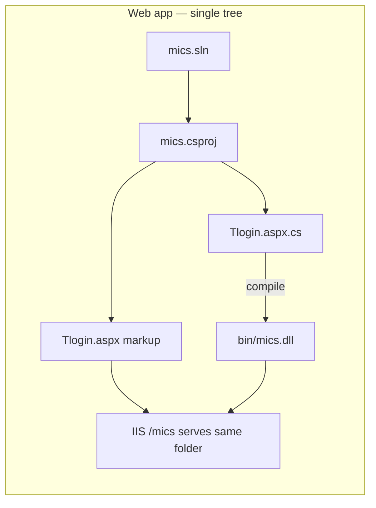

# ReMICS Dev — where source code lives

**Codebase:** remicsdev  
**Verified:** 2026-06-23 (filesystem search, `mics.csproj`, first live markup edit on `Tlogin.aspx`)  
**Prerequisite:** [Infrastructure mapping](infrastructure-mapping.md), [Web application structure](web-app-structure.md)  
**Context file:** [`context/codebases/remicsdev.yaml`](../../context/codebases/remicsdev.yaml)

This document answers: *“Where do I edit code, and is there a separate source copy?”* It captures lessons from the first small web change (removing text on the login page) and a full-disk search for duplicate `Tlogin.aspx` files.

---

## Executive summary

| Code type | Source of truth on this server | IIS / runtime path | Separate “source repo”? |
|-----------|--------------------------------|--------------------|-------------------------|
| **MICS web app** | **`D:\inetpub\remicsdev\mics\`** | Same folder (IIS app `/mics`) | **No** — edit in place |
| **Batch programs (main)** | **`D:\MicsBatchProgs\MicsBat\`** | `D:\develbat\` (remicsdev) | **Yes** — source ≠ runtime |
| **Some batch utilities** | `D:\inetpub\remicsdev\{KillTable, sdfImport, …}` | Built/deployed to runtime dirs | Mixed — sibling folders under site root |
| **CentralProject hub** | **`E:\AIProjects\CentralProject\`** | N/A (not deployed) | Docs, scripts, context YAML only |

**Key lesson:** Do not assume a second web source tree exists off-server or on another drive. For the web app, **`inetpub` is the Visual Studio project root**, not just a deploy target.

---

## Web application: source = IIS folder

**Verified** on 2026-06-23:

| Check | Result |
|-------|--------|
| Solution | `D:\inetpub\remicsdev\mics\mics.sln` |
| Main project | `D:\inetpub\remicsdev\mics\mics.csproj` |
| `Tlogin.aspx` in project | `<Content Include="Tlogin.aspx" />` + code-behind in same folder |
| Git under `mics\` | **None** (no `.git` directory) |
| `Tlogin.aspx` on **D:** | **2 files** — remicsdev + remicstest (see below) |
| `Tlogin.aspx` on **C:** / **E:** | **None found** (recursive search) |



### Implications for editing

| Change type | Files | Rebuild needed? | Takes effect |
|-------------|-------|-----------------|--------------|
| **Markup only** (`.aspx`, static HTML in page) | e.g. `Tlogin.aspx` | **No** | Immediately on save (IIS serves updated markup) |
| **Code-behind** (`.aspx.cs`) | e.g. `Tlogin.aspx.cs` | **Yes** — build `mics.csproj` | After rebuild; `bin\mics.dll` updated |
| **`web.config`** | `mics\web.config` | Usually no compile | App recycle may be required for some keys |

**Verified:** Removing a `<p>` line from `Tlogin.aspx` on remicsdev took effect immediately at http://remicsdev.cloudmicsdev.ca/mics/Tlogin.aspx without rebuilding.

---

## Batch programs: source ≠ runtime

Unlike the web app, batch tools follow a **source → build → deploy** pattern.

| Layer | remicsdev typical path | Notes |
|-------|------------------------|-------|
| Primary source | `D:\MicsBatchProgs\MicsBat\` | `MicsBat.sln`; PostBuild COPY to runtime |
| Staging build | `MicsBat\_bin\Release\` | ~118 exes after full build |
| Runtime (dev site) | `D:\develbat\` | From `ProgDir=\develbat\` in remicsdev `web.config` |
| Runtime (test site) | `D:\devel\bin\` | remicstest `web.config` |
| Runtime (prod, inferred) | `D:\prod\bin\` | Promotion process **open** |

Some console projects also live as **IIS site-root siblings** (`D:\inetpub\remicsdev\KillTable\`, etc.) and are referenced from `mics.sln` via `..\`. Batch source of truth for most new work is still **`MicsBatchProgs`**, not a missing `..\BatchProgs` path in the solution.

See [Batch programs](batch-programs.md) for build/deploy detail.

---

## CentralProject (this repo)

**Path:** `E:\AIProjects\CentralProject`  
**GitHub:** https://github.com/FCSA2025/CentralProject

| Contains | Does **not** contain |
|----------|----------------------|
| Documentation under `docs/` | MICS `.aspx` / web source |
| Machine context `context/codebases/*.yaml` | Batch `.cs` source |
| Helper scripts `scripts/` | IIS deploy artifacts |
| `env.local.example` | Compiled `mics.dll` |

CentralProject is the **knowledge hub** for working on remicsdev — not a mirror of application source. Web and batch code are edited on **`D:\`** on the server.

For Git/GitHub setup on a new machine, see [GitHub setup checklist](../github-setup-checklist.md).

---

## Parallel environments (separate inetpub trees)

Each IIS site has its **own copy** of the web tree under `D:\inetpub\{sitename}\`. They are **not** symlinked or auto-synced.

| Site | IIS binding (known) | Web app path | Notes |
|------|---------------------|--------------|-------|
| **remicsdev** | `remicsdev.cloudmicsdev.ca` | `D:\inetpub\remicsdev\mics` | Primary dev; where we edit |
| **remicstest** | `remicstest.cloudmicsdev.ca` | `D:\inetpub\remicstest\mics` | Separate copy; can drift from dev |
| **REMICS** | port 8080 | *(not fully mapped)* | Listed in YAML; lower priority |

**Verified:** `D:\inetpub\remicstest\mics\Tlogin.aspx` exists (last modified 2025-06-05). Changes on remicsdev **do not** propagate to remicstest automatically. When promoting a web change across environments, edit or deploy each tree explicitly.

---

## Login pages (multiple entry points)

Forms auth `loginUrl` in `web.config` points to **`Tlogin.aspx`**. Other login-related pages exist:

| File | Purpose | Same “authorized hours” markup? |
|------|---------|----------------------------------|
| **`Tlogin.aspx`** | Active dev login (`/mics/Tlogin.aspx`) | Removed on remicsdev 2026-06-23 |
| **`TloginValidate.aspx`** | Post-login session setup | N/A |
| **`Tlogin2.aspx`** | Alternate login variant | **Open** — not checked in this pass |
| **`login2.aspx`** | “Site not active” redirect UI | No hours text |
| **`loginfcsa.aspx`** | Alternate login (“Please Login 6D”) | **Still has** authorized-hours `<p>` on remicsdev |

Before editing login UX globally, grep for shared strings:

```powershell
Select-String -Path "D:\inetpub\remicsdev\mics\*.aspx" -Pattern "Authorized Hours"
```

---

## How to find “another copy” of a web file

When unsure whether a file exists elsewhere:

```powershell
# All Tlogin.aspx on D: (fast enough on this server)
Get-ChildItem -Path D:\ -Filter "Tlogin.aspx" -Recurse -ErrorAction SilentlyContinue |
  Select-Object FullName, LastWriteTime

# Grep remicsdev mics root only
Select-String -Path "D:\inetpub\remicsdev\mics\*.aspx" -Pattern "your search text"
```

**Inferred:** Production and import sites (`remicsproddev`, `micsimport`, etc.) likely follow the same `D:\inetpub\{site}\mics\` pattern but were **not** scanned in the 2026-06-23 pass. Extend the search before assuming dev is the only copy.

---

## First change workflow (checklist)

Use this for any small web tweak on remicsdev:

1. **Confirm URL → file** — e.g. `/mics/Tlogin.aspx` → `D:\inetpub\remicsdev\mics\Tlogin.aspx`
2. **Confirm no duplicate source** — search `D:\` (and other drives if applicable)
3. **Classify change** — markup-only vs code-behind vs config
4. **Edit in inetpub path** — do not look for a separate “src” folder for web
5. **Verify in browser** — hard refresh or incognito if cached
6. **Note other environments** — remicstest / prod copies may need the same edit later
7. **Document in CentralProject** — update relevant doc or YAML if the finding is reusable

---

## Related docs

| Topic | Doc |
|-------|-----|
| IIS paths, config | [Infrastructure mapping](infrastructure-mapping.md) |
| Folders, modules, batch invoke | [Web application structure](web-app-structure.md) |
| Login auth chain | [Login flow](login-flow.md) |
| Batch source vs runtime | [Batch programs](batch-programs.md) |
| GitHub on new machines | [GitHub setup checklist](../github-setup-checklist.md) |
