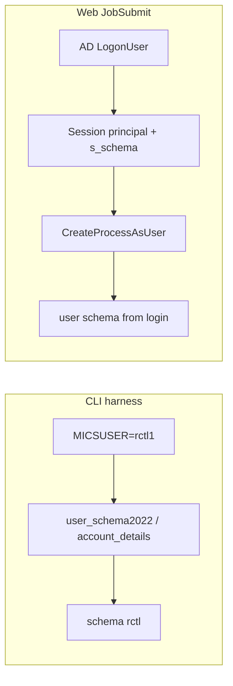

# ReMICS Dev — dedicated test account setup

**Codebase:** remicsdev (Phase A) → production (Phase B)  
**Last updated:** 2026-07-15  
**Related:** [automated-testing.md](automated-testing.md), [test-fixtures-and-baselines.md](test-fixtures-and-baselines.md), [login-flow.md](login-flow.md)

Provisioning guide for a **dedicated MICS test account** — required before running automated tests against production. Also documents how MICS auth maps users to SQL schemas (needed for isolation decisions).

---

## How auth and schema work (verified)

Schema ownership is **not** derived by string rules (e.g. stripping digits from `rctl1`). It is a **SQL / MICS account lookup**.

| Path | Windows identity | How schema is chosen | Password |
|------|------------------|----------------------|----------|
| **Web login** (`TloginValidate`) | Required: AD `LogonUser` → session `principalw` → `CreateProcessAsUser` for batch | ODBC Trusted_Connection; `SELECT RTRIM(dbo.user_schema())` → `Session["s_schema"]` | Real AD password |
| **CLI harness** (`Invoke-MicsFileOpCompare`, `Invoke-LastTsipCompare`) | Process runs as whoever launches the script (often a privileged SQL login) | Env `MICSUSER` → `dbo.user_schema2022(user)` / `adm.account_details` (`micsid` → oper / schema) | Required by batch tooling; can be a placeholder when SQL is trusted |

Documented example: MICS user **`rctl1`** → schema **`rctl`**, project **`rctl1_0`**, workspace  
`D:\inetpub\remicsdev\mics\userdirs\rctl\rctl1\`.

Implications:

- Inventing a schema name without a MICS account row does **not** work — `ftImport` / `TpRunTsip` resolve schema from `MICSUSER`.
- A dedicated **`autotest`** schema needs an AD (for web) + MICS/`account_details` user that maps to it.
- CLI-only tests can use a dedicated MICSUSER once that mapping and SQL grants exist; full browser E2E still needs AD + GPO logon rights (see error 1385 in [session-2026-06-29-login-import-fixes.md](session-2026-06-29-login-import-fixes.md)).



Batch drop helper for imports: `ftImport … -x` drops `ft_{root}_*` then exits (no re-import). `-f` drops then imports. Web overwrite path also uses `KillTable.exe`.

---

## Why a dedicated account

- Never run automation as a real user (`rctl1`, etc.) long-term.
- Isolated schema, fixtures, and baselines avoid side effects on production data.
- Credentials live in gitignored `tests/remicsdev/fixtures/secrets.env` only.

---

## Phase A — remicsdev now (`rctl1` + cleanup)

Use `rctl1` / schema `rctl` until the harness is stable.

Credentials via `tests/remicsdev/fixtures/secrets.env` (copy from `secrets.env.example`; never commit passwords). Harness also accepts `MICS_TEST_PASSWORD` / `.env.local`.

**AD-free prep (Phases 0–1 complete):** schema lookup and plaintext password helpers live in CentralProject only — see [ad-free-auth-phase01.md](ad-free-auth-phase01.md). Pilot DB-auth user: `dbautht1` / schema `rctl` (no AD account). Web login still uses AD until Phase 2+.

### Temporary tables and cleanup

Import / validate always create a **fresh short root** (`cataHHmmss`, `e2602aHHmmss`, `e2601aHHmmss`) so pinned fixtures are never overwritten.

After each import, validate, or round-trip, [`scripts/Invoke-MicsFileOpCompare.ps1`](../../scripts/Invoke-MicsFileOpCompare.ps1) runs **soft cleanup**:

- Allowlisted prefixes only: `cata*`, `e2602a*`, `e2601a*`, legacy `cat_auto*`
- Never drops pinned roots: `cat`, `ecomm2602`, `ecomm2601b`
- Uses `ftImport remicsdev <project> <root> <junk> -x`
- Cleanup failure is recorded (`cleanup_ok`, `cleanup_message`) but does **not** change MATCH / NO MATCH

One-shot orphan sweep (existing leftovers):

```powershell
# Preview
.\scripts\Remove-RemicsDevTestTables.ps1 -WhatIf

# Drop allowlisted orphans in rctl
.\scripts\Remove-RemicsDevTestTables.ps1
```

---

## Phase B — `autotest1` (before prod)

### AD + MICS

1. Create AD user `autotest1` in `CLOUDMICSDEV` (or prod equivalent).
2. Add to MICS with own schema (e.g. `autotest`) so `user_schema2022('autotest1')` / `account_details` resolve to `autotest`.
3. Set `tsip_email=n` to avoid spam during nightly runs.

### SQL + fixtures

- Copy or grant read access to pinned fixtures (`cat`, `ecomm2602`, …) into `autotest` schema.
- Document copy commands here when provisioned.

### Filesystem

- `user_dir`: `D:\inetpub\remicsdev\mics\userdirs\autotest\autotest1\`
- Confirm directory created on first login.

### Windows / GPO

Same logon rights as other domain users on IIS:

- Allow log on locally
- Log on as a batch job

See [session-2026-06-29-login-import-fixes.md](session-2026-06-29-login-import-fixes.md) for error 1385 context.

### Baselines

- Seed `tests/remicsdev/fixtures/baselines-autotest1.yaml` after first successful full suite run.
- Switch default test user via env var `MICS_TEST_USER=autotest1` in `config.yaml`.

---

## Production promotion checklist

1. Provision `autotest1` (or env-specific name) on prod IIS + SQL.
2. Deploy exes (`mics.dll`, `develbat` batch programs).
3. Run smoke suite as `autotest1` only — never as real users.
4. Verify L0 + L1 + one TSIP run before declaring deploy good.
