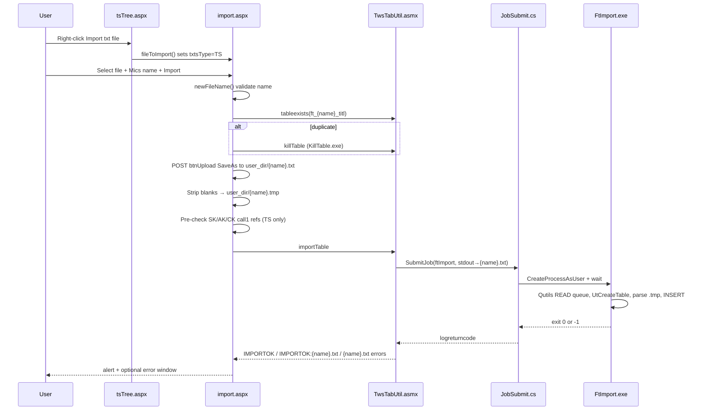

# TS File Import — End-to-End Flow

**Codebase:** remicsdev  
**Status:** **Operational** (1314 and export truncate resolved 2026-06-29) — see [session-2026-06-29-login-import-fixes.md](session-2026-06-29-login-import-fixes.md)  
**Related:** [login-flow.md](login-flow.md), [web-app-structure.md](web-app-structure.md), [batch-programs.md](batch-programs.md)

---

## Resolution summary (2026-06-29)

| Issue | Resolution |
|-------|------------|
| **1314** spawn failure | GPO **MICS IIS Server Rights** on `IISReMicsSer` + valid login token |
| **Import “Errors found”** after export | **FtPrint** did not `Close()` output file → 1024-byte truncate; fixed in `FtPrint.cs`, redeployed `D:\develbat\ftPrint.exe` |
| Distinguish spawn vs parse | `logerrorcode = -98` → 1314 (never ran); `logerrorcode = 0` + `logreturncode = -1` + `Errors found` → ran, parse/validation failed |

**Export size check:** if `ftPrint` output is exactly **1024 bytes**, file is truncated — redeploy fixed `ftPrint.exe`.

### Import warnings (2026-06-29)

Successful TS/ES imports may produce non-fatal warnings in `{name}.txt` (stdout from `ftImport`/`feImport`). These are **no longer shown** to the user (no alert or popup window).

| Location | Content |
|----------|---------|
| `D:\MicsWebLogs\imports\import_warnings.log` | Index line per import-with-warnings (user, file, session, path) |
| `D:\MicsWebLogs\imports\{schema}\{user}\{name}_{timestamp}_{FCSASESS}.txt` | Full warning text archive |

Hard **errors** (`logreturncode = -1`) still open the error file and show `File import failed!`.

---

## User path (UI)

1. Log in → [`TnavigationFull.aspx`](http://remicsdev.cloudmicsdev.ca/mics/TnavigationFull.aspx) (frame shell).
2. Left menu: **TS Data Files** (`editTsPdf`) → right frame loads [`Ttsmenu/tsTree.aspx`](http://remicsdev.cloudmicsdev.ca/mics/Ttsmenu/tsTree.aspx).
3. Expand **TS Data Tree** root → node **New TS Data File** (`z_newTsPdf`).
4. Right-click **New TS Data File** → **Import txt file**.
5. Right frame loads [`Tfileactions/import.aspx`](http://remicsdev.cloudmicsdev.ca/mics/Tfileactions/import.aspx).
6. User picks a `.txt` file from disk, confirms **Mics File Name**, clicks **Import**.

**Alternate path:** **Create new file** on the same node creates empty DB tables via `CopyTable` (no file upload). That is a different flow from **Import txt file**.

---

## Flow diagram



---

## Step-by-step (code)

| Step | Component | What happens |
|------|-----------|--------------|
| 1 | [`TnavigationLeft.aspx`](D:\inetpub\remicsdev\mics\TnavigationLeft.aspx) | `editTsPdf` → `Ttsmenu/tsTree.aspx` |
| 2 | [`tsTree.aspx`](D:\inetpub\remicsdev\mics\Ttsmenu\tsTree.aspx) | Sets `parent.txtsType = "TS"`. Context menu **Import txt file** → `fileToImport()` |
| 3 | [`includeFiles/TFileOptions.js`](D:\inetpub\remicsdev\mics\includeFiles\TFileOptions.js) | `fileToImport()` → `../Tfileactions/import.aspx` |
| 4 | [`import.aspx`](D:\inetpub\remicsdev\mics\Tfileactions\import.aspx) JS | `newFileName()` → `check_dups()` |
| 5 | [`TwsTabUtil.asmx.cs`](D:\inetpub\remicsdev\mics\Tfileactions\TwsTabUtil.asmx.cs) | `tableexists("ft_{name}_titl")` — ODBC against `INFORMATION_SCHEMA.TABLES` in `Session["s_schema"]` |
| 6 | Same (if count > 0) | User confirms overwrite → `killTable` → [`KillTable.exe`](D:\develbat\KillTable.exe) via `JobSubmit` |
| 7 | [`import.aspx.cs`](D:\inetpub\remicsdev\mics\Tfileactions\import.aspx.cs) | `FileUpload1.SaveAs(user_dir + name + ".txt")`; strip blank lines to `.tmp`; validate SK/AK/CK call1 consistency |
| 8 | `TwsTabUtil.importTable` | Builds `ftImport` job: `logargs = {db_name} {projectCode} {filename} {user_dir}{filename}.tmp`; stdout redirected to `{user_dir}{filename}.txt` |
| 9 | [`utilities/JobSubmit.cs`](D:\MicsBatchProgs\MicsBat\utilities\JobSubmit.cs) | Impersonate `Session["principalw"]`; set env `MicsUser`, `Password`, `work_dir`, etc.; `CreateProcessAsUser(D:\develbat\ftImport …)` |
| 10 | [`FtImport/FtImport.cs`](D:\MicsBatchProgs\MicsBat\FtImport\FtImport.cs) | READ queue → connect → refuse if `ft_{name}_*` already exist → `UtCreateTable` → parse CSV lines (TT, SK, AK, CK, …) → INSERT → exit **0** (OK) or **-1** (errors to stdout) |
| 11 | `importTable` return mapping | `-1` → error file name; `0` + non-empty `.txt` → `IMPORTOK:{file}` (warnings); `0` + empty `.txt` → `IMPORTOK:`; `100` → `READWRITEBLOCK` |
| 12 | `import.aspx` JS | Alert user; on success `goBack()` → `tsTree.aspx?key=e.{name}` |

**Batch executable (remicsdev):** `D:\develbat\ftImport.exe` (built 2025-10-07).  
**Program path:** `Session["prog_dir"]` + `ftImport` → from `web.config` `ProgDir` = `\develbat\`.

**Tables created (schema = user schema, e.g. `rctl`, `venn`):**

`ft_{name}_titl`, `_chng`, `_site`, `_ante`, `_chan`, `_shrl`

---

## Session / disk dependencies

| Dependency | Set at | Used for |
|------------|--------|----------|
| `Session["s_schema"]` | Login validate | `tableexists`, tree listing, table names |
| `Session["user_dir"]` | Login validate | Upload `.txt`/`.tmp`, stdout error file |
| `Session["principalw"]` | Login (`LogonUser`) | Impersonation in ASMX + `CreateProcessAsUser` token |
| `Session["s_password"]` | Login | Batch env `Password` |
| `Session["prog_dir"]` | Application + login | `D:\develbat\` on remicsdev |
| `parent.txtsType` | `tsTree.aspx` pageLoad | Must be `"TS"` on import form |
| `parent.txtProjectCode` | `navigationTop.aspx` | 2nd arg to `ftImport` |

Debug trace for each batch spawn: `D:\extractlogs\{site_type}_{user}submit5.txt`

---

## remicsdev evidence (2026-06-26)

Queried `web.dblogger` on **remicsdev** database:

| Time (local) | User | Program | Result |
|--------------|------|---------|--------|
| 11:57–12:02 | **rctl1** | `D:\develbat\ftImport` | **Failed** — `logerrorcode -98`, `ERROR:CreateProcessAsUser: 1314` |
| 12:21–12:22 | **venn1** | `D:\develbat\ftImport` | **Failed** — same **1314** error |
| 12:23 | **venn1** | `D:\develbat\ftPrint` | **Failed** — same **1314** error |
| 11:07 | rctl1 | `D:\develbat\ftPrint` | **Succeeded** (earlier session `13029-1`) |
| 12:31 | import1 | `D:\develbat\ftImport` | **Succeeded** per `D:\extractlogs\remicsdev_import1submit5.txt` — logged against **remicsimport** DB, not remicsdev `web.dblogger` |

**Windows error 1314** = `ERROR_PRIVILEGE_NOT_HELD` — *A required privilege is not held by the client.*

In this failure mode **`FtImport.exe never runs`**. The UI may show a generic import failure; no parse errors are produced and no `ft_*` tables are created.

---

## Diagnostic run (2026-06-26) — confirmed

SQL and log review on remicsdev server. **Start next debugging session here.**

### Failed imports (`web.dblogger`, database **remicsdev**)

| Time (local) | User | File | logserial | Result |
|--------------|------|------|-----------|--------|
| 12:22 | venn1 | `ecomm2601lk2` | 13034-2 | `logerrorcode -98`, `CreateProcessAsUser: 1314` |
| 12:21 | venn1 | `ecomm2601lk2` | 13034-1 | same |
| 12:02 | rctl1 | `ecomm2602a` | 13032-1 | same |
| 11:57 | rctl1 | `ecomm2602a` | 13031-1 | same |

No `ft_ecomm2601lk2*` or `ft_ecomm2602a*` tables on **remicsdev** (0 rows) — batch never created schema objects.

### All `D:\develbat\` jobs on remicsdev today

| User | Program | Outcome | Count | Notes |
|------|---------|---------|-------|-------|
| rctl1 | `ftPrint` | **Success** | 1 | 11:07, session `13029` — before re-login |
| rctl1 | `ftImport` | **1314** | 2 | sessions `13031`, `13032` |
| venn1 | `ftImport` | **1314** | 2 | session `13034` |
| venn1 | `ftPrint` | **1314** | 1 | same session |
| venn1 | `sdfPrint` | **1314** | 5 | through 14:17 — **no** successful develbat job for venn1 today |

**Conclusion:** Not TS-import-specific. Any batch spawn under affected sessions fails with 1314. Same user can succeed in one session and fail after re-login (rctl1).

### Control case — import succeeded (different DB)

**import1** at 12:31 (`D:\extractlogs\remicsdev_import1submit5.txt`):

- `CreateProcessAsUser succeeded`; `ftImport` exit 0
- Same filename `ecomm2601lk2` that venn1 failed nine minutes earlier
- Tables on database **remicsimport**, schema **import**: `ft_ecomm2601lk2_titl`, `_site`, `_ante`, `_chan`, `_chng`, `_shrl`

Proves **FtImport.exe** and upload path work; failure is **remicsdev session / token / privilege** for venn1 and rctl1.

### UI message (expected)

`File import failed! ERROR: Unable to start D:\develbat\ftImport`

### Next session — debug plan

1. **IIS app pool** for remicsdev — verify `SeAssignPrimaryTokenPrivilege` and `SeImpersonatePrivilege` on pool identity (and `whoami /priv` under pool context if possible).
2. **Compare login tokens** — import1 (works) vs venn1/rctl1 (fail): `Tlogin.aspx.cs` `LogonUser` → `Session["principalw"]`; logon type, token elevation, group membership.
3. **Reproduce with logging** — one import as venn1; read `D:\extractlogs\remicsdev_venn1submit5.txt` and matching `web.dblogger` row.
4. **Session correlation** — note `FCSASESS` / logserial on success vs failure (rctl1 `13029` ok vs `13031+` fail).
5. **GPO / recent server change** — cross-check IIS permissions work documented in [login-flow.md](login-flow.md).

Reference queries:

```sql
-- remicsdev: recent import failures
SELECT TOP 10 logserial, loguserid, logprogram, logargs, logreturncode, logerrorcode, logerrordesc, logstarttime
FROM web.dblogger
WHERE logprogram LIKE '%ftImport%' AND logprogram LIKE '%develbat%'
ORDER BY logstarttime DESC;

-- remicsdev: all spawn failures today
SELECT loguserid, logprogram, logerrordesc, COUNT(*) AS cnt, MAX(logstarttime) AS last_seen
FROM web.dblogger
WHERE logstarttime >= CAST(GETDATE() AS date) AND logerrorcode = -98
GROUP BY loguserid, logprogram, logerrordesc
ORDER BY last_seen DESC;

-- remicsimport: verify successful import tables
SELECT table_schema, table_name FROM INFORMATION_SCHEMA.TABLES
WHERE table_name LIKE 'ft_ecomm2601lk2%' ORDER BY table_name;
```

Use `scripts/Invoke-RemicsDevSql.ps1` with `-Database remicsimport` for the last query.

---

## Problem areas (ranked)

### 1. Critical — `CreateProcessAsUser` / privilege 1314 (active on remicsdev today)

- **Symptom:** Import (and other batch jobs in the same session) fail immediately; `web.dblogger.logerrordesc` contains `CreateProcessAsUser: 1314`.
- **Not caused by** `FtImport` parsing or TS file format — process does not start.
- **Likely causes:** IIS app pool identity missing `SeAssignPrimaryTokenPrivilege` / `SeImpersonatePrivilege`; `LogonUser` token not suitable for `CreateProcessAsUser`; GPO / hardening change on the server (see also [login-flow.md](login-flow.md) IIS permissions work).
- **Why intermittent / user-specific:** Token quality can differ per login session; rctl1 print worked in session `13029` but import failed in session `13031+`.
- **Check:** `web.dblogger` for `logerrorcode = -98`; `D:\extractlogs\{site}_{user}submit5.txt` line `CreateProcessAsUser failed with 1314`.

### 2. High — Overwrite / `TABLEEXIST` race

- `FtImport` exits if **`ft_{name}_*` tables already exist** (does not auto-drop unless `-f` flag).
- Overwrite path depends on **`killTable`** completing before `importTable`.
- If `killTable` fails silently or user skips overwrite, import fails with table-exist message in stdout (exit -1).

### 3. Medium — Web upload / pre-validation

- **`SaveAs` to `user_dir`** fails if directory missing or ACL denies write (login creates `userdirs\{schema}\{user}\`).
- **Pre-validation** in `import.aspx.cs`: antenna/channel `call1` values must appear in site (SK) records — returns `MISSING^…` alerts before batch runs.
- **File rules:** `.txt` only; Mics name ≤ 16 chars, alphanumeric + underscore.

### 4. Medium — DB READ queue block

- `FtImport` calls `Qutils.EnterQueue(READ)` — returns **`READWRITEBLOCK`** (import rolled back via `killTable` in `importTable`).

### 5. Lower — Parse / data errors (when batch runs)

- `FtImport` exit **-1** → messages written to `{user_dir}{name}.txt` (stdout capture).
- **`D:\MicsBatchLogs\FtImport.log`** — session Log2 (often minimal unless verbose).

### 6. UI / tree refresh

- Success returns to `tsTree.aspx?key=e.{name}` — tree loads PDF list via `TwsTSTree.asmx` `get_pdf_nodes` (`LIKE 'ft\_%\_titl' ESCAPE '\'`).
- Legacy `TSpopulateTree()` uses unescaped `LIKE 'ft_%_titl'` (underscore wildcard) — not used by current RadTree `expandNode` path.

---

## Relation to recent project changes

| Change | Touches TS import? |
|--------|-------------------|
| TSIP archive / `TpRunTsip` | No — separate batch path |
| SDF `anteTree()` fix | No |
| Disk-write reduction (planned only) | No — not implemented |
| IIS / GPO permissions work (documented earlier) | **Possible** — same privilege family as 1314 |

No edits to `import.aspx`, `TwsTabUtil.importTable`, `JobSubmit`, or `FtImport` appear in recent CentralProject work. Failures align with **batch spawn / Windows privilege**, not import logic changes.

---

## Diagnostic checklist

1. Reproduce import; note exact alert text.
2. Query `web.dblogger` for the user's latest `ftImport` row:
   ```sql
   SELECT TOP 5 logserial, logprogram, logargs, logreturncode, logerrorcode, logerrordesc, logstarttime
   FROM web.dblogger
   WHERE loguserid = '<user>' AND logprogram LIKE '%ftImport%'
   ORDER BY logstarttime DESC;
   ```
3. Read `D:\extractlogs\remicsdev_<user>submit5.txt` — confirm whether `CreateProcessAsUser succeeded` or `failed with 1314`.
4. If process **did** start (`logreturncode -1`, `logerrorcode 0`): open `userdirs\{schema}\{user}\{name}.txt` for parse errors.
5. Confirm tables: `SELECT table_name FROM INFORMATION_SCHEMA.TABLES WHERE table_schema = '<schema>' AND table_name LIKE 'ft_<name>%'`.
6. Compare with a batch that skips stdout redirect (e.g. export/validate) in the **same session** — if all fail with 1314, fix privileges/token, not `FtImport`.

---

## Key source files

| Role | Path |
|------|------|
| Tree + menu | `D:\inetpub\remicsdev\mics\Ttsmenu\tsTree.aspx` |
| Tree data | `D:\inetpub\remicsdev\mics\Ttsmenu\TwsTStree.asmx.cs` |
| Import UI | `D:\inetpub\remicsdev\mics\Tfileactions\import.aspx` (+ `.cs`) |
| Web service | `D:\inetpub\remicsdev\mics\Tfileactions\TwsTabUtil.asmx.cs` |
| Job spawn | `D:\MicsBatchProgs\MicsBat\utilities\JobSubmit.cs` |
| Batch import | `D:\MicsBatchProgs\MicsBat\FtImport\FtImport.cs` |
| Deployed exe | `D:\develbat\ftImport.exe` |
