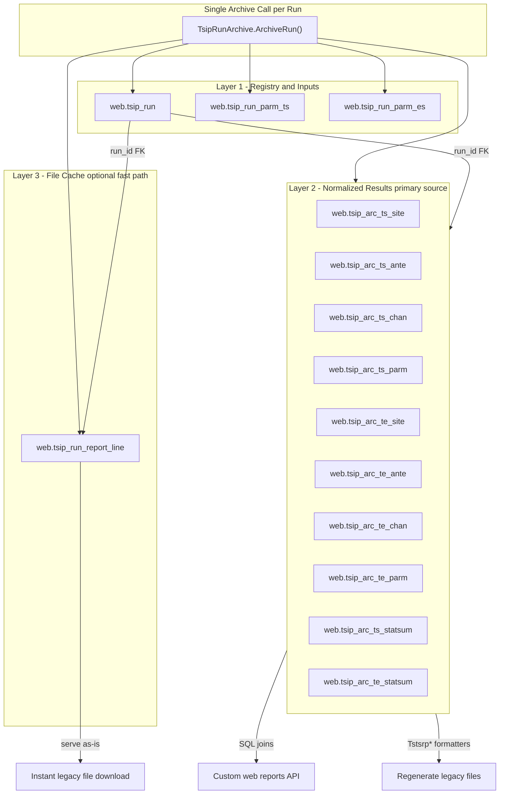

# TSIP Run Archive — Storage Design and Implementation Plan

**Codebase:** remicsdev  
**Status:** Planned (not implemented)  
**Created:** 2026-06-17  
**Related:** [TSIP deep dive](tsip.md), [Working tables lifecycle](tsip-tt-tables.md), [Batch programs](batch-programs.md)

---

## Goals

1. **Capture every TSIP run** — including multiple executions with the same parameter file and run name (results change over time).
2. **Reproduce legacy TSIP output files** (.CASEDET, .STUDY, .STATSUM, etc.) quickly and accurately.
3. **Support custom web reports** — searchable, filterable, displayable via the MICS website (KML, CSV, grids, dashboards).
4. **Isolate archive logic** — single function call from `TpRunTsip`, no changes to calculation code.

---

## Recommendation: hybrid 3-layer storage

Two requirements pull in different directions:

| Goal | What it needs |
|------|----------------|
| **Reproduce legacy TSIP files** (.CASEDET, .STUDY, etc.) | Either the **exact file bytes** or the **same normalized DB rows** the existing `Tstsrp*` formatters already read |
| **Custom web reports** (KML, CSV, new dashboards) | **Queryable structured SQL** — joins on site/ante/chan with `run_id`, not text blobs |

### Approaches to avoid

| Approach | Problem |
|----------|---------|
| **Text blobs / line-per-row only** | Fast file download, but poor for custom reports, run comparison, and filtering |
| **One denormalized table per report type** (11× TS + 11× ES ≈ 22 tables) | Massive duplication of CASEDET/CASESUM/AGGINT data; hard to maintain when `TabDef` changes |
| **Working tables only, no file cache** | Best for new web UI; file regen requires re-invoking legacy formatters (correct but slower) |

### Best approach

**Normalized archive + optional file cache**, coordinated by one central run table.



---

## Layer 1 — Central registry and input parameters

### `web.tsip_run` (one row per execution)

Every batch invocation gets a unique **`run_id`** (`BIGINT IDENTITY`). Same `parm_file` + `run_name` can appear many times over time.

| Column | Purpose |
|--------|---------|
| `run_id` | PK |
| `parm_file` | Parameter file name (e.g. `MYTSIP01`) |
| `run_name` | Run identifier from parm row |
| `view_name` | `{parmfile}_{runname}` — ephemeral table suffix |
| `protype` | `T` or `E` |
| `analysis_path` | `TS_TS`, `TS_ES`, or `ES_TS` |
| `mics_user` | User who submitted the run |
| `project_code` | Charge code |
| `db_name` | Database (e.g. `remicsdev`) |
| `started_at`, `completed_at` | Run timestamps |
| `duration_sec` | Elapsed time |
| `num_int_cases`, `num_te_cases` | Interference case counts |
| `num_stn_groups` | Station group count |
| `status` | `completed`, `failed`, `partial` |
| `exit_code` | TpRunTsip exit code |
| `report_prefix` | `Info.DestName` — output file prefix |
| `source_schema` | User schema where live `tt_*` / `te_*` lived |

**Indexes:** `(parm_file, run_name, completed_at DESC)`, `(mics_user, completed_at DESC)`, `(protype, completed_at DESC)`.

This is the **only table** the website needs to list/search runs and drill into detail.

### Input parameter snapshots

| Table | When used |
|-------|-----------|
| `web.tsip_run_parm_ts` | TS-path runs (`protype=T`, env not ES) |
| `web.tsip_run_parm_es` | ES-path runs (`protype=E` or ES environment) |

Columns mirror `TpParm` (`D:\MicsBatchProgs\MicsBat\_DataStructures\TpParm.cs`): `proname`, `envname`, `envtype`, `coordist`, `spherecalc`, `margin`, `analopt`, `reports`, `chancodes`, `country`, `selsites`, `numcases`, `mdate`, `mtime`, etc.

Store **both**:

- User-editable input from `{schema}.tp_{parmfile}_parm`
- Run-time copy from `{schema}.tt_/te_{viewName}_parm`

This allows diffing “what the user configured” vs “what TSIP actually ran.”

---

## Layer 2 — Normalized working-table archive (primary data store)

Copy ephemeral **`tt_*` / `te_*` working tables** into permanent archive tables keyed by `run_id`. Schema matches existing `TabDef` column definitions (same shapes as `TtChan`, `TtSite`, `TtAnte`, `TeChan`, etc.) plus:

- `run_id BIGINT NOT NULL` on every row
- Optional `row_id BIGINT IDENTITY` per table for stable web pagination

### TS path (4 tables)

| Archive table | Source at run time |
|---------------|-------------------|
| `web.tsip_arc_ts_site` | `{schema}.tt_{viewName}_site` |
| `web.tsip_arc_ts_ante` | `{schema}.tt_{viewName}_ante` |
| `web.tsip_arc_ts_chan` | `{schema}.tt_{viewName}_chan` |
| `web.tsip_arc_ts_parm` | `{schema}.tt_{viewName}_parm` |

### ES path (4 tables)

| Archive table | Source at run time |
|---------------|-------------------|
| `web.tsip_arc_te_site` | `{schema}.te_{viewName}_site` |
| `web.tsip_arc_te_ante` | `{schema}.te_{viewName}_ante` |
| `web.tsip_arc_te_chan` | `{schema}.te_{viewName}_chan` |
| `web.tsip_arc_te_parm` | `{schema}.te_{viewName}_parm` |

### STATSUM exception (2 tables)

STATSUM does **not** read `tt_*` directly. It reads a **temporary table** `cUnique` created by `TpReport.CreateTTStatRep` and dropped in `TpRunTsip.Main()` via `Ssutil.KillTable(cUnique)` (~line 674).

| Archive table | Source | Capture timing |
|---------------|--------|----------------|
| `web.tsip_arc_ts_statsum` | `cUnique` temp table | **Before** `KillTable(cUnique)` |
| `web.tsip_arc_te_statsum` | `cUnique` / `cUniqueEnv` | Same |

**Total Layer 2: 10 tables** (8 working + 2 statsum).

### Why this layer satisfies both goals

**Custom web reports:** Same pattern as today's KML pages (`Ttsipmenu\CASEDETTSTSkml.aspx.cs`) — join `site` + `ante` + `chan` filtered by `run_id` instead of ephemeral `tt_{viewName}_*`.

Example SQL view (mirrors `Tstsrp3.SELECT_TEMPLATE`):

```sql
CREATE VIEW web.v_tsip_casedet AS
SELECT
    r.run_id,
    r.parm_file,
    r.run_name,
    r.completed_at,
    a.interferer,
    a.caseno,
    c.subcaseno,
    -- ... remaining CASEDET columns from site/ante/chan join ...
    c.patloss,
    c.calcico,
    c.calcixp,
    c.reqdcalc,
    c.resti,
    c.calctype
FROM web.tsip_arc_ts_site a
JOIN web.tsip_arc_ts_ante b
    ON a.run_id = b.run_id
    AND a.intcall1 = b.intcall1 AND a.intcall2 = b.intcall2
    AND a.viccall1 = b.viccall1 AND a.viccall2 = b.viccall2
    AND a.caseno = b.caseno AND a.interferer = b.interferer
JOIN web.tsip_arc_ts_chan c
    ON c.run_id = b.run_id
    AND c.intcall1 = b.intcall1 AND c.intcall2 = b.intcall2
    AND c.viccall1 = b.viccall1 AND c.viccall2 = b.viccall2
    AND c.caseno = b.caseno AND c.interferer = b.interferer
    AND c.intanum = b.intanum AND c.vicanum = b.vicanum
    AND c.intbndcde = b.intbndcde AND c.vicbndcde = b.vicbndcde
JOIN web.tsip_run r ON r.run_id = a.run_id;
```

**Regenerate legacy files:** Existing formatters (`Tstsrp3`, `Tstsrp4`, `AggInt`, etc.) consume ODBC cursors from SQL SELECTs. Phase 5 adds **archive-aware variants** that query `web.tsip_arc_*` by `run_id` instead of live `tt_{viewName}_*`. No need to duplicate data into separate “CASEDET tables.”

Reports that are **pure formatting** (STUDY headers, EXEC timing) can be regenerated from `tsip_run` + parm rows + statsum, OR served from Layer 3 cache.

---

## Layer 3 — Report file cache (fast legacy output)

One table for all text report types:

### `web.tsip_run_report_line`

| Column | Purpose |
|--------|---------|
| `run_id` | FK → `web.tsip_run` |
| `report_type` | See list below |
| `line_num` | Order within file |
| `line_text` | `NVARCHAR(MAX)` or `VARCHAR(8000)` |

**Report types:** `CASEDET`, `CASESUM`, `STUDY`, `STATSUM`, `EXEC`, `HILO`, `ORBIT`, `CASEOHL`, `AGGINT`, `AGGINT_CSV`, `TS_EXPORT`, `ES_EXPORT`, `ERR`

Captured by reading report files already written under `TARGETDIRFORTSIPREPORTS` (paths tracked in `TsipReportHelper`).

**Why include this if Layer 2 can regen?**

- **Byte-identical** output to what was emailed (pagination, headers, legacy `PrintLine` quirks)
- **Instant download** — no batch formatter invocation
- **STUDY / EXEC / HILO / ORBIT** — mostly procedural text; caching avoids re-implementing layout logic in v1

For v1: cache **all** report types written to disk. Layer 2 remains source of truth for structured analytics.

**Alternative:** `web.tsip_run_report_blob` with `VARBINARY` per `(run_id, report_type)` — fewer rows, same fast-download benefit, weaker line-level diff.

---

## Table count summary (~14 tables)

| # | Table | Role |
|---|-------|------|
| 1 | `web.tsip_run` | Central lookup / search |
| 2 | `web.tsip_run_parm_ts` | Input snapshot (TS path) |
| 3 | `web.tsip_run_parm_es` | Input snapshot (ES path) |
| 4 | `web.tsip_arc_ts_site` | TS site pairs |
| 5 | `web.tsip_arc_ts_ante` | TS antenna data |
| 6 | `web.tsip_arc_ts_chan` | TS channel calcs |
| 7 | `web.tsip_arc_ts_parm` | TS run parm snapshot |
| 8 | `web.tsip_arc_te_site` | ES site pairs |
| 9 | `web.tsip_arc_te_ante` | ES antenna data |
| 10 | `web.tsip_arc_te_chan` | ES channel calcs |
| 11 | `web.tsip_arc_te_parm` | ES run parm snapshot |
| 12 | `web.tsip_arc_ts_statsum` | TS station summary |
| 13 | `web.tsip_arc_te_statsum` | ES station summary |
| 14 | `web.tsip_run_report_line` | Legacy file cache |

Optional SQL views (`web.v_tsip_casedet`, `web.v_tsip_casesum`) — not additional storage.

---

## Isolated code: single archive entry point

New class: `MICSTSIP\_Utillib\TsipRunArchive.cs` (mirror in `MicsBat\_Utillib` if needed for build).

```csharp
public static int ArchiveRun(TsipArchiveContext ctx)
{
    // 1. INSERT web.tsip_run → run_id
    // 2. INSERT parm snapshot (ts or es table)
    // 3. INSERT SELECT * FROM live tt_/te_ tables → arc_* (add run_id)
    // 4. INSERT SELECT * FROM cUnique → arc_*_statsum (if present)
    // 5. Read report files from ctx.ReportPaths → tsip_run_report_line
    // All in one transaction; failure logs to .ERR but does not fail TSIP run (configurable)
}
```

### Hook location

`TpRunTsip.Main()` — end of each parm-record loop iteration, **after** all reports written, **before** `Ssutil.KillTable(cUnique)` (~line 670–674):

```
ReportNew / TpExecRpt / TpExportRpt  ✓
TsipRunArchive.ArchiveRun(ctx)         ← NEW
Ssutil.KillTable(cUnique)
CloseReportStreams()
```

### `TsipArchiveContext` fields

- `viewName`, `parmFile`, `runName`
- `currParm` (`ParmTableWN`)
- `isTS`, `analysisPath`
- `cUnique`, `cUniqueEnv` (statsum temp table names)
- `mReports` file paths from `TsipReportHelper`
- Timing: `startDate`, `startTime`, `endDate`, `endTime`, `durationSec`
- Case counts: `numIntCases`, `numTeIntCases`, `numStnGroups`
- `Info.DbName`, `Info.ProjectCode`, `Info.DestName`, `Info.MicsUser`, `Info.GlobalSchema`

No changes to calculation logic (`TtCalcs`, `TeCalcs`). Archive failure should **warn, not abort** the run (same pattern as optional `-t` reporting).

---

## Website consumption (future phases)

| Use case | Data source |
|----------|-------------|
| Run history / search | `web.tsip_run` |
| Compare runs with same parms | Filter by `parm_file` + `run_name`, compare by `run_id` |
| New KML/JSON/Grid views | `web.v_tsip_casedet` or direct `arc_ts_*` joins by `run_id` |
| Download original `.CASEDET` | Assemble `tsip_run_report_line` by `report_type` + `line_num` |
| Regenerate if formatter updated | Archive-aware `Tstsrp3.ArchiveRp3(run_id, TextWriter)` reading Layer 2 |

Existing pages (`CASEDETTSTSkml.aspx`) can later accept `?run_id=12345` instead of live `tt_*` table names.

---

## Implementation phases

### Phase 1 — Schema and registry

- [ ] Create DDL for `web.tsip_run`, parm tables, 10 `arc_*` tables, `tsip_run_report_line`
- [ ] Scripts in `docs/remicsdev/sql/` (or dedicated migration folder)
- [ ] Indexes and FK constraints (`run_id` ON DELETE CASCADE for child tables)

### Phase 2 — Archive hook (batch)

- [ ] Implement `TsipRunArchive.cs` + `TsipArchiveContext`
- [ ] Wire single call in `TpRunTsip.Main()` before `KillTable(cUnique)`
- [ ] Integration test: run TSIP twice on same parm+runname → two `run_id` rows, first run data preserved

### Phase 3 — File cache

- [ ] Populate `tsip_run_report_line` from `TsipReportHelper` file paths
- [ ] Optional: gzip blob storage if line count is excessive

### Phase 4 — Web read path

- [ ] API/page: list runs from `web.tsip_run`
- [ ] Download endpoint: assemble report lines → `.CASEDET` response
- [ ] Custom report prototype: query `v_tsip_casedet` by `run_id`

### Phase 5 — Archive-aware report regen (optional)

- [ ] Refactor `Tstsrp3`/`Tstsrp4`/`AggInt` to accept `(run_id)` instead of live `viewName`
- [ ] Enables regenerated files from Layer 2 without maintaining duplicate CASEDET tables

---

## Design decisions (recommended defaults)

| Decision | Recommendation |
|----------|----------------|
| Schema location | **`web.*`** shared schema with `mics_user` column — admin search with permission checks in web layer |
| Multiple runs same inputs | **`run_id`** is unique key; `(parm_file, run_name, completed_at)` is lookup key |
| Structured vs text | **Layer 2 normalized** for analytics; **Layer 3 line cache** for exact legacy files |
| Per-report-type tables | **Avoid** — derive CASEDET/CASESUM/AGGINT from `arc_*` via views or existing SELECT templates |
| Transaction scope | One transaction per run archive; rollback on failure, log warning, continue TSIP |

---

## Key source references

| File | Relevance |
|------|-----------|
| `MICSTSIP\TpRunTsip\TpRunTsip.cs` | Hook location (~line 670) |
| `MICSTSIP\TpRunTsip\TtBuildSH.cs` | When `tt_*` tables are dropped/recreated |
| `MICSTSIP\TpRunTsip\Tstsrp3.cs` | CASEDET SELECT template |
| `MICSTSIP\TpRunTsip\Tstsrp4.cs` | CASESUM SELECT template |
| `MICSTSIP\TpRunTsip\TsipReportHelper.cs` | Report file paths and types |
| `MICSTSIP\_Utillib\TpReport.cs` | STATSUM temp table `cUnique` |
| `MicsBat\_DataStructures\TpParm.cs` | Parm snapshot columns |
| `mics\Ttsipmenu\CASEDETTSTSkml.aspx.cs` | Current web query pattern |

---

## Related documentation

- [tsip-tt-tables.md](tsip-tt-tables.md) — ephemeral table lifecycle (superseded for capture strategy by this plan)
- [tsip.md](tsip.md) — calculations, formulas, I/O
- [TODO.md](../TODO.md) — implementation tracked under “TSIP run archive”
