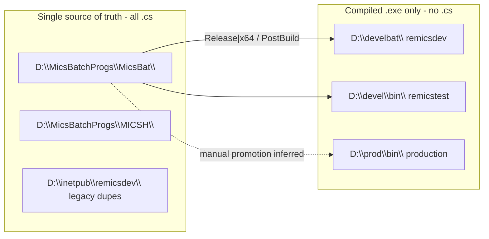
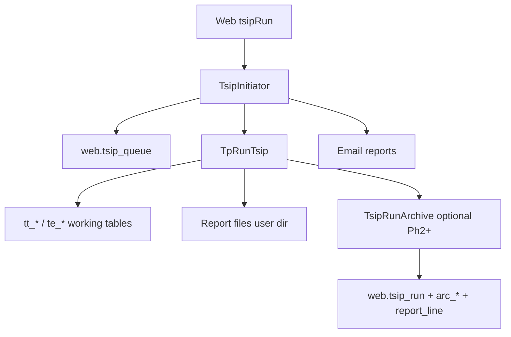
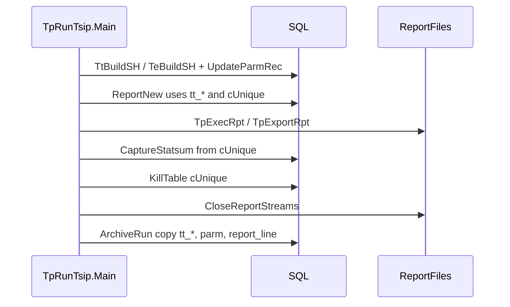

# TSIP — Implementation Plan (Fix + Archive)

**Codebase:** remicsdev  
**Status:** Active — Phases 0–3 complete (verified remicsdev 2026-06-25); Phases 4–5 pending  
**Created:** 2026-06-17  
**Last updated:** 2026-06-25  
**Supersedes:** `tsip-archive-plan.md` (removed), Cursor plan drafts (`tsip_fix_vs_archive`, `tsip_archive_plan_review`, `tsip_run_archive_storage`)

**Related (reference, not plans):** [TSIP deep dive](tsip.md), [Working tables lifecycle](tsip-tt-tables.md), [Batch programs](batch-programs.md), [Source layout](source-layout.md)

---

## Goals

1. **Restore TSIP execution on remicsdev** — remove the broken in-process DB prototype blocking all runs (exit 666).
2. **Capture every TSIP run** — including reruns with the same parm file and run name.
3. **Support custom web reports** and **legacy file reproduction** via a greenfield **`web.*` archive in a shared schema** — one set of tables for all MICS users, not per-user schema tables.
4. **Test incrementally** — each phase has explicit pass/fail checks before moving on.
5. **Do not alter any existing tables** — archive is **CREATE-only** new objects in `web`; reads from live user-schema working tables; no `ALTER`, `DROP`, or triggers on production objects.

---

## Design decision: shared schema, multi-user archive

**Decision (2026-06-17):** All run registry, archived calc data, and report-line cache live in the **`web` shared schema**, keyed by **`run_id`**, with explicit **user and source-schema columns** on the registry row. We do **not** create `{user_schema}.{parmfile}_tsip_*` archive tables (Bill’s pattern) and do **not** mirror the per-tenant layout used for live `tp_*` / `tt_*` working tables.

| Concern | Live TSIP today | Archive (planned) |
|---------|-----------------|-------------------|
| **Where** | User/project schema (`rctl`, `venn`, `hulme`, …) | **`web` only** |
| **Scope** | One `tt_{viewName}_*` set per parm+run name (overwritten on rerun) | **Many runs** per parm+run name, distinguished by `run_id` |
| **User identity** | Implicit from schema + `MICSUSER` env | **`mics_user`** + **`source_schema`** on `web.tsip_run` |
| **Table naming** | `tt_ecomm2602_TS1_site`, etc. | Fixed names: `web.tsip_arc_ts_site`, … (no parm in table name) |

**Why `web`:** Already used for cross-user registry objects (`web.tsip_queue`, `web.dblogger`). Batch code resolves shared schema via `Info.GlobalSchema` (same pattern as queue insert). **`tsip` / `tsip_archive` legacy schemas are not extended** — pilot tables remain read-only/out of scope.

### Registry row (`web.tsip_run`) — multi-user columns

Each TSIP execution gets one registry row. Child tables reference **`run_id` only**; they do not embed user or schema in the table name.

| Column | Type (proposed) | Purpose |
|--------|-----------------|--------|
| `run_id` | `BIGINT IDENTITY` PK | Surrogate key for this execution |
| `mics_user` | `VARCHAR(32)` NOT NULL | Login that submitted the run (`MICSUSER` / queue user) |
| `source_schema` | `VARCHAR(128)` NOT NULL | Schema where live `tp_*` / `tt_*` lived for this run (e.g. `rctl`) |
| `parm_file` | `VARCHAR(64)` NOT NULL | Parm file stem (e.g. `ecomm2602`) |
| `run_name` | `VARCHAR(64)` NOT NULL | Run name from parm (e.g. `TS1`) |
| `view_name` | `VARCHAR(128)` NOT NULL | Working-table prefix (e.g. `ecomm2602_TS1`) |
| `protype` | `CHAR(1)` NOT NULL | `T` = TS–TS, `E` = ES path |
| `run_started_utc` | `DATETIME2` NOT NULL | Archive capture start |
| `run_finished_utc` | `DATETIME2` NULL | After successful archive write |
| `num_int_cases` | `INT` NULL | From `UpdateParmRec` |
| `queue_job_id` | `INT` NULL | Optional FK to `web.tsip_queue.TQ_Job` |
| `archive_status` | `VARCHAR(16)` NOT NULL | e.g. `complete`, `partial`, `failed` |
| `archive_message` | `NVARCHAR(500)` NULL | Warning text if partial/failed |

**Indexes (proposed):** `(mics_user, run_started_utc DESC)`, `(source_schema, parm_file, run_name, run_started_utc DESC)`, unique optional on `(run_id)` for child FKs only.

**Query pattern:** “All runs for user X” → `WHERE mics_user = @user`. “History for this parm” → `WHERE source_schema = @schema AND parm_file = @parm AND run_name = @run`. No cross-schema table scan required.

### Layer 2 / 3 child tables — same `run_id`, no user columns repeated

Each `web.tsip_arc_*` and `web.tsip_run_report_line` row includes **`run_id`** FK → `web.tsip_run` ON DELETE CASCADE. Working-table column layouts are copied from live `tt_*` / `te_*` **plus** `run_id`; live column names are preserved inside the archive row set so formatters can stay familiar. **Do not** add `{schema}` or `{parm}` to archive table names.

Parm snapshots: `web.tsip_run_parm_ts` / `web.tsip_run_parm_es` — one row set per `run_id`, copied from `source_schema.tp_{parm}_parm` at archive time.

### Non-destructive constraint (mandatory)

Archive implementation must **only**:

- **CREATE** new objects under `web` (tables, indexes, FKs, optional views).
- **INSERT** into those new tables during/after a TSIP run.
- **SELECT** from existing user-schema working tables and parm tables as **read-only sources**.

Archive implementation must **not**:

| Object class | Examples | Action |
|--------------|----------|--------|
| User working tables | `{schema}.tt_*`, `{schema}.te_*` | No ALTER; continue existing create/drop lifecycle |
| User parm tables | `{schema}.tp_*_parm` | No ALTER; read-only copy at archive time |
| Bill’s report SQL cache | `{schema}.{parm}_tsip_reports` | No ALTER; disable separately (see below) |
| Shared web registry | `web.tsip_queue`, `web.dblogger`, … | No ALTER |
| Legacy pilot | `tsip_archive.*`, `venn.tsip*Storedef` | No CREATE/ALTER for Storedef; do not write to `tsip_archive` |
| Live report files | User dir `.CASEDET`, etc. | Unchanged; Layer 3 reads files after close |

If a future phase needs queue linkage, prefer **`web.tsip_run.queue_job_id`** populated from env at insert time — not an `ALTER` on `web.tsip_queue`.

### Bill’s prototype code (out of scope for schema; disable later)

Separate from the archive plan:

| Code | Location | Effect today |
|------|----------|--------------|
| Storedef ODBC block | Removed from deployed `MicsBat\TpRunTsip` (Phase 0) | Was fatal (666) |
| `WritePerRunReportsToDbTable` / `-t` | `MicsBat\TpRunTsip\TsipReportHelper.cs`, `_Utillib\DynTsipReports.cs` | **Disabled 2026-06-17:** `mOutputToReportsTable = false`; `InsertFinalMD5allRunsandReports()` and `WriteRunReportToDbTable()` also no-op when false. Re-enable only via `-t` CLI if needed. |

**Next step (after plan review):** Archive **replaces the intent** of Bill’s per-parm report table with **`web.tsip_run_report_line`**. No further Bill-code changes required unless `-t` regression tooling is wanted.

---

## What we learned (2026-06 investigation)

### The exit-666 mystery

| Symptom | Meaning |
|---------|---------|
| Web returns **`OK:0`** | TsipInitiator queued successfully — **not** calculation success |
| `TsipInitiator.log`: exit **666** | Failure inside `TpRunTsip.exe` |
| No `.ERR` file | Failure before meaningful error reporting |
| Queue row `TQ_Status='F'`, `TQ_Finish=666` | Job finished failed; hidden from monitor (`TQ_Status not in ('D','F')`) |

**Root cause:** `D:\develbat\tpRunTsip.exe` was built from **`MicsBat\TpRunTsip`**, which contains an **unfinished archive prototype** in `OpenReportStreams()`. After opening report files, it runs:

```sql
SELECT * FROM venn.tsipAGGINTREPStoredef WHERE 1 = 2
```

via a **separate** `OdbcConnection` (`Trusted_Connection=yes`, hardcoded `DSN=remicsdev`). That fails for most users (missing objects, no `venn` access, or wrong auth path) and calls `Application.Exit(666)`.

**Not the cause:** `.exe` permissions, queue insert, or user-directory write access — all of those succeeded before the ODBC failure.

**Misleading exit code:** 666 is reused from the “failed to open report file” path in the same method; the actual failure was **ODBC**, not file I/O.

### The abandoned prototype vs the archive plan

| | Broken prototype (remove) | Archive plan (implement) |
|---|---------------------------|--------------------------|
| **When** | Start of run, in `OpenReportStreams` | End of parm iteration, after reports |
| **What** | Bulk-copy formatted report rows into `venn.tsip*Store*` (never finished) | Copy `tt_*` / `te_*` working tables + optional report lines into `web.*` |
| **Schema** | Hardcoded `venn.` | `Info.GlobalSchema` → `web.tsip_arc_*` keyed by `run_id` |
| **On failure** | Fatal — kills the run | Warn and continue |

The immediate fix and the archive plan are **compatible and sequential**: fix first on the clean baseline, then add `TsipRunArchive` as an isolated call.

### Legacy `tsip_archive` schema

- Exists on SQL Server (~18 tables, stale pilot data).
- **No C# references** in current MicsBat TSIP or web code.
- **Out of scope** — greenfield `web.*` only; do not read from or write to `tsip_archive`.

---

## Codebases: source vs runtime (dev and prod)

**There is no separate production C# source tree on this server.** Production and dev share the same source; they differ only in **where compiled `.exe` files are deployed** and **which IIS `ProgDir` the web app uses**.



| Location | Contains `.cs`? | Role |
|----------|-----------------|------|
| **`D:\MicsBatchProgs\MicsBat\`** | Yes | **Primary batch solution** (`MicsBat.sln`, ~63 projects). TSIP: `TpRunTsip`, `TsipInitiator`, shared `_Utillib`. **Authoritative TSIP source.** |
| **`D:\MicsBatchProgs\MICSH\`** | Yes | Parallel fork (`MICS#.sln`); includes broken Storedef prototype in `TpRunTsip`. Treat as separate until diffed; **do not deploy to develbat**. |
| **`D:\MicsBatchProgs\MICSTSIP\`** | **No usable source** | **Does not exist** as maintained C# — older docs and folder listings referenced a separate TSIP tree; **no MICSTSIP `.cs` codebase is available** in CentralProject or on the server for build/edit. All TSIP work is **`MicsBat\TpRunTsip`**. |
| **`D:\inetpub\remicsdev\`** | Yes (web + some legacy batch dupes) | IIS web app (`mics\`); stale sibling projects (`KillTable`, `SQLtoFlat`, …). Not primary batch source. |
| **`D:\develbat\`** | **No** — `.exe` only | **remicsdev runtime** — `web.config` `ProgDir=\develbat\` → `D:\develbat\`. TSIP runs from here today. |
| **`D:\devel\bin\`** | **No** | **remicstest runtime** (inferred). |
| **`D:\prod\bin\`** | **No** — `.exe` only | **Production runtime** — `D:\prod\` contains only `bin\` and `files\`; **no `src` or `.cs`**. ~55 exes similar to develbat. Promotion from devel/develbat is **manual / undocumented** (not in csproj PostBuild). |
| **`D:\prod\files\`** | No | Production support files (e.g. NAD grid). |

### TSIP-specific deploy notes (remicsdev)

- Web launches: `D:\develbat\TsipInitiator.exe` with `-pD:\develbat\`.
- `Ssutil.GetBinPath()` is **hardcoded** to `D:\develbat\` on remicsdev (override in `MicsBat\_Utillib\Ssutil.cs`).
- **Build tree:** **`MicsBat\TpRunTsip`** only — MICSTSIP source **does not exist** (see below).

**Decision (Phase 0):** Fix and build from **`MicsBat\TpRunTsip`**; avoid building **`MICSH\TpRunTsip`** to develbat.

### MICSTSIP — not available

**Documented fact (2026-06-17):** There is **no maintained MICSTSIP C# source tree** — not in CentralProject/Git, and not available as a separate buildable codebase on the server. Earlier investigation notes that referenced `D:\MicsBatchProgs\MICSTSIP\` are **superseded**. All TSIP edits, builds, and archive hooks use **`D:\MicsBatchProgs\MicsBat\TpRunTsip\`** and **`MicsBat\TsipInitiator\`**.

### CentralProject vs server source

| Tree | In CentralProject repo? | On remicsdev server? |
|------|-------------------------|----------------------|
| **`MicsBat\`** (incl. TSIP) | **No** | **Yes** — `D:\MicsBatchProgs\MicsBat\` |
| **`MICSTSIP\`** | **No** | **No usable `.cs` source** |
| **IIS `mics\`** | Partial (config symlinks only) | **Yes** — full web source |

Phase 2 archive hook targets **`D:\MicsBatchProgs\MicsBat\_Utillib\`** (or `TpRunTsip\` as appropriate).

### Production source in CentralProject / GitHub

CentralProject tracks **documentation and selected IIS config symlinks**, not `D:\MicsBatchProgs\`. Batch `.cs` lives on the server under `D:\MicsBatchProgs\` only (not yet in this repo). For prod behavior, compare **`D:\prod\bin\*.exe`** timestamps/build metadata against **`D:\develbat\`** and source trees — there is no `D:\prod\src`.

---

## Architecture after all phases



---

## Implementation phases

Each phase ends with **verification** before starting the next.

---

### Phase 0 — Fix TSIP execution (immediate)

**Status:** **Complete** — deployed to `D:\develbat\TpRunTsip.exe` on 2026-06-24; verified **`rctl1` / `ecomm2602`** (`TQ_Finish=0`, full report set, email attachments).

**Rollback:** `.\scripts\Restore-TpRunTsipDevelbat.ps1` restores `D:\develbat\tpRunTsip.exe.bak-20260623`.

**Problem:** Broken Storedef ODBC block in deployed `tpRunTsip.exe`.

**Work:**

1. Remove from [`D:\MicsBatchProgs\MicsBat\TpRunTsip\TpRunTsip.cs`](D:\MicsBatchProgs\MicsBat\TpRunTsip\TpRunTsip.cs):
   - Static `tblAGGINTREP` … `tblSTATSUM`, `cnstr`, `connection`
   - ODBC block in `OpenReportStreams` (~1797–1824)
   - Unused `using System.Data.SqlClient` if nothing else references it
2. Rebuild **`MicsBat\TpRunTsip`** (Release\|x64; PostBuild → `D:\develbat\TpRunTsip.exe`).
3. Rebuild **`TsipInitiator.exe`** if needed (same tree).
4. Document chosen build tree in [batch-programs.md](batch-programs.md) TSIP section.

**Do not:** Create `venn.tsip*Storedef` SQL objects as a workaround.

**Test (pass before Phase 1):**

| Check | Expected |
|-------|----------|
| Submit TSIP as **`rctl1`** (e.g. parm `ecomm2602`) | Web `OK:0` |
| `TsipInitiator.log` | No exit 666 |
| User dir | `.CASEDET`, `.STUDY`, etc. for successful calc; `.ERR` only on real validation errors |
| `TpRunTsip.log` | No stack trace at `OpenReportStreams` line 1817 |
| Email | Reports attached when user has `tsip_email=y` |
| `web.tsip_queue` | `TQ_Status='F'`, `TQ_Finish=0` on success |

---

### Phase 1 — Schema (greenfield `web.*`, shared multi-user)

**Status:** **Complete** — applied on remicsdev 2026-06-17 via `docs/remicsdev/sql/tsip-archive/*.sql` (14 new tables; `web.tsip_queue` unchanged).

**Work:**

1. Create DDL under `docs/remicsdev/sql/tsip-archive/` (all objects **`CREATE` only** in schema **`web`**):
   - `001_registry.sql` — `web.tsip_run` with **`mics_user`**, **`source_schema`**, parm/run/view metadata, archive status; `web.tsip_run_parm_ts`, `web.tsip_run_parm_es` (parm snapshots keyed by `run_id`)
   - `002_arc_tables.sql` — 10× `web.tsip_arc_*` tables (8 working + 2 statsum); every row includes **`run_id`** FK; column sets mirror live `tt_*` / `te_*` **data columns**, not per-user table names
   - `003_report_line.sql` — `web.tsip_run_report_line` (`run_id`, `report_type`, `line_no`, `line_text`)
   - FK: `run_id` ON DELETE CASCADE on all child tables → `web.tsip_run`
   - Indexes on `web.tsip_run` for `(mics_user, …)` and `(source_schema, parm_file, run_name, …)` as above
2. Apply via [`scripts/Invoke-RemicsDevSql.ps1`](../../scripts/Invoke-RemicsDevSql.ps1) `-InputFile`.
3. Grant INSERT (and SELECT for verification) to MICS user SQL logins on **`web.tsip_*` only** — not only agent `db_owner`.
4. **Do not** use legacy `tsip_archive` schema; **do not** `ALTER` any existing table; **do not** create per-user `{schema}.{parm}_tsip_*` archive tables.

**Test:**

| Check | Expected |
|-------|----------|
| `SELECT name FROM sys.tables WHERE schema_id = SCHEMA_ID('web') AND name LIKE 'tsip_%'` | 14 **new** tables (none pre-existing altered) |
| Pre-existing `web.tsip_queue` etc. | Unchanged — compare column list before/after if desired |
| Test INSERT as a real MICS user identity | Succeeds on `web.tsip_run` with `mics_user` + `source_schema` populated |
| Two INSERTs same `parm_file`+`run_name`, different `mics_user` | Both rows retained (multi-user) |
| TSIP still runs (Phase 0 unchanged) | Phase 0 tests still pass |

---

### Phase 2 — Batch archive hook

**Status:** **Complete** — implemented 2026-06-17; verified remicsdev 2026-06-25 (multi-run retention, Layer 2 + report cache). `queue_job_id` wired via `TSIP_QUEUE_JOB` env in `TsipQ.StartTsip()` 2026-06-25.

**Work:**

1. Implement `TsipRunArchive.cs` + `TsipArchiveContext` in **`MicsBat\_Utillib\`** (or colocated under `MicsBat\TpRunTsip\` per project conventions).
2. Context must carry **`mics_user`**, **`source_schema`**, `parm_file`, `run_name`, `view_name`, `protype`, and resolved **`run_id`** after registry insert.
3. Wire **two internal phases** from `TpRunTsip.Main()` per parm iteration:



| Step | Method | Timing |
|------|--------|--------|
| Registry insert | `InsertRunRegistry(ctx)` → `web.tsip_run` | Start of archive phase |
| Statsum capture | `CaptureStatsum(ctx)` | **Before** `Ssutil.KillTable(cUnique)` |
| Working-table copy | `CopyWorkingTables(ctx)` → `web.tsip_arc_*` | After statsum; **SELECT** from `{source_schema}.tt_*` / `te_*` |
| Full archive | `ArchiveRun(ctx)` — parm snapshot + report lines | **After** `CloseReportStreams()` |

3. Archive failure: **log warning, do not abort** TSIP run.
4. Build + deploy `TpRunTsip.exe` (and deps) to **`D:\develbat\`**.

**Test:**

| Check | Expected |
|-------|----------|
| Run TSIP twice, same `parm_file` + `run_name` | Two rows in `web.tsip_run` (different `run_id`) |
| Run TSIP as two different users, same parm | Two rows; filterable by `mics_user` |
| After second run | First run’s `run_id` data still in `web.tsip_arc_*` |
| Second run overwrites live `tt_*` | Archive preserves both runs |
| Failed archive (simulate) | TSIP completes; reports + email still work |

---

### Phase 3 — Report file cache (Layer 3)

**Status:** **Complete** (implemented inside Phase 2 `TryArchiveAfterClose` — populates `web.tsip_run_report_line` from written report files).

**Work:** Populate `web.tsip_run_report_line` from `TsipReportHelper` file paths after streams are closed.

**Test:**

| Check | Expected |
|-------|----------|
| After successful run | Rows in `tsip_run_report_line` for CASEDET, STUDY, etc. |
| Line order | Matches on-disk file line order |
| Reassemble query | Concatenated lines match original `.CASEDET` bytes |

---

### Phase 4 — Web read path

**Work:**

- List/search runs from `web.tsip_run` (filter by **`mics_user`**, **`source_schema`**, parm, date)
- Download endpoint: assemble `tsip_run_report_line` → file response
- Prototype: `web.v_tsip_casedet` or page querying `web.tsip_arc_*` by `run_id`
- Optional: extend existing KML pages to accept `?run_id=` instead of live `tt_*` names

**Test:**

| Check | Expected |
|-------|----------|
| Run history page | Shows multiple runs per parm/run name |
| Download CASEDET by `run_id` | Matches file from user dir at run time |
| KML/CSV prototype | Renders from archive without live `tt_*` |

---

### Phase 5 — Archive-aware formatters (optional)

**Work:** Refactor `Tstsrp3` / `Tstsrp4` / `AggInt` to accept `run_id` and read `web.tsip_arc_*` instead of live `tt_{viewName}_*`.

**Test:** Regenerated `.CASEDET` from Layer 2 matches Layer 3 cache (or acceptable diff documented).

---

## Storage design summary

| Layer | Tables | Purpose |
|-------|--------|---------|
| **1 — Registry** | `web.tsip_run`, `web.tsip_run_parm_ts`, `web.tsip_run_parm_es` | Run metadata + input snapshots; **`mics_user`** + **`source_schema`** identify origin |
| **2 — Normalized results** | 10× `web.tsip_arc_*` | Queryable calcs per **`run_id`**; regen via formatters |
| **3 — File cache** | `web.tsip_run_report_line` | Byte-identical legacy downloads per **`run_id`** |

**Schema rule:** All archive objects live in **`web`** (shared). Live **`{user_schema}.tt_*` / `tp_*`** tables are **read-only sources** — never altered for archive.

**Avoid:** Per-user archive tables (`{schema}.{parm}_tsip_*`); 22 denormalized report-type tables; finishing `venn.tsip*Storedef` bulk-copy; hooking archive inside `OpenReportStreams`; **`ALTER`** on any existing table.

---

## Optional future enhancements

- `web.tsip_run.queue_job_id` ← `TSIP_QUEUE_JOB` env var set by `TsipQ.StartTsip()` (wired 2026-06-25)
- Link archive to queue monitor UI
- Remove `GetBinPath` hardcode before prod promotion
- Add `D:\MicsBatchProgs\` to Git / CentralProject (separate initiative)

---

## Key source files

| File | Relevance |
|------|-----------|
| `MicsBat\_Utillib\TsipRunArchive.cs` | Phase 2 archive hook (`web.tsip_run`, `web.tsip_arc_*`, report lines) |
| `MicsBat\_Utillib\TsipQ.cs` | Spawns TpRunTsip; sets `TSIP_QUEUE_JOB` env for `queue_job_id` |
| `MicsBat\TpRunTsip\TpRunTsip.cs` | Main loop; archive hook location; Phase 0 Storedef fix |
| `MicsBat\TpRunTsip\TsipReportHelper.cs` | Report output; `mOutputToReportsTable = false` (2026-06-17) |
| `MicsBat\_Utillib\Ssutil.cs` | DB connect, `GetBinPath` develbat override |
| `MicsBat\_Utillib\TsipQ.cs` | Queue + spawn TpRunTsip |
| `MicsBat\_Utillib\DynTsipReports.cs` | Bill’s `-t` INSERT path (unused while `OutputToTable` false) |
| `MicsBat\utilities\JobSubmit.cs` | Web → batch impersonation |
| `mics\Ttsipmenu\TwsTsip.asmx.cs` | `tsipRun` web entry |
| `MicsBat\TpRunTsip\Tstsrp3.cs` | CASEDET SELECT template for Layer 2 / views |

---

## Related documentation

- [tsip-tt-tables.md](tsip-tt-tables.md) — ephemeral `tt_*` lifecycle (reference; early hook at ~568 superseded by Phase 2 timing above)
- [tsip.md](tsip.md) — calculations, formulas, I/O
- [batch-programs.md](batch-programs.md) — build/deploy paths
- [database-access.md](database-access.md) — SQL access patterns
