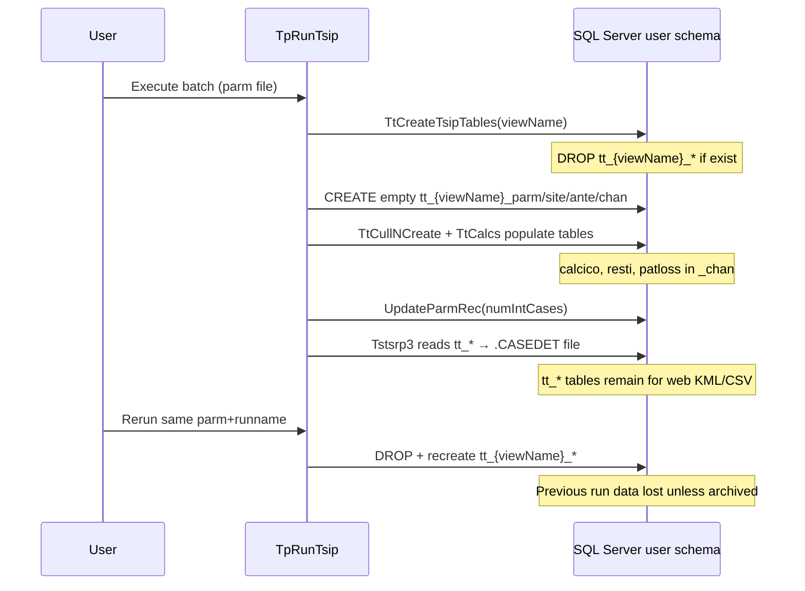

# TSIP working tables (`tt_*` / `te_*`) — lifecycle and capture strategy

**Codebase:** remicsdev  
**Status:** Investigation complete (source verified 2026-06-17)  
**Related:** [TSIP deep dive](tsip.md), [Batch programs](batch-programs.md), **[Run archive plan](tsip-archive-plan.md)** (planned)

This document describes the SQL Server tables TSIP creates and fills during a run, when they are destroyed, and where to hook capture so calculated results persist before the next rerun.

---

## Summary

| Question | Answer |
|----------|--------|
| Where do calculated results live? | User schema tables `tt_{parmfile}_{runname}_site/ante/chan/parm` (TS) or `te_*` (ES) |
| When are they deleted? | **At the start of the next run** with the same `{parmfile}_{runname}` — not at end of current run |
| What does the web read today? | Same `tt_*` tables (KML/CSV viewers in `Ttsipmenu`) |
| Best capture point | **Inside `TpRunTsip`**, immediately after `TtBuildSHTable` / `TeBuildSHTable` succeeds and `UpdateParmRec` completes (~line 568) |
| Easiest query shape | Reuse `Tstsrp3.SELECT_TEMPLATE` — the same join used for `.CASEDET` reports |
| What `-t` flag does | Stores **report file MD5 checksums** in `{schema}.{parmfile}_tsip_reports` — **not** structured `tt_*` data |

---

## Table naming

For each parameter-file **run**, `TpRunTsip` builds:

```
viewName = "{parmfile}_{runname}"
```

Example: parm file `MYTSIP01`, run `RUN01` → `viewName = MYTSIP01_RUN01`.

All working tables live in the **user's SQL schema** (`Session["s_schema"]` / `dbo.user_schema2022(userid)`).

### TS (terrestrial) runs — `tt_*`

| Suffix | Full name example | Role |
|--------|-------------------|------|
| `_parm` | `{schema}.tt_MYTSIP01_RUN01_parm` | Copy of run parm row + run metadata (`mdate`, `mtime`, `numcases`) |
| `_site` | `{schema}.tt_MYTSIP01_RUN01_site` | Interferer/victim site pairs, distances, coordinates, case numbers |
| `_ante` | `{schema}.tt_MYTSIP01_RUN01_ante` | Antenna geometry, gains, discrimination (co/cross-polar) |
| `_chan` | `{schema}.tt_MYTSIP01_RUN01_chan` | **Calculation results**: `patloss`, `calcico`, `calcixp`, `reqdcalc`, `resti`, frequencies, powers |

Naming convention from `Cvt.cs`:

```197:201:D:\inetpub\remicsdev\mics\_DataStructures\Cvt.cs
            cvtList.Add(new Cvt(Constant.TT_PARM, "TT_PARM", "tt_", "_parm", ...));
            cvtList.Add(new Cvt(Constant.TT_SITE, "TT_SITE", "tt_", "_site"));
            cvtList.Add(new Cvt(Constant.TT_ANTE, "TT_ANTE", "tt_", "_ante"));
            cvtList.Add(new Cvt(Constant.TT_CHAN, "TT_CHAN", "tt_", "_chan"));
```

### ES (earth station) runs — `te_*`

Same four-table pattern with `te_` prefix: `te_{viewName}_parm`, `_site`, `_ante`, `_chan`.

Report queries: `Tsesrp3.cs`, `Estsrp3.cs`.

### ES-only temporary tables (short-lived)

During ES builds, `TeCreateTsipTables` also creates:

| Table | Purpose |
|-------|---------|
| `{schema}.tt_{parmfile}_tmp1` | 1-D temp site pairs |
| `{schema}.tt_{parmfile}_tmp2` | 2-D temp environment table |
| `{schema}.te_{parmfile}_tmp1` | ES temp table |

These are **dropped at end of `TeBuildSHTable`** via `RemoveTempTables(paramName)` — before reports. They are **not** suitable capture targets.

### Input parm table (not a working table)

| Table | Lifecycle |
|-------|-----------|
| `{schema}.tp_{parmfile}_parm` | User-editable run definitions; **not** dropped by TSIP calc |

One row per run in the parm file. TSIP reads this at start; `UpdateParmRec` writes back `numcases` / interference counts.

---

## Lifecycle diagram



### Drop/create code (TS)

```390:418:D:\MicsBatchProgs\MICSTSIP\TpRunTsip\TtBuildSH.cs
        public static int TtCreateTsipTables(string tsipName)
        {
            if (Ssutil.UtTableExist(Constant.TT, tsipName))
            {
                if ((rc = Ssutil.UtDropTable(Constant.TT, tsipName)) != Constant.SUCCESS)
                    return (rc);
            }
            if ((rc = Ssutil.UtCreateTable(Constant.TT, tsipName)) != Constant.SUCCESS)
                return (rc);
            return (Constant.SUCCESS);
        }
```

`UtCreateTable(Constant.TT, ...)` creates all four tables (`_parm`, `_site`, `_ante`, `_chan`) in one call.

`UtTableExist(Constant.TT, ...)` requires **all four** to exist before treating the set as present.

### viewName assignment

```457:516:D:\MicsBatchProgs\MICSTSIP\TpRunTsip\TpRunTsip.cs
                    viewName = String.Format("{0}_{1}", Info.PdfName, currParm.parmStruct.runname);
                    ...
                        GenUtil.UtCvtName(Constant.TT_SITE, viewName, out siteName);
                        rc = TtBuildSH.TtBuildSHTable(viewName, ...);
```

`Info.PdfName` is the **parameter file name** (not the proposed PDF name).

---

## What each table holds

### `_site` — geometry and case grouping

Key fields: `caseno`, `subcaseno`, `interferer`, call signs (`intcall1/2`, `viccall1/2`), site names, `int1vic1dist`, lat/long (arc-seconds), ground heights, off-axis angles, `report` flag, `distadv`, `eirpadv`.

### `_ante` — antenna discrimination

Key fields: antenna numbers/codes, hop/azimuth angles, `intgain`/`vicgain`, cross-polar discrimination (`adiscctxh/v`, `adisccrxh/v`, …), `totantdisc`.

### `_chan` — calculation outputs (primary capture target)

Key calculated columns on `TtChan`:

| Column | Meaning |
|--------|---------|
| `patloss` | Path loss (dB) for selected propagation model |
| `calcico` | Calculated C/I or I (co-polar) |
| `calcixp` | Calculated C/I or I (cross-polar) |
| `reqdcalc` | Required C/I or I/N threshold |
| `resti` | **Remaining margin** — reportable interference when below `margin` |
| `pathloss80/99`, `calcico80/99`, `resti80/99` | OH-loss percentile variants |
| `intfreqtx`, `vicfreqrx`, `freqsep` | Frequencies (stored ×1000; divide for MHz in reports) |
| `intpwrtx`, `vicpwrrx` | Powers |
| `calctype` | C/I vs I/N mode indicator |

### `_parm` — run configuration snapshot

Single row per run: copies TSIP parm fields at run time plus `mdate`, `mtime`, `numcases`, `numtecases`.

---

## Who reads these tables today

| Consumer | How |
|----------|-----|
| **`.CASEDET` report** | `Tstsrp3.TsTsRp3()` — large JOIN of `_site`, `_ante`, `_chan` |
| **Web KML** | `CASEDETTSTSkml.aspx.cs` — `SELECT ... FROM {schema}.tt_{tsipname}_site/ante/chan` |
| **Web CSV** | `CASEDETTSTScsv.aspx.cs` — same pattern |
| **Aggregate interference** | `AggInt.cs` reads `tt_{viewName}_chan` |

Web query string `tsip` = `viewName` (e.g. `MYTSIP01_RUN01`).

---

## Existing persistence mechanisms (and gaps)

### 1. Text report files (`.CASEDET`, etc.)

Written to `TARGETDIRFORTSIPREPORTS` / user working directory. Emailed by `TsipInitiator`. Human-readable but awkward for SQL analytics.

### 2. `-t` flag → `{parmfile}_tsip_reports`

Optional CLI flag sets `TsipReportHelper.OutputToTable = true`. At end of all runs, writes **normalized MD5 hashes of report file contents** to `{schema}.{parmfile}_tsip_reports` via `DynTsipReports`.

**Not invoked from web today** — `TsipInitiator` does not pass `-t` to `TpRunTsip`.

**Does not store** structured channel-level calculation rows.

### 3. `TsipSkim` (stub)

`D:\inetpub\remicsdev\mics\Tsipskim\tsipskim\Program.cs` — intended to parse report files into DB tables. **All skim methods are empty stubs**; hardcoded test path. Not in the web batch pipeline.

### 4. `tt_*` tables left in user schema

Tables persist until rerun. Web viewers depend on them. **No automatic archive** — data loss on next run of same `{parmfile}_{runname}`.

---

## Capture strategy recommendations

### Recommended: in-process archive after calculations (best)

**Hook location:** `TpRunTsip.Main()`, after successful build and parm update:

```
TtBuildSHTable / TeBuildSHTable  →  SUCCESS
UpdateParmRec                  →  SUCCESS
>>> CAPTURE HERE <<<
ReportStudy / ReportNew        →  reads same tt_* data
```

Approximate line ~568 in `TpRunTsip.cs`, between `UpdateParmRec succeeded` and `Starting ReportStudy`.

**Why this point:**

- All calculations complete (`calcico`, `resti`, etc. populated)
- ES temp tables already dropped (no noise)
- Same data reports and web KML will use
- Runs **once per run**, before any future drop
- Failures in report generation do not lose calc data if capture is independent

**Implementation shape:**

1. Add `TsipArchive.SnapshotRun(string schema, string viewName, string parmFile, string runName, bool isTS)` in `_Utillib`
2. Execute `INSERT INTO {archive} SELECT ..., @runMeta FROM ...` using `Tstsrp3.SELECT_TEMPLATE` (TS) or `Estsrp3`/`Tsesrp3` template (ES)
3. Create permanent table(s) in `web` schema (cross-user) or per-user archive schema

**Suggested archive table:** `web.tsip_case_archive` (or `{schema}.tsip_case_archive`)

Metadata columns to add on insert:

| Column | Source |
|--------|--------|
| `archive_id` | `IDENTITY` or `NEWID()` |
| `parm_file` | `Info.PdfName` |
| `run_name` | `currParm.parmStruct.runname` |
| `view_name` | `viewName` |
| `protype` | `T` / `E` |
| `mics_user` | `Info.MicsUser` / env `MICSUSER` |
| `run_timestamp` | `GETUTCDATE()` |
| `num_int_cases` | from `UpdateParmRec` |

All CASEDET columns from the existing SELECT can map 1:1 — no re-derivation needed.

### Alternative A: archive full four-table set

`SELECT * INTO {schema}.tt_{viewName}_chan_arc_{yyyyMMddHHmmss}` (and site/ante/parm).

**Pros:** Exact schema preservation, minimal logic  
**Cons:** Four tables per run, harder to query across runs, schema drift if `TabDef` changes

### Alternative B: capture before drop on rerun

Hook in `TtCreateTsipTables` / `TeCreateTsipTables` before `UtDropTable`.

**Pros:** No change to happy-path flow  
**Cons:** **Only fires on rerun** — first run never archived unless something else copies it; easy to lose data if user never reruns

### Alternative C: external SQL Agent / scheduled job

Poll user schemas for `tt_*` tables; when `tp_*_parm.mdate/mtime` updates, copy via dynamic SQL.

**Pros:** No batch exe change  
**Cons:** Race with drop on concurrent rerun; fragile; harder to attach run metadata

### Alternative D: enable `-t` + extend `DynTsipReports`

**Not sufficient alone** — would need new columns/table for structured data, not MD5 of report text.

### Alternative E: complete `TsipSkim`

Parse `.CASEDET` flat files post-run.

**Cons:** Lossy (format parsing), duplicates work already in SQL JOIN, stub status

---

## Reference JOIN (TS CASEDET — reuse for archive)

From `Tstsrp3.cs` — this is the canonical denormalized row set:

```sql
SELECT a.interferer, a.caseno, subcaseno, ...
       patloss, calcico, calcixp, reqdcalc, resti, calctype,
       pathloss80, calcico80, resti80, pathloss99, calcico99, resti99, ...
FROM {schema}.tt_{viewName}_site a,
     {schema}.tt_{viewName}_ante b,
     {schema}.tt_{viewName}_chan c
WHERE a.intcall1 = b.intcall1 AND ...  -- full join keys in Tstsrp3.SELECT_TEMPLATE
```

Filter for interference cases only (matches web KML):

```sql
WHERE a.caseno > 0 AND a.report > 0
```

---

## Implementation checklist (when ready)

1. **Design archive schema** — denormalized `web.tsip_case_archive` vs four-table snapshot
2. **Add capture call** in `TpRunTsip.Main()` post-`UpdateParmRec`
3. **Handle ES path** — separate INSERT template from `Estsrp3` / `Tsesrp3`
4. **Idempotency** — key on `(parm_file, run_name, run_timestamp)` or delete prior archive for same view before insert
5. **Web batch** — no change required for capture; optional UI to browse archive later
6. **Testing** — run TSIP twice on same runname; verify archive retains first run after second overwrites `tt_*`
7. **Do not rely on** `TsipSkim` or `-t` alone for structured data

---

## Open questions

1. **Archive scope:** all cases or only `report > 0` interference cases?
2. **Schema location:** central `web.*` vs per-user schema (privacy / multi-tenant)?
3. **Retention:** keep all historical runs or prune after N days?
4. **ES runs:** same archive table with `protype` column, or separate `tsip_es_case_archive`?
5. **Production:** remove `GetBinPath` hardcode before deploying archive hook to prod

**Superseded by:** [tsip-archive-plan.md](tsip-archive-plan.md) — hybrid 3-layer storage design with refined hook location (before `KillTable(cUnique)`).

---

## Related source files

| File | Relevance |
|------|-----------|
| `MICSTSIP\TpRunTsip\TpRunTsip.cs` | Main loop — capture hook location |
| `MICSTSIP\TpRunTsip\TtBuildSH.cs` | `TtCreateTsipTables` drop/create |
| `MICSTSIP\TpRunTsip\TeBuildSH.cs` | ES tables + `RemoveTempTables` |
| `MICSTSIP\TpRunTsip\Tstsrp3.cs` | TS CASEDET SELECT (archive query template) |
| `MICSTSIP\TpRunTsip\TsipReportHelper.cs` | `-t` report MD5 persistence |
| `mics\Ttsipmenu\CASEDETTSTSkml.aspx.cs` | Web reads `tt_*` directly |
| `mics\Tsipskim\tsipskim\Program.cs` | Stub file-based skim (unused) |
