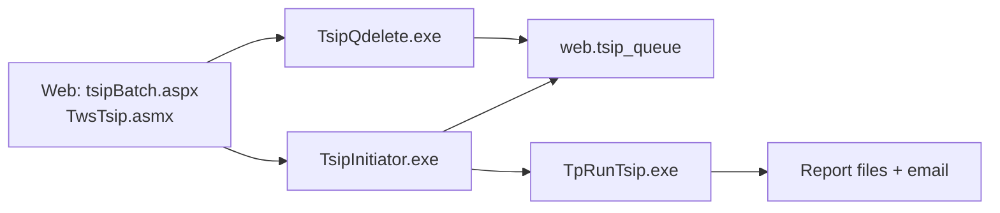

# ReMICS Dev — TSIP (Terrestrial Station Interference Program)

**Codebase:** remicsdev  
**Status:** In progress (source verified 2026-06-17)  
**See also:** [Working tables lifecycle](tsip-tt-tables.md), **[Run archive plan](tsip-archive-plan.md)** (planned implementation)

TSIP identifies **radio interference** between proposed/new systems and existing terrestrial (TS) and earth (ES) stations. It is described in source as *"the core of the MICS system"*.

---

## What TSIP does (plain language)

Given a **parameter file** that describes one or more analysis runs (proposed PDF/MDB vs environment PDF/MDB, coordination distance, path-loss model, margins, etc.), TSIP:

1. Loads station/antenna/channel data from the database
2. **Culls** distant or irrelevant sites
3. Computes **path loss** between interferer and victim
4. Computes **C/I or I/N** (carrier-to-interference or interference-to-noise)
5. Flags cases where margin requirements are not met
6. Writes **text reports** and optionally emails them to the user

Analysis types: **TS–TS**, **TS–ES**, and **ES–TS** interference.

---

## Program architecture

Three executables form the batch pipeline; a fourth handles queue admin.



| Program | Path | Role |
|---------|------|------|
| **TpRunTsip** | `D:\MicsBatchProgs\MICSTSIP\TpRunTsip\` | **Calculation engine** — all interference math and reports |
| **TsipInitiator** | `D:\MicsBatchProgs\MICSTSIP\TsipInitiator\` | Queue supervisor (~5 slots), spawns TpRunTsip, emails results |
| **TsipQdelete** | `D:\MicsBatchProgs\MicsBat\TsipQdelete\` | Remove waiting jobs from queue |
| **TsipSkim** | `mics\Tsipskim\` | Post-process reports into DB (not web-triggered) |

**Source trees:** Primary TSIP code is under **`D:\MicsBatchProgs\MICSTSIP\`**. Parallel copies exist under `MicsBat\` and a large related tree under `MICSH\` (`MICS#.sln`).

**Runtime on remicsdev:** `TsipInitiator` is launched from `D:\develbat\` via web `prog_dir`. `TpRunTsip.exe` is resolved by `Ssutil.GetBinPath()` — on this server hardcoded to **`D:\develbat\`** (see below).

---

## Web → batch invocation

### User workflow

1. User builds/selects a **parameter file** in `Ttsipmenu` (`tsipParm.aspx`, `lookuptsip` lookups)
2. **Execute Batch TSIP** → `tsipBatch.aspx?parameter={parmfile}`
3. AJAX **`tsipValidateAll`** — checks all runs have valid TS/ES PDFs
4. AJAX **`tsipRun`** — submits batch job
5. Browser gets immediate **`OK:0`** (queued) or **`OK:2`** (duplicate) — **does not wait for calculations**
6. User receives **email** with report attachments when complete
7. Reports browsable via **`tsipRepsTree.aspx`**, CASEDET KML/CSV pages

### Command line built by web

From `TwsTsip.asmx.cs`:

```csharp
oLog.logprogram = Session["prog_dir"] + "TsipInitiator";
oLog.logargs = db_name + " " + projectCode + " -otsip " + parmfile + " -p" + Session["prog_dir"];
JobSubmit.SubmitJob(oLog, " ", 2);  // 2 sec wait — detect duplicate queue
```

Example:

```
D:\develbat\TsipInitiator remicsdev PROJ01 -otsip MYTSIP01 -pD:\develbat\
```

`-otsip` flags operator/web submission. `-p` passes the batch directory for sibling utilities.

### TsipInitiator → TpRunTsip

`TsipQ.StartTsip()` spawns `TpRunTsip.exe`. **`GetBinPath("tpRunTsip", database)`** normally resolves `{micsRoot}\bin\`, but on remicsdev:

```4787:4791:D:\MicsBatchProgs\MICSTSIP\_Utillib\Ssutil.cs
            /**************************************************************************************************************************
             * OVERRIDE FOR remicsdev TESTING
             * ************************************************************************************************************************/
            mMicsBinDirPath = @"D:\develbat\";
            string path = Path.Combine(mMicsBinDirPath, micsProgramName + ".exe");
```

**Verified:** Both `TsipInitiator` and `TpRunTsip` run from **`D:\develbat\`** on this dev server.

---

## Inputs

### A. What the user submits (web layer)

| Input | Source | Example |
|-------|--------|---------|
| Parameter file name | Tree selection / query string | `MYTSIP01` |
| Database | Session `db_name` | `remicsdev` |
| Project code | Session `defProject` | charge code |
| MICS user | Session `s_user` | login id |
| Windows identity | Session `principalw` | batch impersonation |

The web passes **only the parm file name** — not per-run fields.

### B. Parameter table (database)

Table: **`{schema}.tp_{parmfile}_parm`** — one row per **run**.

Loaded by `TpRunTsip.ParmFileInit()` → `TpDynParm.TpSelectParm()`.

Key fields (from code usage):

| Field | Meaning |
|-------|---------|
| `runname` | Run identifier (used in output filenames) |
| `protype` | `T` = terrestrial (TS), `E` = earth (ES) |
| `proname` | Proposed system PDF/MDB name |
| `envname` | Environment PDF/MDB name |
| `envtype` | Environment type (`PDF_ES`, `MDB_ES`, etc.) |
| `coordist` | Coordination distance (site culling) |
| `spherecalc` | Path-loss model selector (`'1'`–`'5'`, see formulas) |
| `margin` | Required margin (dB) — interference if `resti < margin` |
| `analopt` | Analysis options |
| `reports` | Which reports to generate |
| `country`, `selsites`, `codes`, `chancodes` | Filtering / scope |

### C. Proposed and environment data

PDF or MDB tables (`ft_*`, `fe_*`, `mt_*`, `me_*`) referenced by parm rows — station locations, antennas, channels, powers, heights, frequencies, etc.

### D. Environment variables (batch runtime)

Set by `JobSubmit` and TsipInitiator/TpRunTsip startup:

| Variable | Purpose |
|----------|---------|
| `MICSUSER` / `PASSWORD` | DB session identity |
| `WORK_DIR` | User working directory (email attachment paths) |
| `TARGETDIRFORTSIPREPORTS` | Report output directory (set when TpRunTsip starts) |
| `FCSAMAPS50K` / `FCSAMAPS250K` | DTED terrain dirs (default `d:\dted50\data`, `d:\dted250\data`) |
| `MICS_CTX_CALC` | If set, compute CTX values vs lookup |
| `SqlInstance`, `DBName`, `odbc`, `work_dir`, `MICS_PROJECT` | From JobSubmit |

### E. TpRunTsip command line

```
TpRunTsip <dbName> <projCode> <paramTableName> [-o<prefix>] [-u<micsUser>] [-t]
```

| Flag | Purpose |
|------|---------|
| `-o<prefix>` | Report filename prefix |
| `-u` | MICS user override |
| `-t` | Also store reports in DB table `{param}_tsip_reports` |

---

## Calculation flow (TpRunTsip)

High-level loop in `TpRunTsip.Main()`:

```
Parse args + env
Connect DB (Ssutil.UtConnect)
ParmFileInit → load tp_{parm}_parm rows
Init DTED directories (CTEfunctions.Init_Directories)
FOR EACH parm run:
    OpenReportStreams()
    ParmRecInit() — validate PDFs, adjust coordist
    IF protype=E OR envtype is ES:
        TeBuildSH.TeBuildSHTable()   ← ES–TS / TS–ES engine
    ELSE:
        TtBuildSH.TtBuildSHTable()   ← TS–TS engine
    UpdateParmRec(numIntCases)
    ReportStudy → ReportNew → TpExecRpt → TpExportRpt
CloseReportStreams
```

### TS–TS path (`TtBuildSH` + `TtCalcs`)

| Step | Method | Purpose |
|------|--------|---------|
| Site culling | `GenRoughCull`, `IntVicSiteCull` | Drop sites outside coordination distance |
| Geometry | `AxSub2.AxDistan`, `AxSub3.PathDist` | Distance, bearing, path length |
| Tables | `TtDynSite`, `TtDynAnte`, `TtDynChan` | Build interference case records |
| Path loss | `TtCalcs.TtPathLoss` | Model selected by `spherecalc` |
| Antenna/discrimination | `TtCalcs.CalcTotADisc` | Antenna gain, cross-polar, nulls |
| Interference | `TtCalcs.TtChanCalcs` | C/I or I/N, margin check |
| Orbit (optional) | `TtCalcs.TtTsorbCalcs` | Uses `AxOrbitSupp.AxOrbit` → `.ORBIT` report |
| Passive | `TtCalcPassive` | Passive interference cases |

### ES path (`TeBuildSH` + `TeCalcs` + `TeSubCalc`)

| Step | Method | Purpose |
|------|--------|---------|
| Tables | `TeSubCalc.TeTableNames` | Terrain/earth/azimuth tables |
| Horizon | `TeSubCalc.TeCheckRadioHoriz` | Radio horizon vs `me_azim` / `fe_azim` |
| Path loss | `TeCalcs.TeChanCalcs`, `TeSubCalc.TeCalcL20M1` | ES-specific models |
| Refraction | `TeCalcs.CalcRefElev` | Atmospheric refraction on elevation |

---

## Formulas (verified in source)

### 1. Free-space path loss

`GenUtil.FreeSpacePathLoss` — `MICSTSIP\_Utillib\GenUtil.cs`

```
pLoss = 32.45 + 20·log10(plengthKm) + 20·log10(freqMHz) + AtmosphericAtten(freqKHz, plengthKm)
```

Used when `spherecalc = '3'`, and as baseline for OH-loss display.

### 2. Spherical Earth path loss (TS–TS)

`TtCalcs.SphericalPathLoss` — `MICSTSIP\TpRunTsip\TtCalcs.cs`

```
transDist = 4.123 · (√rxHeight + √txHeight)     // km, heights in meters
FSL = 32.45 + 20·log10(plength) + 20·log10(freq)

IF plength > transDist:
    θ = (plength - transDist) / 8.5              // milliradians
    H = θ · plength / 4000
    h = 1.063 · θ² · 0.001
    N = 20·log10(5 + 0.27·H) + 1.17261·h
    ploss = 29.73 + 30·log10(freq) + 10·log10(plength) + 30·log10(θ) + N
    ploss = max(ploss, FSL)
ELSE:
    ploss = FSL
```

Selected when `spherecalc = '2'`.

### 3. Path-loss model selector (TS–TS)

`TtCalcs.TtPathLoss` — `spherecalc` from parm record:

| Code | Model |
|------|-------|
| `'1'` | CCIR-SJM — `GenUtil.CalcPatLoss` |
| `'2'` | Spherical Earth — `SphericalPathLoss` |
| `'3'` | Free space — `FreeSpacePathLoss` |
| `'4'` | PCS / COST-231 extension — `PCSPropLoss` (Hata-style α for antenna heights ≤60 m) |
| `'5'` | Over-horizon — `CTEfunctions.Calc_OhLoss` using DTED 50K/250K terrain profiles |

Path distance uses **`AxSub3.PathDist`** (path length accounting for antenna and ground heights), not always great-circle surface distance alone.

### 4. C/I and I/N interference (TS–TS)

`TtCalcs.TtChanCalcs` — after path loss and antenna discrimination:

**I/N mode** (`ecalctype == eMINUSI`):

```
bandTmp = intPowrTx + intAGain - patloss + vicAGain - intAFSLtx - totAdiscC
calcico = bandTmp - vicAFSLrx

resti = reqdcalc - calcico          // copolar
resti = reqdcalc - calcixp          // cross-polar (uses totAdiscX)

report = TRUE if resti < margin    → interference case
```

**C/I mode:**

```
calcico = vicpwrrx - bandTmp
resti = calcico - reqdcalc
report = TRUE if resti < margin
```

`reqdcalc` = required C/I or I/N threshold (from parm / band rules).  
`resti` = **margin remaining** — negative or below `margin` means reportable interference.

### 5. ES Mode 2.0 loss

`TeSubCalc.TeCalcL20M1` — for air-route radio with spherical calc Y/2:

```
x = 2.2 · dist · freq^(1/3) · (K_FACTOR·6374.82)^(-2/3)
fx = 11 + 10·log10(x) - 17.6·x
y = 9.6 · freq^(2/3) · (K_FACTOR·6374.82)^(-1/3)
gyt, gye = height-gain terms from terrht, earthht
FSL = 32.45 + 20·log10(dist) + 20·log10(freqMHz)
loss = max(FSL, FSL - fx - gyt - gye)
```

Other distance bands use piecewise constants (`const1`, `const2`) for non-air routes.

### 6. Geometry

- **`AxSub2.AxDistan`** — geodesic distance/bearing on WGS-style ellipsoid (lat/long in arc-seconds)
- **`AxSub3.PathDist`** — 3-D path distance with ground and antenna heights
- **`TeCalcs.CalcRefElev`** — refraction-adjusted elevation using earth-radius factor and refractive index

### 7. Over-horizon (terrain)

When `spherecalc = '5'`, `CTEfunctions.Calc_OhLoss` uses DTED elevation profiles between site coordinates (`OhLossXfer` struct with lat/long pairs). Free-space loss is stored for comparison; OH result codes distinguish colocated sites, profile failures, etc.

---

## Outputs

### Report files

Written to **`TARGETDIRFORTSIPREPORTS`** (user/report directory), named:

```
{prefix}_{paramTableName}_{runname}.{EXT}
```

| Extension | Content |
|-----------|---------|
| `.ERR` | Error log (shared: `{prefix}_{paramTableName}.ERR`) |
| `.CONSOLE` | TsipInitiator console capture |
| `.STUDY` | Study summary |
| `.CASEDET` | Case detail |
| `.CASESUM` | Case summary |
| `.CASEOHL` | Over-horizon case detail |
| `.STATSUM` | Station summary |
| `.EXEC` | Execution report |
| `.HILO` | Hi/Lo analysis |
| `.ORBIT` | Orbit intersection (when requested) |
| `.AGGINTREP` / `.AGGINT.csv` | Aggregate interference |
| `.TS_EXPORT` / `.ES_EXPORT` | Export for FtPrint/FePrint |

With `-t` flag: reports also stored in DB table **`{param}_tsip_reports`**.

### Database updates

| Table | Purpose |
|-------|---------|
| `web.tsip_queue` | Job queue (Waiting `W`, Running `X`) |
| `web.dblogger` | Job submit log from web |
| Parm table | `numIntCases` updated after run |
| `{param}_tsip_reports` | Optional consolidated reports |

### Email

`TsipEmail.SendSql()` in TsipInitiator attaches report files to user email (primary delivery path).

### Web browsing (post-run)

| Page | Purpose |
|------|---------|
| `tsipMonitor.aspx` | Queue status |
| `tsipRepsTree.aspx` | Report tree |
| `CASEDETTSTSkml.aspx`, `CASEDETTSESkml.aspx` | KML viewers |
| `DownLoad.aspx` | File download |

---

## Shared libraries (calculation dependencies)

| Library | Location | Used for |
|---------|----------|----------|
| `_Auxlib` | `MicsBat\_Auxlib\` | `AxSub2`, `AxSub3`, `AxOrbitSupp`, `SatAze` — geometry, orbit |
| `_OHloss` | `MicsBat\_OHloss\` | `CTEfunctions` — terrain OH loss, DTED |
| `_Utillib` | `MICSTSIP\_Utillib\` | `GenUtil`, `TsipQ`, `Ssutil`, reporting |
| `_Configuration` | `MICSTSIP\_Configuration\` | Constants, errors, enums |
| `_DataStructures` | `MicsBat\_DataStructures\` | `TpParm`, `TtChan`, `FtSite`, etc. |
| `_NewLib` | `MicsBat\_NewLib\` | Math helpers |

---

## Related but separate tools

These share math libraries but are **not** the TSIP batch pipeline:

| Tool | Invoked from | Calculation | Output |
|------|--------------|-------------|--------|
| **Worbit.exe** | `auxengmenu\AUXOrbit.aspx` | `AxOrbitSupp.AxOrbit` | `returnvalues` table |
| **WsatAze.exe** | `auxengmenu\AUX*.aspx` | `SatAze.AxSataze` | Bearings/elevation → `returnvalues` |
| **getcoords.exe** | Engineering menus | Coordinate lookup | User dir files |

TSIP internally reuses **`AxOrbitSupp`** for optional `.ORBIT` reports inside `TtTsorbCalcs`.

---

## Key source files (start here when reading code)

| File | Why |
|------|-----|
| `MICSTSIP\TpRunTsip\TpRunTsip.cs` | Main loop, report orchestration |
| `MICSTSIP\TpRunTsip\TtCalcs.cs` | TS–TS path loss + C/I math |
| `MICSTSIP\TpRunTsip\TtBuildSH.cs` | TS–TS table build + culling |
| `MICSTSIP\TpRunTsip\TeCalcs.cs` / `TeSubCalc.cs` | ES path loss |
| `MICSTSIP\_Utillib\GenUtil.cs` | Free space, CCIR helpers |
| `MICSTSIP\_Utillib\TsipQ.cs` | Queue + spawn TpRunTsip |
| `MICSTSIP\_Utillib\Ssutil.cs` | DB connect, GetBinPath |
| `MICSTSIP\TsipInitiator\TsipInitiator.cs` | Web entry orchestration |
| `mics\Ttsipmenu\TwsTsip.asmx.cs` | Web service submit |
| `mics\Ttsipmenu\tsipBatch.aspx` | User batch UI |

External doc reference in code: `AH-0034 TsipInitiator System Context.pdf` (under mics documentation).

---

## Open questions

1. Is **`MICSH`** or **`MicsBat`** the authoritative build tree for TSIP today?
2. **`GetBinPath` hardcode** to `D:\develbat\` — intentional for all dev work or temporary?
3. Production **`TpRunTsip`** path — `{micsRoot}\bin` vs `prod\bin` when override removed?
4. Full mapping of **`spherecalc`** and **`analopt`** parm values to user-visible UI labels
5. **`TsipSkim`** — is it still used in any workflow?

---

## Related

- [Batch programs](batch-programs.md) — deploy paths, TsipInitiator in develbat
- [Automated testing](automated-testing.md) — tier 4 batch smoke candidate
- [Web app structure](web-app-structure.md) — JobSubmit pattern
