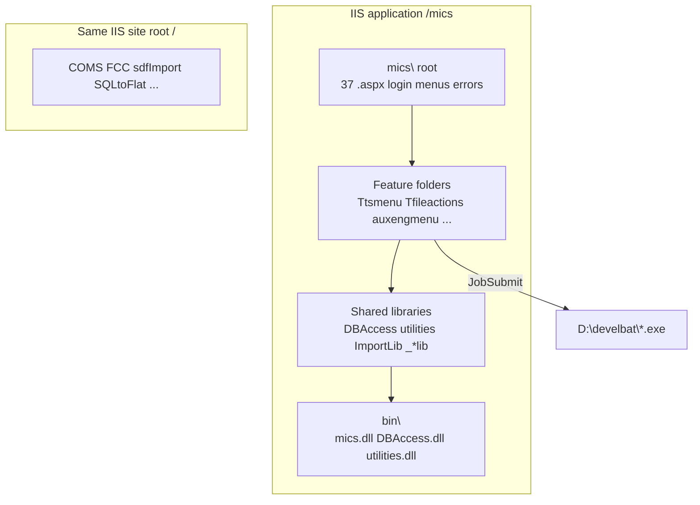
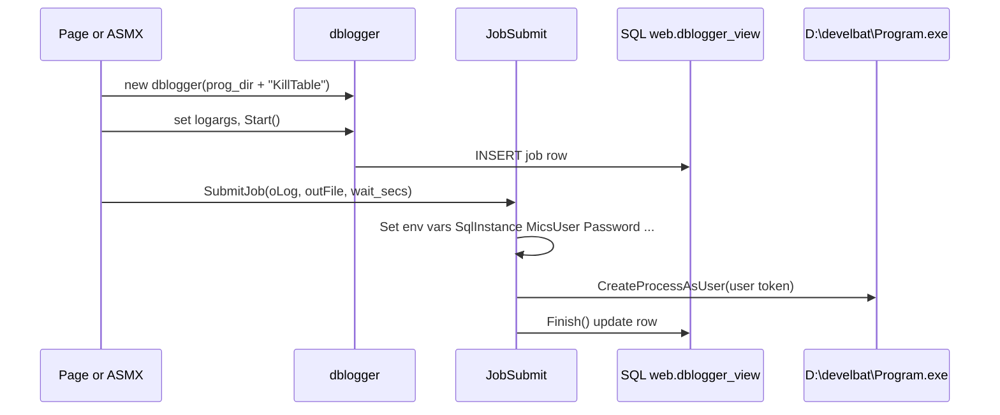

# ReMICS Dev — web application structure

**Codebase:** remicsdev  
**Verified:** 2026-06-17 (filesystem scan, source grep, `mics.sln`, batch verification script)  
**Prerequisite:** [Infrastructure mapping](infrastructure-mapping.md)  
**Context file:** [`context/codebases/remicsdev.yaml`](../../context/codebases/remicsdev.yaml)

This document maps how the MICS **web application** is organized under `D:\inetpub\remicsdev\mics` and how pages invoke external batch programs. Conclusions are tagged **Verified**, **Inferred**, or **Open**.

---

## Executive summary

MICS is a large ASP.NET Web Forms site (~**1,043** `.aspx`/`.asmx` files excluding dated `*_Backup_*` folders) compiled primarily as **`mics.dll`**, with dozens of sibling project folders that act as feature modules (menus, lookups, engineering tools, reports).

Heavy work is delegated to **C# console programs** in `D:\develbat\` through a single job-submission path:

```
Page or ASMX web method
  → dblogger (job record)
  → JobSubmit.SubmitJob()
  → CreateProcessAsUser (logged-in user's Windows token)
  → D:\develbat\<Program>.exe
```

**Verified:** 27 of 36 unique program names referenced in live code exist in `D:\develbat`. Nine are missing, dead paths, or placeholders — see [Batch verification](#batch-program-verification).

---

## Physical layout vs logical layout



| Layer | Path | Role |
|-------|------|------|
| IIS app root | `D:\inetpub\remicsdev\mics` | All MICS URLs under `/mics/` |
| Site root sibling | `D:\inetpub\remicsdev\` | Separate folders/tools; some referenced from `mics.sln` via `..\` |
| Runtime DLLs | `mics\bin\` | **Verified:** `mics.dll`, `DBAccess.dll`, `utilities.dll` present |
| Batch runtime | `D:\develbat\` | Executables invoked by web code |

---

## Solution and project model

**Verified:** `mics.sln` at `D:\inetpub\remicsdev\mics\mics.sln` lists **40+ projects**.

### Direct dependencies of the main web project

**Verified** from `mics.csproj`:

| Reference | Project | Output |
|-----------|---------|--------|
| `DBAccess\DBAccess.csproj` | Database access, `dblogger`, `dbconnect`, domain classes | `DBAccess.dll` |
| `utilities\utilities.csproj` | Job submission, session/email/error helpers | `utilities.dll` |

The main **`mics`** project holds root pages (`Tlogin.aspx`, `Global.asax`, error pages) and compiles to **`mics.dll`**.

### Feature modules (separate `.csproj` per folder)

**Verified:** 59 `.csproj` files under `mics\` (including backups and nested projects). Major live modules:

| Folder pattern | Examples | Typical role |
|----------------|----------|--------------|
| **`T*menu`** / **`Tds*`** | `Ttsmenu`, `Tesmenu`, `Tsdfmenu`, `Ttsipmenu`, `Tpcnmenu`, `Tdsts`, `Tdses`, `Tdssdf` | Top-level **menu systems** by domain (TS, ES, SDF, TSIP, PCN, data search) |
| **`Tfileactions`** | `TwsTabUtil.asmx` | **Web services** for table/file/batch operations — highest batch-job traffic |
| **`auxengmenu`** | `AUXOrbit.aspx`, `AUXTerrain1.aspx`, … | **Auxiliary engineering** calculations; many `JobSubmit` calls |
| **`*Info`** | `FCCInfo`, `ISEDESInfo`, `ISEDTSInfo`, `COMSTSInfo` | Regulatory / reference **info** modules |
| **`lookup*`** | `lookupscrns`, `lookuptsip` | Lookup UI (119+ pages in `lookupscrns`) |
| **`reports`**, **`accountingReps`**, **`DisplayReps`** | Reporting | |
| **`Maintenance`** | `pwdrecov.aspx`, `shownetsession.aspx` | Admin / diagnostics |
| **`documentation`**, **`micshelp`** | Help content | **807** `.aspx` under `micshelp` (mostly static help) |
| **`tools`**, **`Releases`**, **`BuildRadioCatalog`** | Utilities | |
| **`LAML`** | VB MVC-style sub-app | Separate `Global.asax.vb` |
| **`blazor`** | `BlazorApp1` | **Inferred:** newer/experimental UI; not the main login path |

### Underscore-prefixed internal libraries

**Verified** folders: `_Auxlib`, `_Utillib`, `_Configuration`, `_DataStructures`, `_NewLib`, `_OHLoss`, `_private`, `_bin`.

Treat these as **shared compile-time libraries** for subsets of features — not standalone IIS apps.

### Ignore for navigation: dated backups and FrontPage artifacts

**Verified** folders matching `*_Backup_2025.05.29_*` are full copies of live modules. **`_vti_*`** folders are legacy FrontPage metadata. Do not treat backups as active code paths.

---

## `mics.sln` vs disk reality (messy areas)

**Verified:** Several solution entries point to **`..\` sibling paths** under `D:\inetpub\remicsdev\`:

| Project | Path exists? |
|---------|--------------|
| `CopyAnyTable`, `KillTable`, `sdfImport`, `sdfValidate`, `SQLtoFlat` | **Yes** — at site root |
| `CopyTable`, `sdfPrint`, `DailyStorage`, `DailyAcctng` | **No** — missing from site root |
| `BatchProgs`, `RunJob`, `BatchApp`, `BatchA` | **No** — missing; batch source moved to `D:\MicsBatchProgs` |

**Inferred:** `mics.sln` is partially **stale**. Batch/console source of truth for compilation is likely **`D:\MicsBatchProgs\MicsBat\`**, not the missing `..\BatchProgs` entries. Building the full solution may fail until paths are reconciled.

---

## Shared libraries (where cross-cutting logic lives)

### `DBAccess` — database layer

**Verified** namespace `DBAccess` in `mics\DBAccess\`.

| Type | File | Purpose |
|------|------|---------|
| `dbconnect` | `TsRadio.cs` (large file, class at end) | ODBC connections from session |
| `dblogger` | `dblogger.cs` | Job logging to `web.dblogger_view` |
| Domain classes | Many files (`TsRadio.cs`, `EsRadio.cs`, `billing.cs`, …) | Business/data access |

`dblogger` constructor stores the **full program path prefix**:

```108:108:D:\inetpub\remicsdev\mics\DBAccess\dblogger.cs
			m_logprogram = prog;
```

Callers pass `Session["prog_dir"] + "KillTable"` → `D:\develbat\KillTable` (no `.exe` in code; Windows resolves `KillTable.exe`).

### `utilities` — job submission and site utilities

**Verified** single DLL, multiple namespaces in `mics\utilities\`:

| Namespace | File | Purpose |
|-----------|------|---------|
| `JobSubmission` | `JobSubmit.cs`, `JobSubmitNET.cs` | **Batch job launcher** |
| `SesUtilities` | `SesUtils.cs` | Email, session logging |
| `ErrorUtilities` | `ErrorUtils.cs` | Error notification |

### Other libraries

| Library | Location | Notes |
|---------|----------|-------|
| `ImportLib` | `mics\ImportLib\` | Import helpers |
| `_Utillib`, `_Auxlib`, … | `mics\_*\` | Feature-specific shared code |

---

## Session and configuration flow

After login, pages use **`Session[]`** keys populated in `TloginValidate.aspx.cs`:

**Verified:**

```77:78:D:\inetpub\remicsdev\mics\TloginValidate.aspx.cs
                // set standalone bin directory based on web.config
                Session["prog_dir"] = Application["web_drive"].ToString() + Application["ProgDir"].ToString();
```

| Key | Source | Resolved (remicsdev) |
|-----|--------|----------------------|
| `Session["prog_dir"]` | `Web_drive` + `ProgDir` | `D:\develbat\` |
| `Session["db_name"]` | `web.config` / user overrides | Usually `remicsdev` |
| `Session["s_user"]` | Login | MICS username |
| `Session["user_dir"]` | Set during login | Per-user working directory on `D:` |
| `Session["principalw"]` | Login | Windows principal for impersonation |

Special-case DB routing **Verified** in `TloginValidate.aspx.cs`: usernames starting with `import` or `venn2` → `remicsimport`; `hulme2` → `remicsproddev`.

---

## How batch programs are invoked

### Standard path (almost all batch calls)



**Verified** from `JobSubmit.SubmitJob`:

1. Builds `prog_args = oLog.logprogram + " " + oLog.logargs`
2. Sets environment variables for the batch process (`SqlInstance`, `MicsUser`, `Password`, `work_dir`, `odbc`, `DBName`, …)
3. Inserts **`web.dblogger`** row via `oLog.Start()`
4. Launches with **`CreateProcessAsUser`** using the **logged-in user's Windows token** from `Session["principalw"]` — not the app pool identity
5. Waits per `wait_secs` (`0` = infinite, `<0` = fire-and-forget, `>0` = timeout)

Debug logging **Verified** to `D:\extractlogs\<site>_<user>submit5.txt`.

### Primary batch entry points in web code

**Verified** via source grep (excluding `*_Backup_*`):

| File | `SubmitJob` calls | Role |
|------|-------------------|------|
| `Tfileactions\TwsTabUtil.asmx.cs` | **15** | Table copy/kill, import/print/validate, SQL-to-flat, COMSEARCH |
| `auxengmenu\AUXOrbit.aspx.cs` | 3 | Orbit / coords |
| `auxengmenu\AUXTerrain1.aspx.cs` | 3 | Terrain |
| `auxengmenu\AUXOHLoss1.aspx.cs` | 3 | OH loss |
| `auxengmenu\AUXpfdc1.aspx.cs` | 2 | PFDC |
| `Ttsipmenu\TwsTsip.asmx.cs` | 2 | TSIP queue/initiation |
| Other `auxengmenu\AUX*.aspx.cs` | 1–2 each | Engineering tools |
| `Maintenance\pwdrecov.aspx.cs` | 1 | Uses `SubmitJobPwd` variant |
| `Tpcnmenu\PcnLookup.aspx.cs` | 1 | PCN scan |

**Inferred:** Most batch traffic flows through **`TwsTabUtil.asmx`** (AJAX from file/table menus) and **`auxengmenu`** (engineering pages).

### Example: KillTable from web service

**Verified** pattern in `TwsTabUtil.asmx.cs`:

```csharp
dblogger oLog = new dblogger(Session["prog_dir"].ToString() + "KillTable");
// ... set oLog.logargs ...
oLog = JobSubmit.SubmitJob(oLog, " ", 0);
```

### Non-batch `Process.Start`

**Verified:** Only special cases:

| Location | Target |
|----------|--------|
| `JobSubmit.SubmitJobPwd` | Password-change executable via `Process.Start` |
| `Releases\RelNewDetailDT.aspx.cs` | Notepad++ on server (`D:\tools\notepad++.exe`) |
| `_Utillib\TsipQ.cs` | TSIP queue helper (separate from main JobSubmit path) |

---

## Batch program verification

We verify mapping by scanning live C# for `Session["prog_dir"] + "..."` and checking `D:\develbat`:

```powershell
.\scripts\verify-batch-mapping.ps1
```

**Verified run (2026-06-17):** 27 found, 9 missing (36 unique program name references).

### Found on disk (sample)

| Code name | File on disk |
|-----------|--------------|
| `KillTable` | `KillTable.exe` |
| `CopyTable` | `CopyTable.exe` |
| `sdfImport` / `ftImport` / `feImport` | `sdfImport.exe`, `FtImport.exe`, `FeImport.exe` |
| `getcoords` | `GetCoords.exe` |
| `TsipInitiator` | `TsipInitiator.exe` |

**Note:** Windows file matching is **case-insensitive**. Code uses `fePrint`; disk has `FePrint.exe` — works on Windows (**Verified** behavior).

### Missing or non-literal (needs care)

| Code reference | Status | Notes |
|----------------|--------|-------|
| `Dummy` | **Inferred** placeholder | Used as initial `dblogger` name then overwritten with real `logprogram` in `TwsTabUtil.asmx.cs` |
| `esImport`, `esPrint` | **Inferred** dead/commented | Commented-out branches in `TwsTabUtil.asmx.cs` |
| `pl5Import` | **Open** | Referenced in live code; not in `D:\develbat` |
| `SQLtoFlat.exe` | **Verified missing** | Code includes `.exe` suffix; not deployed to `D:\develbat` (source at `D:\inetpub\remicsdev\SQLtoFlat\`) |
| `updatedb` | **Verified missing** | Referenced in `TwsTabUtil.asmx.cs`; may be legacy name (`SdUpdateOper.exe` exists for similar work) |
| `wTerrex` | **Verified missing** | `AUXTerrex3.aspx.cs`; terrain exe not in `D:\develbat` |
| `BatchApp` | **Open** | Referenced in code; no matching exe |
| `testdefaultschema` | **Open** | Test/maintenance path |

Do not assume every string in source is a live deploy path — trace the **`logprogram`** assignment before the `SubmitJob` call.

---

## Folder page counts (live code only)

**Verified** approximate `.aspx`/`.asmx`/`.ashx` counts (excluding backups):

| Folder | Pages | Notes |
|--------|-------|-------|
| `micshelp` | 807 | Help static content |
| `lookupscrns` | 119 | Lookup screens |
| `documentation` | 99 | Docs browser |
| `Tsdfmenu` | 41 | SDF menu |
| `Tdssdf` | 38 | SDF data search |
| `Maintenance` | 34 | Admin |
| `FCCInfo` | 32 | FCC |
| Root `mics\` | 37 | Login, relogin, errors, global pages |

---

## Site-root siblings referenced from MICS

**Verified** at `D:\inetpub\remicsdev\` (IIS site `/`, not `/mics`):

`COMS`, `CopyAnyTable`, `FCC`, `ISED`, `KillTable`, `micsBatch`, `sdfImport`, `sdfValidate`, `SQLtoFlat`, `Tbulkprint`, …

Some are **`mics.sln` projects** with source at site root; URLs may be under `http://remicsdev.../` without the `/mics` prefix. **Open:** full URL map for each sibling — needs IIS vdir audit per folder.

---

## Navigation tips (reading this codebase safely)

1. **Start from URL** → map to folder under `mics\` (see [Infrastructure mapping](infrastructure-mapping.md)).
2. **Check code-behind or `.asmx.cs`**, not `.aspx` markup alone.
3. For background processing, search for **`JobSubmit.SubmitJob`** and **`prog_dir`**.
4. For database access, search for **`dbconnect`**, **`Odbc`**, or **`Session["s_cnString"]`**.
5. **Ignore `*_Backup_*` and `_vti_*`** unless comparing historical changes.
6. **Verify batch names** with `scripts\verify-batch-mapping.ps1` before assuming deploy gaps are bugs.
7. Treat **`mics.sln` load failures** as expected until missing `..\` projects are relocated or removed from the solution.

---

## Open questions

1. Complete URL routing for site-root siblings (`CopyAnyTable`, `SQLtoFlat`, …).
2. Deploy pipeline from `D:\devel\bin` / `D:\MicsBatchProgs` → `D:\develbat`.
3. Whether missing exes (`wTerrex`, `SQLtoFlat.exe`, `updatedb`) are deploy gaps or dead code.
4. How feature-module DLLs (e.g. `Tfileactions.dll`) are deployed — same `mics\bin` or bin subfolders?
5. Relationship between `JobSubmit.cs` and `JobSubmitNET.cs` — which is active?

---

## Related docs

- [Infrastructure mapping](infrastructure-mapping.md) — IIS, config, drives
- [README](README.md) — doc index
- [`scripts/verify-batch-mapping.ps1`](../../scripts/verify-batch-mapping.ps1) — repeatable verification
